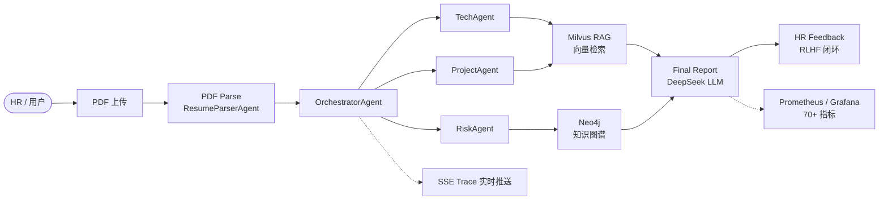

# ResumAI-Agent

[](backend/pom.xml)
[](backend/pom.xml)
[](frontend/package.json)
[](docker-compose.prod.yml)

**AI 驱动的多 Agent 简历评估平台** — 上传 PDF 简历，经编排 Agent 流水线完成技术/项目/风险多维评估，结合 RAG 与知识图谱输出可解释的招聘决策报告。

---

## Architecture Overview



---

## Multi-Agent Pipeline

ResumAI-Agent 采用 **Orchestrator → Specialist Agents → RAG/Graph → Report** 的分层编排模式：

| Agent | 职责 |
|-------|------|
| **OrchestratorAgent** | 任务创建、路由决策（SERIAL / DAG_CONCURRENT）、子 Agent 委派与 Trace 汇总 |
| **ResumeParserAgent** | PDF/文本解析，抽取教育、工作、项目、技能与风险线索 |
| **TechAgent** | 技术栈审计（TechStackAuditSkill），评估岗位技术匹配度 |
| **ProjectAgent** | 项目深度分析（ProjectDepthSkill），评估复杂度与个人贡献 |
| **RiskAgent** | 风险识别（RiskDetectionSkill），检测时间线矛盾、技能堆砌、夸大描述 |
| **RagasJudgeAgent** | RAG 可信度评估（Faithfulness / Answer Relevancy / Context Precision） |
| **FinalReportAgent** | 汇总各 Agent 结论，生成综合评分、推荐结论与面试追问 |
| **HumanFeedbackAgent** | 记录 HR 反馈，驱动 Meta-Agent 反思与 Skill 进化 |

**委派机制**：Orchestrator 根据 `SystemOrchestrationRule`（岗位类别 + 版本）决定执行模式。SERIAL 模式下 Agent 串行执行；DAG_CONCURRENT 模式下 Tech/Project/Risk 可并发。每次委派均记录 Span、Token 成本与 Prometheus 指标。

---

## Tech Stack

### Backend

| 组件 | 版本 |
|------|------|
| Java | 21 |
| Spring Boot | 3.3.1 |
| LangChain4j | 1.13.0 |
| MyBatis-Plus | 3.5.7 |
| PDFBox | 3.0.2 |
| Neo4j Driver | 5.21.0 |
| Milvus SDK | 2.4.4 |
| Redisson | 3.32.0 |
| OpenTelemetry | 1.39.0 |

### Frontend

| 组件 | 版本 |
|------|------|
| Vue | 3 |
| Vite | latest |
| TypeScript | latest |
| Tailwind CSS | latest |
| Element Plus | latest |
| ECharts | latest |

### Infrastructure

| 组件 | 版本 |
|------|------|
| MySQL | 8.0 |
| Redis | 7.2 |
| Neo4j | 5.20 |
| Milvus | 2.4.4 |
| MinIO | RELEASE.2024-05-10 |
| Prometheus | 2.53.0 |
| Grafana | 11.1.0 |

---

## Quick Start (Local Dev)

### 1. 环境变量

```bash
cp .env.example .env
# 编辑 .env，填写数据库密码、DeepSeek API Key 等
```

### 2. 启动基础设施

```bash
docker compose up -d
```

### 3. 启动后端

```bash
cd backend
mvn spring-boot:run
```

### 4. 启动前端

```bash
cd frontend
npm install
npm run dev
```

访问 `http://localhost:5173`。

---

## Production Deployment

生产环境使用 Docker Compose 全栈部署（**前端构建必须在 ECS 上执行，禁止本地 build**）。

### 1. 配置部署凭据

在项目根目录创建 `.deploy.local.env`（已被 `.gitignore` 忽略）：

```env
ALIYUN_HOST=<your-ecs-host>
ALIYUN_USER=root
ALIYUN_PASSWORD=<your-ssh-password>
DEEPSEEK_API_KEY=<your-api-key>
MYSQL_ROOT_PASSWORD=<your-mysql-root-password>
MYSQL_PASSWORD=<your-mysql-app-password>
REDIS_PASSWORD=<your-redis-password>
NEO4J_AUTH=neo4j/<your-neo4j-password>
MINIO_ROOT_PASSWORD=<your-minio-password>
GRAFANA_PASSWORD=<your-grafana-password>
```

### 2. 远程部署

```powershell
pip install -r scripts/requirements.txt
python scripts/deploy_aliyun.py
```

### 3. ECS 手动更新

```bash
cd /opt/ai-resume-agent-platform
git fetch origin && git reset --hard origin/main
docker compose -f docker-compose.prod.yml build --no-cache ai-resume-backend ai-resume-frontend
docker compose -f docker-compose.prod.yml up -d --force-recreate ai-resume-backend ai-resume-frontend grafana
```

公网建议仅开放 **22**（SSH，限 IP）、**80**（HTTP）、**443**（HTTPS）。MySQL、Redis、Milvus、Neo4j 不暴露公网。

---

## API Endpoints

| Method | Path | 说明 |
|--------|------|------|
| `GET` | `/api/health` | 健康检查 |
| `GET` | `/api/tasks` | 任务列表 |
| `POST` | `/api/tasks` | 创建评估任务（JSON） |
| `POST` | `/api/tasks/upload` | 上传 PDF 简历并创建任务 |
| `GET` | `/api/tasks/{traceId}` | 任务详情 |
| `GET` | `/api/metrics` | 大盘性能指标 |
| `GET` | `/api/traces/{traceId}` | Agent 执行 Trace |
| `GET` | `/sse/traces/{traceId}` | SSE 实时 Trace 推送 |
| `POST` | `/api/feedback` | 提交 HR 反馈 |
| `GET` | `/api/feedback` | 反馈列表 |
| `GET` | `/api/graphs/{traceId}` | GraphRAG 知识子图 |
| `GET` | `/actuator/prometheus` | Prometheus 指标导出 |

---

## Observability

平台内置 **70+ 自定义 Prometheus 指标**，覆盖 6 大维度：

1. **Agent Execution** — Span 耗时、委派次数、迭代次数、错误率、Skill 调用
2. **Tool Calls** — PDF 解析、Milvus 索引/检索、Neo4j 写入的工具调用耗时与错误
3. **LLM Economics** — Token 用量、单次/单任务成本、上下文利用率、重试与错误
4. **Business Funnel** — 上传→解析→评估→推荐的全链路漏斗与转化率
5. **RAG Quality** — Faithfulness、Answer Relevancy、Context Precision、空结果率
6. **System Health** — Neo4j/Milvus 连接、线程池、SSE 订阅数、任务缓存大小

Grafana 预配置 Prometheus 数据源，访问 `http://<your-host>:3000`（凭据见 `.env` 中的 `GRAFANA_PASSWORD`）。

---

## Project Structure

```
ResumAI-Agent/
├── backend/                    # Spring Boot 后端
│   ├── src/main/java/com/resumai/agent/
│   │   ├── ai/                 # DeepSeek / LangChain4j 客户端
│   │   ├── api/                # REST 控制器与 DTO
│   │   ├── config/             # AgentMetrics、LangChain4j 配置
│   │   ├── dao/                # MyBatis-Plus Mapper
│   │   ├── domain/             # 实体与枚举
│   │   └── service/            # 评估编排、RAG、Graph 服务
│   └── pom.xml
├── frontend/                   # Vue 3 前端
│   ├── src/                    # 页面、组件、API 客户端
│   └── package.json
├── monitoring/                 # Prometheus + Grafana 配置
├── scripts/                    # 部署与运维脚本
├── docker-compose.yml          # 本地开发编排
├── docker-compose.prod.yml     # 生产全栈编排
├── .env.example                # 环境变量模板
└── README.md
```

---

## Security

- **`.env`**、**`.deploy.local.env`** 及所有密码、API Key **不得提交到 Git**
- 生产部署脚本通过环境变量注入凭据，仓库内不含默认值
- Grafana 管理员密码必须通过 `GRAFANA_PASSWORD` 显式设置
- 部署后建议轮换所有曾出现在 Git 历史中的凭据

---

## License

MIT License — see [LICENSE](LICENSE) for details.
