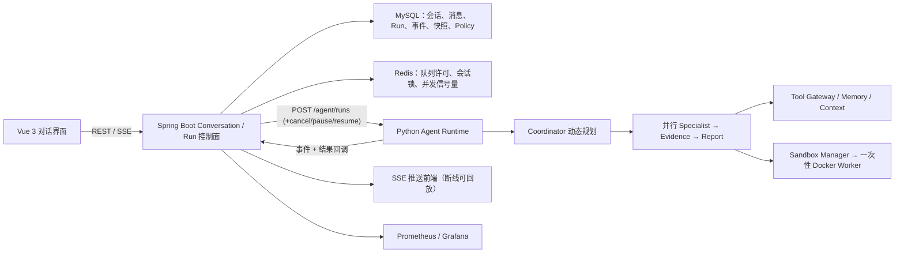

<div align="center">

# ResumAI Agent Platform

**支持持续对话、运行控制与可追溯修订的简历评估 Agent**

[](backend/pom.xml)
[](backend/pom.xml)
[](workflow/app/runtime/)
[](frontend/package.json)
[](docker-compose.prod.yml)
[](workflow/run_agent_harness.py)

</div>

---

## 这套系统解决什么问题

传统"上传简历后等待一个分数"的流程无法处理评估中的真实变化：用户会追问原因、补充事实、修改目标岗位，也会暂停或取消任务。本项目把每一次用户请求建模为一个 **Run**：Java 控制面持久化 Run 的全生命周期（队列、并发、取消、暂停、恢复、结果），Python Agent Runtime 只负责执行一个已被调度的 Run。

- **持续对话**：同一会话严格串行、不同会话并行；运行中可 COLLECT（排队补充）或 INTERRUPT（打断重来）。
- **动态多 Agent**：Coordinator 按问题类型、共享状态与失败记忆动态规划 Agent 流水线；Tech/Project/Risk 三个 specialist 并行执行，Evidence 核验，Report 显式收尾。
- **可暂停恢复**：PAUSE 在 Agent 组边界保存 RunExecutionSnapshot（MySQL），RESUME 用同一 runId/traceId/revision 恢复，绝不重跑已完成的非幂等动作。
- **证据不造假**：结论必须可定位到简历/JD/工具结果；无证据结论进入 conflicts 并标记不确定；降级结果永远显式标注 `PARTIAL_SUCCESS`，不伪装完整成功。
- **策略可学习**：PolicyBundle 控制 Agent 组合与预算，epsilon-greedy/Thompson 按 HR 反馈与真实 E2E Benchmark 的 Reward 持续选择更优策略（Agent 外层学习，非模型权重训练）。

## 架构



Java 是 Run 持久状态和队列的唯一事实源；Python 只保留当前进程正在执行的 asyncio Task 句柄用于真实取消。每个事件、工具调用、Sandbox 执行和回调都携带 `conversationId + runId + traceId + revision`，旧 revision 或已取消 Run 的迟到结果只进审计，不覆盖可见结果。

## Run 状态机

```text
QUEUED → STARTING → RUNNING ⇄ WAITING_LLM / WAITING_TOOL / WAITING_SANDBOX
RUNNING → PAUSING → PAUSED → RESUMING → RUNNING
任意活动态 → CANCELLING → CANCELLED
终态：SUCCEEDED / PARTIAL_SUCCESS / FAILED / CANCELLED / TIMED_OUT
```

- 全局并发默认 4（Redis 全局许可）；单会话并发固定 1（会话许可 + FIFO）。
- 服务重启后：QUEUED 保留，孤儿 RUNNING 收敛为 FAILED，PAUSED 凭 MySQL 快照跨重启保留，CANCELLING 由 watchdog 强制收敛。
- PAUSE 是 Agent 组边界的协作式暂停，不承诺冻结正在输出的 token。

## 关键 API

| Method | Path | 说明 |
|---|---|---|
| `POST` | `/api/conversations` | 创建会话（可带简历与 JD） |
| `POST` | `/api/conversations/{id}/messages` | 发送消息；`queueMode: collect/interrupt` |
| `GET` | `/api/runs/{runId}` | Run 状态、答案与真实 metrics |
| `POST` | `/api/runs/{runId}/cancel` | 取消（传播到 LLM/Tool/Sandbox） |
| `POST` | `/api/runs/{runId}/pause` | 安全边界暂停并保存执行快照 |
| `POST` | `/api/runs/{runId}/resume` | 从快照恢复（不重跑已完成动作） |
| `GET` | `/sse/runs/{runId}` | 运行事件流（Last-Event-ID 断线回放） |
| `POST` | `/api/runs/{runId}/feedback` | HR 反馈 → Reward → 策略统计 |
| `GET` | `/api/policies/statistics` | 各策略学习统计 |

Python 内部控制面（Docker 网络内、`WORKFLOW_INTERNAL_TOKEN` 保护）只有：
`POST /agent/runs`、`GET /agent/runs/{id}`、`POST /agent/runs/{id}/cancel`、
`POST /agent/runs/{id}/pause`、`POST /agent/runs/{id}/resume`、
`POST /conversation/turns/resolve`。

## Sandbox

简历解析、时间线检查、JD 覆盖率、证据核验等确定性工具在一次性 Docker Worker 内执行：`network=none`、只读根文件系统、非 root、cap-drop ALL、内存/CPU/PID 限额、TTL 自动回收。Worker 镜像按部署 Git SHA 固定（`resumai-sandbox-worker:${SANDBOX_WORKER_TAG}`），Manager 仅接受白名单工具名与 JSON 参数，调用方永远无法指定镜像、命令、挂载或网络。

## Benchmark：契约与质量分离

| 基准 | 命令 | 性质 |
|---|---|---|
| Contract Benchmark | `python harness/run_policy_contract_benchmark.py` | 离线确定性：工具契约、评分公式、安全规则、故障注入回归。**不产生质量结论，不选 Champion** |
| Real Agent E2E | `python harness/run_agent_e2e_benchmark.py --base http://<host> --repeats 3` | 走真实 `/agent/runs`：真实 Coordinator、真实 DeepSeek、真实 Docker Sandbox；LLM 次数/Token/成本全部来自 runtime metrics。**只有它能选 Champion Policy** |

评估标签（mustFind/mustNotClaim/expectedRisk）只进评估器，永不进入 Agent 输入、Prompt、工具参数、Memory 或 Shared State。

## 运行时契约门禁

```bash
cd workflow
python -m pytest tests -q          # 55+ 单元测试
python run_agent_harness.py        # 确定性契约：规划/并行分组/LoopGuard/压缩配对/冲突不覆盖
```

Docker workflow 镜像在 build 阶段强制执行 compileall + tests + 契约门禁，任一失败镜像不产出。CI 见 `.github/workflows/agent-harness.yml`（另含 Java/前端/Compose 校验；真实 E2E 基准仅 workflow_dispatch 手动触发）。

## 生产部署（复用原有数据卷）

生产 MySQL/Redis/Neo4j/Milvus/MinIO/etcd/Prometheus/Grafana 全部挂载既有 named volume（`resumai-mysql-data` 等）。**部署永远不会**执行 `docker compose down -v`、`docker volume prune` 或用空卷替换业务数据；表结构变化只通过 `backend/src/main/resources/db/migrations/V*.sql` 的 guard 幂等迁移在启动时应用，无变化则整体跳过。

```bash
# ECS 上（中国大陆镜像源已内置：Aliyun Maven/PyPI、npmmirror、daocloud 镜像）
cd /opt/resumai-src
bash scripts/ecs_safe_deploy.sh
# 步骤：备份(.env+mysqldump) → mvn 编译 → npm 构建 → Git SHA Sandbox 镜像 →
#       compose build/up（原卷复用校验）→ 健康检查 → 数据行数前后比对
```

验收脚本：`bash scripts/ecs_acceptance.sh`（E2E、COLLECT/INTERRUPT、并发、SSE 回放、Sandbox 安全、重启持久化）。

## 项目结构

```text
backend/                          Spring Boot 控制面：会话/Run 队列/许可/看门狗/Policy/Memory
backend/.../db/migrations/        Guard 幂等版本化 Schema 迁移（V5–V7）
workflow/app/runtime/             统一 Agent Runtime：Coordinator/Executor/Context/Memory/Tools
workflow/run_agent_harness.py     确定性运行时契约门禁（构建期强制）
sandbox/                          Sandbox Manager 与一次性 Worker（Git SHA 镜像）
harness/                          Contract 基准与真实 E2E 质量基准
frontend/                         Vue 3 对话、运行进度、停止/排队控制
docker-compose.prod.yml           生产全栈（复用原 named volumes）
scripts/ecs_safe_deploy.sh        ECS 安全部署（备份、构建、卷校验、健康检查）
```

## 明确边界

- 策略学习是 **Agent 外层** PolicyBundle 选择（epsilon-greedy/Thompson + 真实 Reward），不训练任何模型权重，不是 RLHF/PPO/GRPO。
- `PARTIAL_SUCCESS` 表示存在明确降级（如某个 Agent 失败后基于剩余结果作答），不能当作完整成功展示；缺少模型凭据时失败关闭。
- Sandbox 只运行固定白名单的简历分析工具，不是任意代码执行平台。
- 当前是单机 Docker Compose 形态，适合演示与中小规模验证；多副本、跨区容灾与密钥托管属于后续生产化工作。

## License

MIT License — see [LICENSE](LICENSE) for details.
