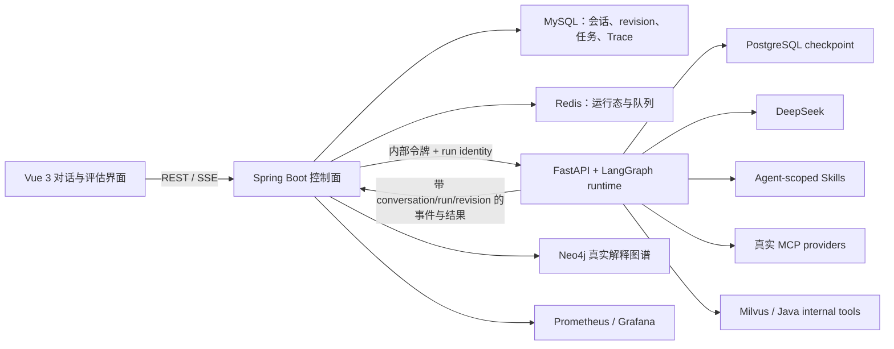

<div align="center">

# ResumAI Agent Platform

**支持持续对话、运行控制与可追溯修订的简历评估 Agent**

[](backend/pom.xml)
[](backend/pom.xml)
[](workflow/)
[](frontend/package.json)
[](docker-compose.prod.yml)
[](workflow/run_agent_harness.py)

</div>

---

## 这套系统解决什么问题

传统“上传简历后等待一个分数”的流程无法处理评估中的真实变化：用户会追问原因、临时比较岗位、补充候选人事实、修改 JD，也会暂停或取消任务。本项目将一次评估建模为持续会话中的不可变 revision，并由 Java 控制面和 Python LangGraph runtime 共同执行。

- **持续对话**：评估运行时仍可提问、要求解释、比较岗位或生成面试追问；这类 side quest 返回答案后继续原运行，不更换 trace/revision。
- **意图变化可追踪**：修改 JD、目标岗位、评估重点或候选人事实会创建新 revision，旧 revision 标记为 superseded，只重跑依赖闭包中的节点。
- **运行可控制**：取消会终止活动任务并阻止迟到回调覆盖结果；暂停在安全节点边界写入 PostgreSQL checkpoint；继续恢复同一 `workflowRunId` 和 revision。
- **证据不造假**：公开资料只能来自真实 MCP 工具结果；失败、无来源、synthetic/fallback 内容不会升级为候选人证据。DeepSeek 未配置或调用失败时不会生成伪评分。
- **可执行 runtime gate**：离线 Agent harness 固化 side quest、revision、checkpoint、取消竞争、工具预算、证据来源和迟到结果 fencing 等 14 个 P0/P1 不变量。

更细的状态机、边界和面试核验路径见 [Agent Runtime 设计说明](docs/AGENT_RUNTIME.md)。

## 架构



Java 是会话、revision、幂等和可见任务状态的事实源；Python runtime 负责图执行、工具循环、checkpoint 与节点事件。每个回调都携带 `conversationId + workflowRunId + revision + traceId`，只有与当前可写 revision 完全匹配的回调才能落库。

## LangGraph 执行图

```text
START ─┬─> intent ───────────┐
       └─> resume_parse ─────┴─> jd_match -> knowledge_context
                                      ├─> tech_eval ─────┐
                                      ├─> project_eval ──┼─> evidence_fusion -> report -> END
                                      └─> risk_eval ─────┘
```

首次运行可根据路由裁剪 specialist 节点；revision 重跑时，路由不能裁掉依赖分析已判定为失效的节点。完整且不受影响的上游输出可以复用，未完成、失败或受影响输出不能复用。

## 对话与中途控制

| 用户输入 | 系统行为 | identity 变化 |
|---|---|---|
| “为什么这个项目分低？”、“顺便给我三道面试题” | side quest；先回答，再保持评估运行 | 不变 |
| “目标改成后端实习”、“用这份新 JD” | 创建不可变 revision，废弃旧可见结果，按依赖闭包重跑 | 新 `traceId`、revision + 1 |
| “重点看分布式和性能” | 创建 revision，复用不受影响节点 | 新 `traceId`、revision + 1 |
| “补充：该候选人负责过容量规划” | 创建 revision 并重新核验证据相关结论 | 新 `traceId`、revision + 1 |
| `PAUSE` | 状态进入 `PAUSING`，在安全节点边界 checkpoint 后成为 `PAUSED` | 不变 |
| `RESUME` | 状态进入 `RESUMING`，从 checkpoint 恢复 | 不变 |
| `CANCEL` | 取消活动协程并进入终态；迟到 SUCCESS 会被拒绝 | 不变 |

对话写入使用 `clientMessageId` 幂等；修改性消息带 `expectedRevision` 做乐观并发检查。暂停是节点边界语义，不承诺在外部模型正在生成的某一个 token 上强行冻结。

## Skills 与 MCP

运行时通过显式 allowlist 将 17 个评估 Skill 分配给对应 Agent，包括意图路由、revision 规划、ATS 检查、技术证据审计、项目主张核验、GitHub 作品检查、置信度校准、岗位比较、面试追问和报告解释。Skill 是版本化指令与工作流，不是伪造的数据源。

`workflow/mcp-servers.json` 声明的 provider：

| Provider | 默认状态 | 用途与约束 |
|---|---|---|
| Internal resume-tools | 启用 | 通过真实 MCP 协议访问 Java/Milvus 内部检索；不算公开证据源 |
| Exa | 启用 | 官方 hosted MCP，公开网页发现与取回 |
| Firecrawl | 启用 | 官方 hosted MCP，页面搜索/抓取；受 provider 限流影响 |
| Time | 启用 | MCP reference server，只提供确定性时区/时间数据 |
| GitHub | `GITHUB_TOKEN` 存在时启用 | 官方只读 remote MCP；仅查询简历声明的 handle/repository |
| Tavily / Brave / arXiv / Fetch | 默认关闭 | 按环境与任务显式启用；Fetch 默认关闭以避免任意 URL 访问 |

公开候选人证据必须绑定简历中声明的 URL、handle、owner 或 repository，并保留 source URL。provider 不可用时结果是 unavailable，不会用博客/GitHub/StackOverflow 模板文本补位。

## Agent harness

Harness 不调用模型、MCP、数据库或 Java 服务，专门验证即使外部依赖全部失效也必须成立的 runtime 契约：

```bash
python workflow/run_agent_harness.py --output reports/agent_harness/result.json
python -m pytest workflow/tests -q

# 使用与生产 workflow 相同的镜像运行
docker compose -f docker-compose.prod.yml --profile harness run --rm ai-resume-agent-harness
```

Docker workflow 镜像在 build 阶段还会执行 `compileall`、runtime tests 和 harness；任一失败都会阻止镜像完成。CI 配置位于 `.github/workflows/agent-harness.yml`。Harness 证明的是控制面不变量和降级边界，不等价于对某个模型输出质量的离线 benchmark。

## 生产部署：fresh versioned volume，不跑 migration

当前会话 runtime 的 MySQL 卷固定为：

```text
resumai-mysql-data-conversation-v1
```

该卷第一次挂载时，MySQL entrypoint 只执行当前完整的 `backend/src/main/resources/db/schema.sql`。部署脚本**不会执行 v5/v6/v7 或其他增量 migration，也不会把旧 MySQL volume 复制进新卷**。旧的 `resumai-mysql-data` 及 Compose 历史卷会原样保留，便于人工回滚/核验，但不挂载到本版本。

这意味着本次部署从空业务库启动；volume 后缀是不可变的 schema generation。若初始化中断导致该卷不完整，或未来 schema 不兼容，应改用新的后缀并保留问题卷，不能删除后假装首次部署。若确实要带入历史数据，应单独设计、演练和审计导入方案，而不是把数据迁移偷偷塞进启动脚本。禁止使用 `docker compose down -v` 或 `docker volume rm` 清理旧卷。

```bash
# 1. 配置生产环境；至少填写 DeepSeek、MySQL/Redis/Neo4j/MinIO、
#    WORKFLOW_INTERNAL_TOKEN、WORKFLOW_POSTGRES_PASSWORD、Grafana 密码
cp .env.example .env

# 2. 校验 Compose 展开结果
docker compose -f docker-compose.prod.yml config >/dev/null

# 3. 构建并启动。MySQL 新卷会从 schema.sql 初始化
docker compose -f docker-compose.prod.yml up -d --build

# 4. 健康与 runtime gate
curl -fsS http://127.0.0.1/api/health
docker compose -f docker-compose.prod.yml exec ai-resume-workflow \
  curl -fsS http://127.0.0.1:8090/ready
docker compose -f docker-compose.prod.yml --profile harness run --rm ai-resume-agent-harness
```

ECS 可用 `python scripts/deploy_aliyun.py` 执行相同流程。脚本在服务器构建 Maven/npm/Python 镜像，不要求本机安装项目运行环境。部署前应确认远端 `.env` 已备份且当前分支正确；脚本不会删除旧 volume。

## 关键 API

| Method | Path | 说明 |
|---|---|---|
| `POST` | `/api/tasks` | JSON 创建评估任务 |
| `POST` | `/api/tasks/upload` | 上传简历并指定 JD |
| `POST` | `/api/tasks/upload-auto` | 上传简历并自动匹配 JD |
| `GET` | `/api/tasks/{traceId}` | 读取一个不可变 revision 的任务快照 |
| `GET` | `/api/conversations/{conversationId}` | 会话消息、active revision 与 revision 列表 |
| `POST` | `/api/conversations/{conversationId}/messages` | 发送幂等对话消息；可触发 side quest/control/revision |
| `POST` | `/api/tasks/{traceId}/control` | `{"action":"PAUSE|RESUME|CANCEL"}` |
| `GET` | `/api/traces/{traceId}` | 历史 Agent Trace |
| `GET` | `/sse/traces/{traceId}` | 增量 Trace SSE |
| `GET` | `/api/graphs/{traceId}` | 真实 Neo4j 子图；无真实数据返回 `source: UNAVAILABLE` |
| `GET` | `/api/health` | 对外健康检查 |

Python `/workflow/*` 与 `/conversation/turns/resolve` 是 Docker 内部控制面，由 `WORKFLOW_INTERNAL_TOKEN` 保护，不应直接暴露公网。

## 数据边界

| 数据 | 事实源 | 降级语义 |
|---|---|---|
| 会话、revision、任务结果、Trace | MySQL | 不用缓存或旧回调覆盖 active revision |
| 活动任务/队列运行态 | Redis + 进程内状态 | 持久任务仍从 MySQL 回源 |
| pause/resume checkpoint | PostgreSQL + LangGraph saver | `/ready` 在 saver 不可用时返回 503，拒绝不安全暂停/恢复 |
| 简历/JD 语义检索 | Milvus | 检索失败显式降级，不生成公开证据 |
| 解释图谱 | Neo4j | 无真实节点时 `UNAVAILABLE`，不返回 simulated graph |
| 公开网页/代码证据 | MCP provider 原始结果 | 失败、无来源或主体不匹配时不可用 |

## 项目结构

```text
backend/                         Spring Boot 控制面、会话/revision、业务存储与内部工具
workflow/                        FastAPI + LangGraph runtime、checkpoint、MCP/Skill registry
workflow/run_agent_harness.py    确定性 runtime gate
frontend/                        Vue 3 对话、revision 切换、Trace 与运行控制 UI
monitoring/                      Prometheus / Grafana 配置
scripts/                         ECS 与 Compose 运维脚本
docker-compose.prod.yml          生产全栈及 versioned named volumes
```

## 明确边界

- 公开 MCP 的在线可用性、速率限制和结果覆盖由 provider 决定；系统保证失败不会被包装成成功证据。
- `PARTIAL_SUCCESS` 表示存在明确降级，不能当作完整成功展示；缺少模型凭据时应失败关闭。
- Neo4j 是可选增强通道，不是评分缺失时的模拟数据生成器。
- 当前是单机 Docker Compose 部署形态，适合项目演示与中小规模验证；多副本调度、跨区容灾和密钥托管需在生产化阶段另行建设。

## License

MIT License — see [LICENSE](LICENSE) for details.
