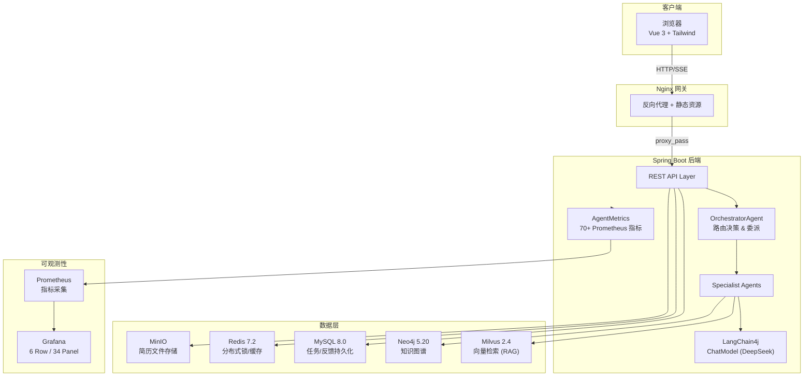

<div align="center">

# ResumAI Agent Platform

**基于多 Agent 编排的智能简历评估系统**

[](backend/pom.xml)
[](backend/pom.xml)
[](backend/pom.xml)
[](frontend/package.json)
[](docker-compose.prod.yml)
[](monitoring/)

</div>

---

## 项目亮点

- **多 Agent 协作编排** — Orchestrator 根据岗位类别动态路由，支持 SERIAL / DAG_CONCURRENT 两种执行模式，Agent 间通过结构化委派实现分工
- **RAG + 知识图谱双通道增强** — Milvus 向量检索提供语义相似证据，Neo4j 构建候选人技能-项目-岗位实体图谱，双通道融合提升评估可解释性
- **LangChain4j 原生集成** — 基于 LangChain4j 1.13.0 的 `ChatModel` 抽象，统一管理 LLM 调用、Embedding、Token 计量
- **70+ 自定义 Prometheus 指标** — 覆盖 Agent 执行链路、工具调用、LLM 经济性、业务漏斗、RAG 质量、系统健康 6 大维度
- **端到端 SSE 实时追踪** — 前端实时展示 Agent 执行 Trace，支持 Span 级别的耗时/Token/状态追踪
- **HR 反馈闭环 RLHF** — 收集人工反馈驱动 Meta-Agent 反思与动态 Skill 进化
- **一键 Docker Compose 部署** — 10 个服务（Backend、Frontend、MySQL、Redis、Neo4j、Milvus、MinIO、Prometheus、Grafana、Etcd）统一编排

---

## 系统架构



---

## 多 Agent 编排设计

| Agent | 职责 | 核心能力 |
|-------|------|----------|
| **OrchestratorAgent** | 入口调度、路由决策、Span 管理 | 根据 `SystemOrchestrationRule` 选择 SERIAL/DAG 模式 |
| **ResumeParserAgent** | PDF 解析、结构化抽取 | PDFBox 文本提取 → 教育/工作/项目/技能实体识别 |
| **TechAgent** | 技术栈审计 | `TechStackAuditSkill` — 评估技术深度与岗位匹配度 |
| **ProjectAgent** | 项目深度分析 | `ProjectDepthSkill` — 评估复杂度、个人贡献、架构决策 |
| **RiskAgent** | 风险识别 | `RiskDetectionSkill` — 时间线矛盾、技能堆砌、夸大描述 |
| **RagasJudgeAgent** | RAG 质量评估 | Faithfulness / Answer Relevancy / Context Precision |
| **FinalReportAgent** | 综合报告生成 | 汇总评分 + 推荐结论 + 面试追问建议 |
| **HumanFeedbackAgent** | 反馈驱动进化 | HR 反馈 → Meta-Agent 反思 → Skill 动态调优 |

**编排流程：**

```
Upload → PDF Parse → [Route Decision] → Tech/Project/Risk (并发或串行)
    → RAG 证据召回 → Neo4j 图谱构建 → LLM 综合评估
    → 生成报告 → HR 反馈 → RLHF 闭环
```

---

## 可观测性体系（70+ 指标 × 6 维度）

| 维度 | 覆盖内容 | 示例指标 |
|------|----------|----------|
| **Agent Execution** | Span 耗时、委派次数、并发度、Skill 调用 | `resumai.agent.span.duration{agent="TechAgent"}` |
| **Tool Calls** | PDF/Milvus/Neo4j 工具粒度的延迟与错误 | `resumai.tool.call.duration{tool_name="milvus_ann"}` |
| **LLM Economics** | Token 输入/输出、单次成本、上下文利用率 | `resumai.llm.cost.per_task` |
| **Business Funnel** | 上传→解析→评估→推荐全链路转化 | `resumai.funnel.time_to_screen{job_category="TECH"}` |
| **RAG Quality** | Faithfulness、Relevancy、空结果率 | `resumai.rag.faithfulness` |
| **System Health** | 连接池、线程池、SSE 订阅、任务缓存 | `resumai.system.executor.active_threads` |

Grafana 预配置 **6 行 34 面板** Dashboard，开箱即用。

---

## 技术栈

### 后端

| 组件 | 版本 | 用途 |
|------|------|------|
| Java | 21 | LTS，Virtual Threads 就绪 |
| Spring Boot | 3.3.1 | Web 框架 + Actuator |
| LangChain4j | 1.13.0 | LLM 抽象层（ChatModel + EmbeddingModel） |
| MyBatis-Plus | 3.5.7 | ORM + 代码生成 |
| Apache PDFBox | 3.0.2 | PDF 文本提取 |
| Neo4j Java Driver | 5.21.0 | 图数据库交互 |
| Milvus Java SDK | 2.4.4 | 向量检索 |
| Redisson | 3.32.0 | 分布式锁 + 缓存 |
| Micrometer | (Spring Boot managed) | Prometheus 指标 |

### 前端

| 组件 | 用途 |
|------|------|
| Vue 3 + Composition API | 响应式 UI |
| TypeScript | 类型安全 |
| Tailwind CSS | 原子化样式 |
| Vite | 构建工具 |

### 基础设施

| 服务 | 版本 | 用途 |
|------|------|------|
| MySQL | 8.0 | 任务/反馈/JD 持久化 |
| Redis | 7.2 | 分布式锁、热数据缓存 |
| Neo4j | 5.20 | 候选人-技能-项目知识图谱 |
| Milvus | 2.4.4 | 简历 Chunk 向量索引 & ANN 检索 |
| MinIO | RELEASE.2024-05-10 | S3 兼容的简历文件存储 |
| Prometheus | 2.53.0 | 指标采集 |
| Grafana | 11.1.0 | 指标可视化 |

---

## 快速开始

### 本地开发

```bash
# 1. 克隆仓库
git clone https://github.com/<your-username>/ResumAI-Agent.git
cd ResumAI-Agent

# 2. 配置环境变量
cp .env.example .env
# 编辑 .env，填写 DEEPSEEK_API_KEY 和数据库密码

# 3. 启动基础设施
docker compose up -d

# 4. 启动后端
cd backend && mvn spring-boot:run

# 5. 启动前端
cd frontend && npm install && npm run dev
```

访问 `http://localhost:5173`

### 生产部署（Docker Compose 全栈）

```bash
# 在项目根目录创建 .deploy.local.env（已被 .gitignore 忽略）
# 填写 ECS 连接信息和所有服务密码

# 一键部署
pip install paramiko
python scripts/deploy_aliyun.py
```

> **安全提示**：所有密码、API Key 通过环境变量注入，仓库内不含任何真实凭据。

---

## API 接口

| Method | Path | 说明 |
|--------|------|------|
| `POST` | `/api/tasks/upload` | 上传 PDF 简历并创建评估任务 |
| `POST` | `/api/tasks` | 通过 JSON 创建评估任务 |
| `GET` | `/api/tasks` | 任务列表 |
| `GET` | `/api/tasks/{traceId}` | 任务详情 |
| `GET` | `/api/metrics` | Dashboard 性能指标 |
| `GET` | `/api/traces/{traceId}` | Agent 执行 Trace |
| `GET` | `/sse/traces/{traceId}` | SSE 实时 Trace 推送 |
| `POST` | `/api/feedback` | 提交 HR 反馈 |
| `GET` | `/api/feedback` | 反馈列表 |
| `GET` | `/api/graphs/{traceId}` | GraphRAG 知识子图 |
| `GET` | `/api/health` | 健康检查 |
| `GET` | `/actuator/prometheus` | Prometheus 指标导出 |

---

## 项目结构

```
ResumAI-Agent/
├── backend/                         # Spring Boot 后端
│   ├── src/main/java/.../agent/
│   │   ├── ai/                      # DeepSeek LLM 客户端 (LangChain4j)
│   │   ├── api/                     # REST Controller + DTO
│   │   ├── config/                  # AgentMetrics (70+指标)、Neo4j、Milvus、LangChain4j 配置
│   │   ├── dao/                     # MyBatis-Plus Mapper
│   │   ├── domain/                  # 实体、枚举、Agent 定义
│   │   └── service/                 # 核心评估编排、RAG 服务、Graph 服务
│   └── pom.xml
├── frontend/                        # Vue 3 前端
│   ├── src/App.vue                  # 单页应用主组件
│   ├── nginx.conf                   # 生产 Nginx 反向代理配置
│   └── package.json
├── monitoring/                      # 可观测性配置
│   ├── prometheus.yml               # Prometheus 采集规则
│   └── grafana/provisioning/        # Grafana 数据源 + Dashboard (34 panels)
├── scripts/                         # 部署运维脚本
│   ├── deploy_aliyun.py             # 一键 ECS 部署
│   └── compose_deploy.py            # Docker Compose 工具库
├── docker-compose.yml               # 本地开发编排
├── docker-compose.prod.yml          # 生产全栈编排 (10 服务)
└── .env.example                     # 环境变量模板
```

---

## 核心设计决策

| 决策 | 选型 | 原因 |
|------|------|------|
| Agent 编排 | 自研 Orchestrator | 比 LangGraph 更轻量，可控性强，支持 DAG 并发 |
| LLM 接入 | LangChain4j ChatModel | 统一抽象，便于切换模型（DeepSeek/OpenAI/Qwen） |
| 向量检索 | Milvus | 高性能 ANN，原生支持大规模向量，云原生架构 |
| 知识图谱 | Neo4j | 成熟的图查询语言（Cypher），强关系建模 |
| 指标体系 | Micrometer + Prometheus | Spring 生态原生支持，零侵入式采集 |
| 前端 | Vue 3 SPA + Tailwind | 快速迭代，组件化，响应式设计 |
| 部署 | Docker Compose | 适合中小规模，一键编排全栈 |

---

## 安全规范

- **`.env`**、**`.deploy.local.env`** 及所有密钥文件已在 `.gitignore` 中忽略
- 仓库内不含任何真实密码或 IP 地址
- 生产环境通过环境变量注入凭据
- Grafana 管理员密码必须通过 `GRAFANA_PASSWORD` 显式设置
- 部署后建议定期轮换所有服务密码

---

## License

MIT License — see [LICENSE](LICENSE) for details.
