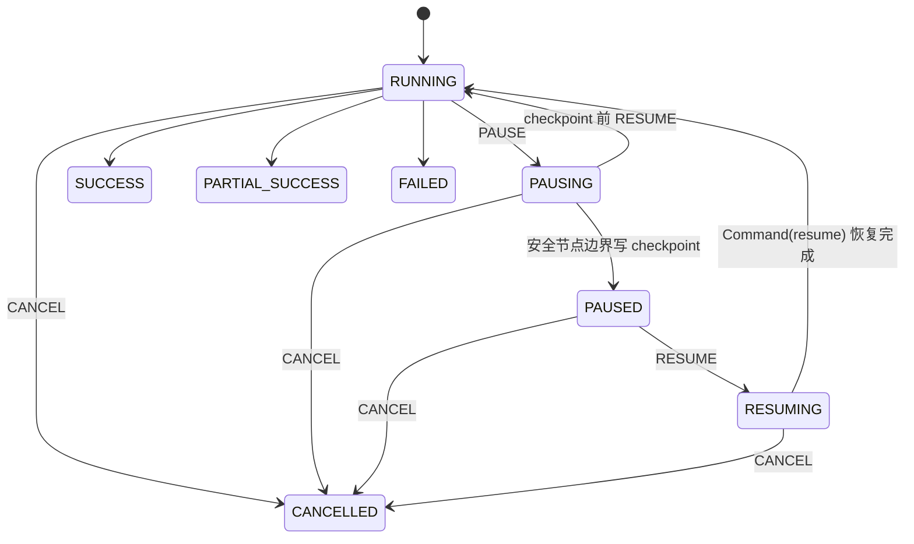

# Agent Runtime：设计不变量与核验清单

本文不是功能宣传页，而是回答面试中最容易被追问的四件事：运行 identity 如何定义、用户中途改意愿如何处理、外部工具失败时是否造假、并发与迟到结果如何隔离。

## 1. 控制面与执行面为什么拆开

Spring Boot 保存业务事实并串行化会话修改：`conversation_session` 的行锁保护 active revision，`client_message_id` 保证消息重试幂等，`expectedRevision` 拦截基于旧页面提交的修改。Python FastAPI/LangGraph 只负责一次 run 的执行和 checkpoint，不自行决定哪个 revision 对用户可见。

一次可写回调必须同时匹配：

```text
conversationId + workflowRunId + revision + traceId + writable task status
```

因此旧 revision、被取消 run 或已终态任务产生的迟到事件不能覆盖当前结果。关键代码入口：

- `backend/.../service/ConversationService.java`：会话行锁、幂等消息、revision 创建
- `backend/.../service/ResumeEvaluationService.java`：任务状态、callback fencing、revision 持久化
- `backend/.../service/InternalWorkflowService.java`：内部事件/结果契约校验
- `workflow/app/run_control.py`：进程内 run registry 与控制状态机
- `workflow/app/main.py`：run/control API、后台任务和 checkpoint 恢复

## 2. side quest 与 revision 的边界

路由采用 rule-first：取消、暂停、继续、明确的 JD/目标/重点/事实变化先走确定性规则；不明确的新想法才使用受约束的模型分类。诸如“不要取消”“别暂停”有显式否定保护，避免关键词误触发。

| intent | 是否改评估 | 处理 |
|---|---:|---|
| `SIDE_QUESTION` / `CLARIFY` | 否 | 回答后继续原 run；不切换 trace |
| `GOAL_CHANGE` | 是 | 新 revision；`resume_parse` 可复用，JD 及下游重跑 |
| `EVALUATION_FOCUS` | 是 | 新 revision；knowledge context 与下游重跑 |
| `CONTEXT_ADD` | 是 | 新 revision；候选人事实相关链路重新核验 |
| `PAUSE/RESUME/CANCEL` | 否 | 进入运行控制状态机 |

revision planner 不是简单相信调用方传入的节点列表。它对 `NODE_DEPENDENCIES` 求下游闭包，并检查旧 checkpoint 中每个节点约定输出是否完整；缓存缺失会 fail closed，把该节点及其下游加入重跑集合。未知节点会触发全图重跑。实现和可执行契约在 `workflow/app/agent_harness.py`。

## 3. pause、resume、cancel 的精确定义



- **Pause** 是协作式节点边界暂停。没有可用的 PostgreSQL saver 时 `/ready` 返回 503，runtime 拒绝声称可安全暂停。
- **Resume** 复用同一 `workflowRunId`、conversation 和 revision；进程重启后可按持久 checkpoint 恢复。
- **Cancel** 取消活动 `asyncio.Task` 并写终态；Java 侧 callback fence 保证同时到达的晚 SUCCESS 不能反转 CANCELLED。
- `PAUSING`、`PAUSED`、`RESUMING` 都是可观察状态。Pause 不等同于从网络层中断已经发给第三方模型的单个 token 流，这是明确边界。

## 4. Agent loop 和证据政策

每个 specialist 只能看到职责 allowlist 中的 tools/Skills。工具循环同时限制：总调用数、检索 query 数、单批 proposal 数、重复 signature、单次 timeout；超限或重复会形成明确 trace，而不是无限自循环。

公开证据的接受条件：

1. 工具调用真实成功，不能是 error/fallback/synthetic；
2. 有可追溯 source URL（时间等非公开事实工具除外）；
3. 候选人查询绑定简历声明的 URL、GitHub handle、owner 或 repository；
4. MCP 返回主体与请求主体一致；
5. 公开活动只能佐证简历，不能替代简历和面试证据。

Exa、Firecrawl、Time 默认注册；GitHub 在 token 存在时按只读 toolset 注册；Tavily、Brave、arXiv、Fetch 是显式 opt-in。provider 发现或执行失败会记录 unavailable。系统没有 GitHub、博客或 StackOverflow 的静态“成功结果”模板。

## 5. 成功、降级与缺失数据

- specialist 与 report 的评分来自真实模型输出和有效证据，生产图没有短简历固定分或关键词评分捷径。
- 任一明确降级进入 `degradedReasons`，有报告也只能是 `PARTIAL_SUCCESS`，不能伪装为 `SUCCESS`。
- DeepSeek key 缺失/调用失败时 fail closed，不返回预制评估。
- Neo4j 没有该 trace 的真实节点时，Graph API 返回 `source: UNAVAILABLE`；不生成候选人 80 分、岗位置信度 0.85 一类模拟图。
- Token 数只有 provider 给出真实 usage 时才计入；无法获得时为 0，而不是用 latency 推算。

## 6. Harness 如何证明这些不是口头约定

`workflow/harness/scenarios.json` 是机器可读的不变量清单，`workflow/run_agent_harness.py` 对每个清单项都有同名实现，并检查清单与代码双向覆盖。当前覆盖 14 个 P0/P1 场景：

- side quest 不终止 run；revision 做最小且完整重跑；显式 JD 是一等输入；
- pause/checkpoint/resume identity；cancel 与 late success 竞争；
- MCP 失败、无 source、主体错绑不能成为证据；
- 工具预算、去重、proposal flood 上限；
- trace identity/parent/call contract；
- 生产图不存在 heuristic scoring；降级报告只能 PARTIAL_SUCCESS。

本地与容器核验：

```bash
python workflow/run_agent_harness.py --output reports/agent_harness/result.json
python -m pytest workflow/tests -q
docker compose -f docker-compose.prod.yml --profile harness run --rm ai-resume-agent-harness
```

面试时不要把 harness 说成“LLM 准确率测试”。它证明的是 runtime 安全契约；模型语义质量仍需独立的标注集、评审协议和线上观测。

## 7. 部署与 schema 边界

当前版本不执行 v5/v6/v7 migration。`docker-compose.prod.yml` 将 MySQL 挂载到全新的 `resumai-mysql-data-conversation-v1`，首次启动由完整 `schema.sql` 初始化；历史 MySQL volumes 不复制、不挂载、不删除。

部署验收至少检查：

```bash
docker compose -f docker-compose.prod.yml config >/dev/null
docker volume inspect resumai-mysql-data-conversation-v1
docker compose -f docker-compose.prod.yml ps
curl -fsS http://127.0.0.1/api/health
docker compose -f docker-compose.prod.yml exec ai-resume-workflow \
  curl -fsS http://127.0.0.1:8090/ready
```

fresh volume 会得到空业务库，这是主动选择，不是无损升级。版本后缀应视为不可变的 schema generation；若首次初始化中断或未来 schema 不兼容，改用新后缀并保留旧/问题卷。需要历史数据时必须另开可回滚的数据导入方案，不能把隐式 migration 恢复到启动脚本。

## 8. 面试官继续追问时应给出的诚实答案

- **“公网 MCP 挂了怎么办？”** 该来源 unavailable；已有一手证据仍可评估，但必须标注降级，不能补造内容。
- **“为什么不用对话直接修改原任务？”** 原地修改无法解释评分基于哪版 JD/事实，也无法可靠隔离迟到回调；immutable revision 让输入、输出和 trace 可审计。
- **“暂停真的是立即吗？”** 取消活动任务是立即控制语义；暂停是安全边界语义，换取可恢复的一致 checkpoint。
- **“最小重跑会不会混用旧结果？”** planner 只复用完整且不在失效闭包内的节点输出；缓存缺失会扩大重跑集合。
- **“Neo4j/RAG 会影响分数吗？”** 只使用实际返回的证据；无结果就是无结果，不用模拟图或固定分补齐。
- **“这就是生产级了吗？”** 当前是单机 Compose 的可验证 runtime 基线；多租户强隔离、多副本 scheduler、秘密托管、灾备与模型质量评测仍是生产化工作。
