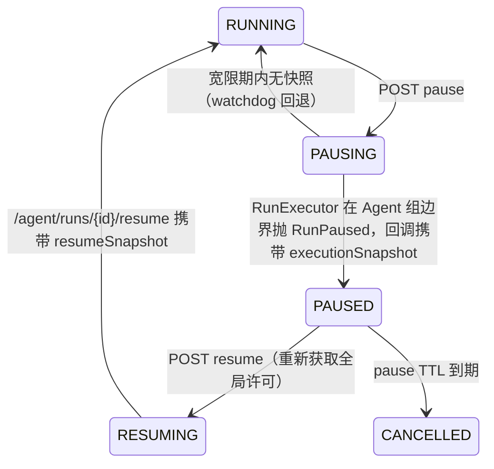

# Agent Runtime：设计不变量与核验清单

回答面试中最容易被追问的四件事：运行 identity 如何定义、用户中途改意愿如何处理、外部依赖失败时是否造假、并发与迟到结果如何隔离。

## 1. 唯一执行链

系统只有一套 Run Runtime：

```text
Spring Boot（队列/许可/状态机/恢复）
  → POST /agent/runs        启动（幂等 by runId）
  → POST /agent/runs/{id}/cancel|pause|resume
  → Python RunExecutor（Coordinator → 并行 Specialist → Report）
  → 事件与最终结果回调 /api/internal/agent-runs/*
```

旧的图执行 Runtime（含其 HTTP 入口与 checkpoint 存储）已彻底删除，没有转发层、没有 deprecated 兼容代码。Python 不再维护第二套持久状态机：`AgentRunRegistry` 只保存活动 asyncio Task 句柄（用于真实取消），持久事实全部在 MySQL/Redis。

关键代码入口：

- `backend/.../service/run/RunQueueService.java`：MySQL 队列、COLLECT 合并、INTERRUPT 取代
- `backend/.../service/run/RunSchedulerService.java`：派发、许可、watchdog、重启恢复
- `backend/.../service/run/RunLifecycleService.java`：状态机、fencing、pause/resume、resume_task 桥接
- `workflow/app/runtime/executor.py`：预算化 Agent 循环、并行组、快照导出/恢复
- `workflow/app/runtime/coordinator.py`：规则优先 + LLM 精化的动态规划

## 2. Run identity 与 fencing

一次可写回调必须匹配 `runId + 非终态状态`；会话可见性由 `conversationId + revision` 约束。旧 revision、已取消或已终态 Run 的迟到结果被 `applyRuntimeResult` 拒绝（仅审计日志）。`CANCELLING` 期间到达的晚 SUCCESS 收敛为 CANCELLED，用户取消永远赢。

## 3. PAUSE / RESUME 精确语义



RunExecutionSnapshot（存 `agent_run.execution_snapshot`，MySQL）：plan、parallelGroups、nextPlanIndex、executedAgents、sharedState、budget、loopGuardState、toolCallLedger、promptVersions、skillVersions、policyId。恢复时已完成 Agent 与已完成 Tool Call 绝不重跑（`test_pause_snapshot_and_resume_skips_completed_agents` 固化该契约）。

PAUSED 释放全局并发额度但保留会话许可（同会话串行不被破坏）；跨服务重启依然可恢复，因为快照在 MySQL 而非进程内。

## 4. 动态规划与并行

Coordinator 规则优先：简单请求（时间线/改写/追问等）直接映射流水线，0 次规划 LLM。复杂请求（完整评估等）在能力目录（capabilities/requires/terminal）上做一次预算内 LLM 精化，输出经过依赖拓扑排序并分组：

```text
[ResumeParser] → [JDAnalysis] → [Tech ∥ Project ∥ Risk] → [Report]
```

并行组内每个 Agent 只读 SharedState 快照视图，输出串行合并；同键冲突写入 `conflicts` 而非覆盖。ReportAgent 是分析链显式终点：它失败时结果只能是标注过的 `PARTIAL_SUCCESS` 降级输出。

### 4.1 Workflow Run 与 LLM 是两个粒度

`RUN_MAX_GLOBAL_CONCURRENT=12` 是唯一的 workflow 执行 permit。Run 入场时由 Java 获取；Python 对同一 Run 的并行 Agent 做引用计数，只有所有存活分支都在等待 LLM 时才释放。任一 LLM 返回后，必须先向 Java 重新获取同一个 Run permit；拿不到就以协程方式继续等待，不能解析结果、执行工具或推进 LangGraph。并行兄弟分支共享这个 permit，不重复占槽。

`LLM_MAX_CONCURRENT=64` 是唯一的供应商 permit，每次 HTTP 调用获取并在响应或异常后释放。conversation permit 只负责同一会话 revision 串行，不是容量槽。当前没有第三套 Agent semaphore。

## 5. 失败、预算与 Loop Guard

- 预算：Run 级 LLM/Tool/Token/超时 + Agent 级迭代/工具/超时。
- LLM：connect/read/total 超时、≤2 次安全重试、指数退避+jitter、熔断、可选 fallback 模型；4xx 类确定性错误不重试。
- Loop Guard：重复工具签名、无新信息观察、重复已完成 Agent、委派环、重复结论/错误 → skip/degrade，状态可随快照迁移。
- 单 Agent 失败：记录 → 保证终端 Agent 仍收尾 → 结果 `PARTIAL_SUCCESS`。

## 6. Context 与 Memory

- Token 估算区分 CJK/ASCII 并用真实 API usage 持续校准（`context.calibrate`）。
- 压缩保留最新请求/目标/约束，Tool Call 与 Result 按 `toolCallId` 严格配对（数量对不上也会报违规）；CompactionRecord 真实记录 messageId 范围并落库 `context_snapshot`。
- JD、当前简历、知识库三类 RAG 由独立 Retrieval 层在生成前执行，结果进入 `[RAG上下文]`，不进入 Provider 工具目录。
- Memory 只保留两层岗位业务记忆：`RECENT_CASE`（同岗位脱敏案例，TTL 30 天、最多召回 2 条）和 `JOB_PROFILE`（按 `jobCategory + JD fingerprint` 聚合的岗位画像，TTL 180 天、召回 1 条）。两者都不保存用户对话、用户偏好、候选人 PII、完整简历、完整报告或录用结论；失败/取消 Run 不写。TTL 来自 `harness/run_business_memory_ttl_experiment.py` 对 100 份简历、15 个岗位 cohort 的受控时间回放。

## 7. 证据政策

结论必须携带证据（简历行/JD/工具结果/记忆）；ReportAgent 只采纳能由当前 Run 原始材料支撑的内容，无法支撑的结论写入 missingEvidence、风险或面试追问；Benchmark 期望标签从不进入执行链；DeepSeek 不可用时失败关闭，不返回预制评估。
