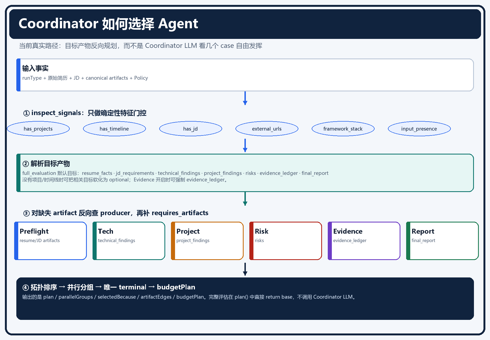
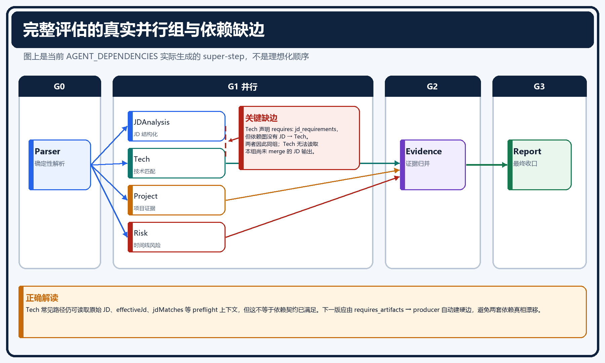
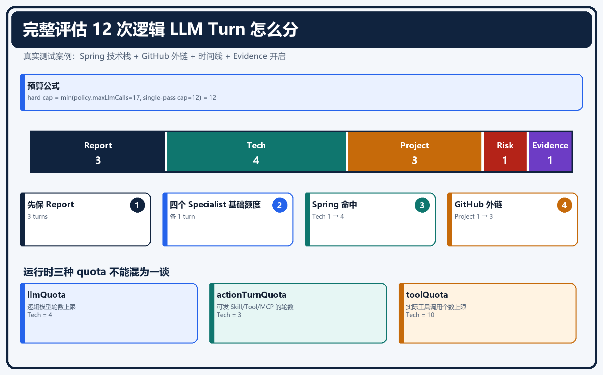
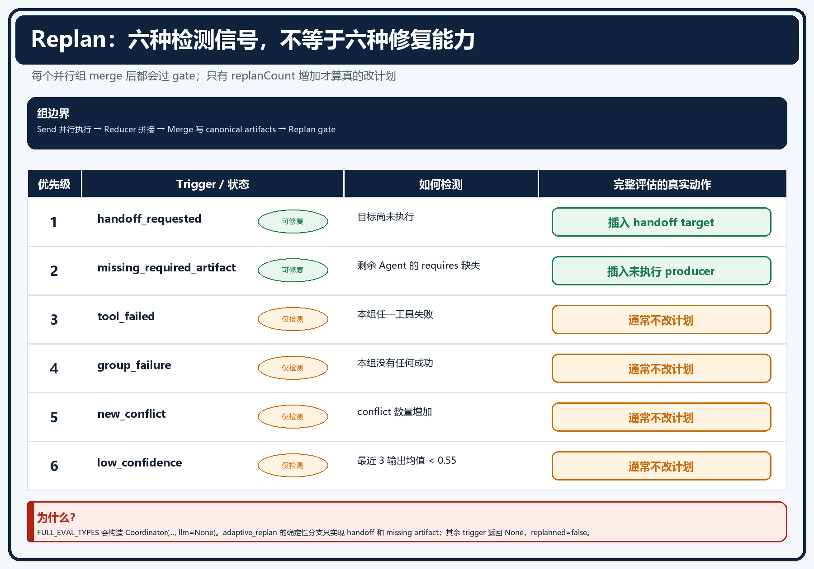
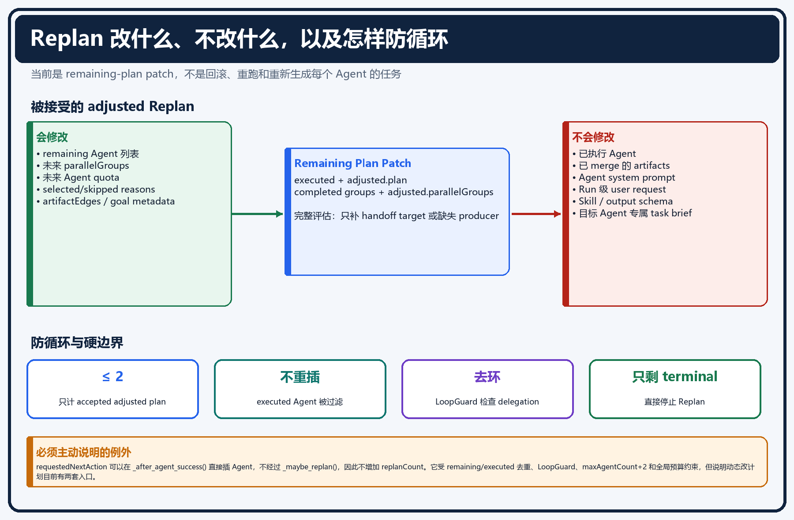
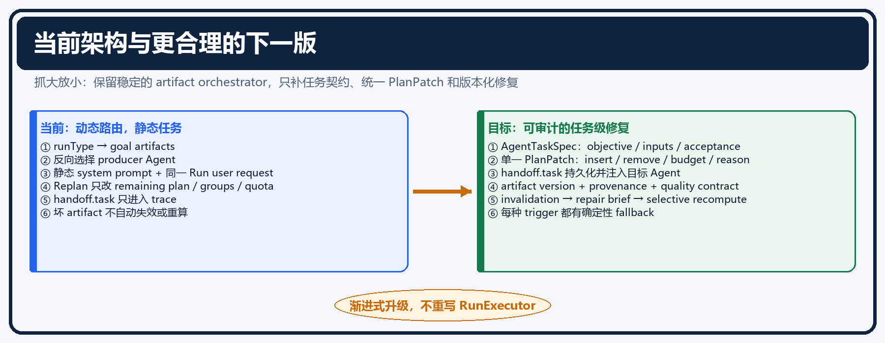

# Coordinator 选 Agent、预算与 Dynamic Replan：基于真实代码的面试级说明

> 适用代码基线：当前 `main` 工作树（2026-08-08）。
> 本文只描述当前仓库能够从源码证明的行为。凡是“设计上希望如此、但当前代码尚未做到”的地方，都会明确标成实现债，不把目标架构冒充现状。
> 当前业务 Agent 只有六个：`CoordinatorAgent`、`TechAgent`、`ProjectAgent`、`RiskAgent`、`EvidenceAgent`、`ReportAgent`。简历解析与 JD 召回/归一化是 Runtime 的确定性 preflight，不是 Agent。

---

## 0. 先给面试官的 60 秒答案

当前系统不是让一个 Coordinator LLM 自由决定所有事情，而是一个**以产物依赖为核心的确定性编排器，外加少量可选 LLM refine/replan 能力**。

1. **怎么选择 Agent？** 先由 `runType` 得到本次必须产出的 artifact，再根据简历、JD 和已有 artifact 提取确定性信号；然后从缺失 artifact 反向查找生产者 Agent，补齐它们依赖的 artifact，最后做拓扑排序和并行分组。完整评估会直接返回这份确定性计划，不调用 Coordinator LLM。
2. **怎么决定 LLM 轮数和工具轮数？** 不是 Memory 决定，也不是 Coordinator Prompt 中写死每人跑几轮。静态 Agent 配置、全局 Policy 和 Coordinator 的 `budgetPlan` 三层共同给出上限；Runtime 再取交集，分别限制逻辑 LLM turn、允许调用工具的 action turn 和实际 tool call 次数。完整评估总 LLM 计划上限会压到 12。
3. **什么时候 Replan？** 每个并行组 merge 后都会经过 Replan gate，但经过 gate 不等于真的改了计划。它按优先级检查 handoff、缺失依赖产物、工具失败、整组失败、新冲突、低置信度。完整评估为了不再消耗 Coordinator LLM，只对 handoff 和缺失产物做确定性补丁；另外四种信号当前通常不会改变计划。
4. **会不会无限 Replan？** 被 `_maybe_replan()` 接受的计划调整最多两次；已执行 Agent 不允许重新插入，只有 terminal 剩余时不再 Replan，委派有环路保护，`replanCount` 会进入 snapshot，宕机恢复后不会清零。
5. **Replan 会不会给每个 Agent 重写任务？** 不会。它只改剩余 Agent 列表、并行组和预算。Agent 的职责仍来自静态 `AgentDefinition`、system prompt、Skill、可见 SharedState 和工具目录。当前没有真正的 `agentTaskMap`，handoff 里的 `task` 也只写 trace，没有注入目标 Agent 的 user message。

如果面试官问“这是不是一个完全自治的 Coordinator Agent”，准确回答是：

> 不是。当前是 deterministic artifact orchestrator with optional LLM refinement。动态的是路由与资源分配，不是动态生成 Specialist 的业务职责。

---

## 1. 先消除一个最容易说错的概念：Coordinator 有两层含义

### 1.1 Coordinator 编排子系统

`Coordinator` 是 `coordinator.py` 里的普通 Python 类，负责：

- 识别输入信号；
- 解析目标 artifact；
- 选择 artifact 生产者；
- 排依赖和并行组；
- 分配预算；
- 必要时调整剩余计划。

这些逻辑绝大多数不需要 LLM。

### 1.2 CoordinatorAgent 这个逻辑 Agent 身份

`AgentRegistry` 里确实注册了 `CoordinatorAgent`，它有 planning/routing/replanning capability，也有 system prompt。但这不代表每次 Run 都会执行一次 Coordinator 模型调用。

当前完整评估的关键代码是：

```python
if (self.is_simple(run_type) or self.llm is None
        or run_type in FULL_EVAL_TYPES):
    return base
```

也就是说：

- `full_evaluation`、`jd_evaluation`、`backend_eval`、`agent_eval`：直接使用确定性 artifact plan；
- `timeline_check`、`risk_check` 等 simple runType：也直接使用确定性 plan；
- 只有既不属于 full-eval、也不属于 simple，并且注入了 LLM 的 runType，才可能进入 `_refine()`。

所以，Coordinator system prompt 里的 case 列表**不是完整简历评估选择 Agent 的真实依据**。它只服务于少数可进入 LLM refine 的路径。

还有一个应主动承认的代码问题：`coordinator.py` 顶部注释仍写着“Full evaluations use LLM-based planning”，但 `plan()` 的真实分支明确对 full-eval 直接返回 base。这是过期注释，面试时必须以执行代码为准。

---

## 2. 问题一：Coordinator 到底怎么确定使用哪些 Agent？

## 2.1 真实决策链

[](assets/coordinator-guide/01-agent-selection-flow.png)

*图 1：图片本身带完整边框；点击可打开 1800px 高清原图。*

```text
runType
  + resume/JD/已有 artifact
        ↓
inspect_signals() 提取确定性信号
        ↓
resolve_goal_artifacts() 得到 required / optional artifacts
        ↓
检查 canonical artifact store 中哪些已经存在
        ↓
对缺失 artifact 反向查 producer Agent
        ↓
递归补 producer 的 requires_artifacts
        ↓
optional gate / forced agent / evidence policy
        ↓
依赖拓扑排序
        ↓
并行分组
        ↓
保证唯一 terminal Agent
        ↓
生成 budgetPlan
```

这个流程的源码入口是：

- `workflow/app/runtime/coordinator.py:383`：`plan_from_artifacts()`；
- `workflow/app/runtime/coordinator.py:525`：`plan()`；
- `workflow/app/runtime/agents.py:32`：Agent capability/artifact 注册表。

## 2.2 第一步：runType 先定义“最终必须交付什么”

完整评估的默认目标不是“跑六个 Agent”，而是下列逻辑 artifact：

```text
resume_facts
jd_requirements
technical_findings
project_findings
risks
evidence_ledger
final_report
```

这是一个重要的架构选择：**目标是 artifact，不是 Agent 名单**。

为什么这样更合理？因为如果未来增加一个更便宜的 `StaticTechMatcher`，只要它也声明能生产 `technical_findings`，Planner 就可以在不改业务目标的前提下选择新的 producer。反过来，如果目标直接写成固定 Agent pipeline，就无法表达“已有 artifact 可以复用”和“同一 artifact 可以有多个 producer”。

## 2.3 第二步：输入信号决定哪些维度有意义

`inspect_signals()` 不是 LLM 分类，它读取简历文本、JD 和已有 artifact，得到例如：

| 信号 | 当前判定依据 | 影响 |
|---|---|---|
| `has_projects` | 结构化 projects 或项目关键词/GitHub | 是否保留/强制 `ProjectAgent` |
| `has_timeline` | experiences 或日期/经历模式 | 是否保留 `RiskAgent` |
| `has_jd` | JD 文本或 JD artifacts | 是否需要 JD/Tech 路径 |
| `has_external_urls` | HTTP、GitHub、Gitee URL | 是否给 Project 更多研究预算 |
| `is_sparse_resume` | 120–800 字符，且有效行和项目/时间线不足 | 软化不受输入支持的目标 |
| `has_framework_stack` | Spring、React、K8s、Kafka、LangGraph 等 | 增加 Tech action turns |
| `has_microsoft_stack` | .NET、Azure、SQL Server 等 | 增加 Tech 文档检索预算 |
| `evidence_enabled` | Policy 中 EvidenceVerification | 是否强制 EvidenceAgent |
| `needs_parse` | 有原始简历但没有 `resume_facts` | 是否由 deterministic preflight 补齐解析产物 |

这些信号只是路由启发式，不是语义事实。例如，正则看到日期不代表履历必然存在冲突；它只代表时间线审查有输入基础。

## 2.4 第三步：required 与 optional 不是一成不变

`resolve_goal_artifacts()` 会根据输入软化或强制目标：

- 没有项目线索：`project_findings` 从 required 移到 optional；
- 没有时间线：`risks` 从 required 移到 optional；
- Evidence policy 关闭：`evidence_ledger` 移到 optional；
- 完整评估、有项目、且不是过于稀疏：强制 `project_findings`；
- Evidence 开启且不是过于稀疏：强制 `evidence_ledger`；
- 稀疏简历只保留有输入支撑的维度，但仍尽可能维持完整评估表面。

这里要避免一句错误表述：

> “Coordinator 根据 Prompt 觉得 ProjectAgent 有用，所以选了它。”

当前真实表述应当是：

> `runType` 要求 `project_findings`，输入又命中了 `has_projects`，而 `ProjectAgent` 注册为该 artifact 的 producer，所以反向依赖规划选择它。

## 2.5 第四步：从 artifact 反向查 producer

Agent 的 artifact contract 来自 `AgentDefinition`：

| Agent | requires_artifacts | produces_artifacts |
|---|---|---|
| CoordinatorAgent | 无 | `execution_plan`（控制面，不进入 Specialist 并行组） |
| TechAgent | `resume_facts` | `technical_findings` |
| ProjectAgent | `resume_facts` | `project_findings` |
| RiskAgent | `resume_facts` | `risks` |
| EvidenceAgent | `resume_facts` | `evidence_ledger` |
| ReportAgent | 无硬 requires | `final_report` |

`resume_facts / parsed_resume / jd_requirements` 在 Agent 调度前由 preflight 写入 canonical artifact store。它们是 Planner 的输入产物，不再通过额外 Agent 生产。

Planner 的核心循环是：

1. 从 missing artifact 队列取一个目标；
2. `registry.producers_of(artifact)` 找 producer；
3. 多个 producer 时优先 cost 较低者；
4. 选择 producer 后，把其 `requires_artifacts` 放回 missing 队列；
5. 记录 `selectedBecause` 和 `artifactEdges`；
6. 没有 producer 时写入 `skippedBecause[artifact:xxx]`，而不是假装目标已完成。

`TASK_PIPELINES` 仍然存在，但只是 artifact planner 产生空计划时的最后 fallback，不是主路由。

## 2.6 第五步：依赖排序和并行分组

当前软依赖是：

```text
TechAgent ───────┐
ProjectAgent ────┼─> EvidenceAgent -> ReportAgent
RiskAgent ───────┘
```

`_parallel_groups()` 只有同时满足下列条件才把 Agent 放入同组：

- Agent 在 `PARALLELIZABLE` 中；
- 前一组成员也都可并行；
- Policy 开启 `parallelSpecialists`；
- 当前 Agent 与组内 Agent 没有依赖边。

因此，典型上传路径的**当前真实分组**是：

```text
[deterministic preflight：parse_resume + JD retrieve/normalize]
[TechAgent, ProjectAgent, RiskAgent]
[EvidenceAgent]
[ReportAgent]
```

[](assets/coordinator-guide/02-real-parallel-groups.png)

*图 2：preflight 先准备简历/JD 输入，随后三个 Specialist 同组并行；Evidence 与唯一 ReportAgent 依次消费已经 merge 的上游产物。*

Tech 不需要等待另一个 JD Agent。它在组开始前读取 preflight 已经写好的 `resumeFacts`、`effectiveJd`、`jdMatches` 和 `jdRequirements`。如果本次没有有效 JD，Tech 仍可只基于简历证据做技术评估；文档不能虚构一条不存在的 Agent 依赖边。

## 2.7 Coordinator 当前究竟动态了什么？

真实动态项：

- 是否需要 Tech/Project/Risk/Evidence；
- 已有 artifact 是否可复用；
- 剩余 Agent 的顺序；
- 哪些 Specialist 可以并行；
- 每个 Agent 的预算上限；
- Replan 时是否插入缺失 producer 或 handoff target。

当前不动态的项：

- Agent 的业务职责；
- 每个 Agent 的 system prompt 主体；
- 每个 Agent 独立的任务说明；
- Agent 输出 schema；
- Agent 允许的 Skill/Tool 基础清单。

所有 Specialist 保留同一个 Run 级原始请求，同时接收由
`AgentDefinition.task_prompt` 确定的独立任务：

```text
[原始请求]
[本Agent任务]
[当前目标]
```

例如：

```text
[原始请求]
请完整评估这份简历。

[本Agent任务]
根据当前简历、目标JD和技术知识库，判断技术主张是否有可定位证据；
重点评估技术深度、生产工程经验和JD技术缺口。
```

任务不是 Coordinator 临时生成的自然语言，也不额外消耗一次 LLM；它由受版本控制的
Agent 定义确定。Coordinator 只选择 Agent 和预算，Runtime 在组装 Prompt 时注入对应任务。

---

## 3. 问题二：Coordinator 怎么确定每个 Agent 的 LLM round、tool-call round？

## 3.1 先把三个经常混淆的计数器分开

| 字段 | 限制什么 | 一个 LLM turn 能否消耗多个 |
|---|---|---|
| `llmQuota` | 该 Agent 最多有多少个逻辑模型 turn | 不适用，它本身就是 turn 数 |
| `actionTurnQuota` | 这些 LLM turn 中，最多多少轮允许模型发起 Skill/Tool/MCP action | 一轮只计 1 个 action turn |
| `toolQuota` | 该 Agent 最多实际执行多少个工具调用 | 同一 action turn 可发多个 tool call，因此可能一次消耗多个 |

例子：TechAgent 某一轮同时请求 `load_skill`、`resolve_library` 和 `query_docs`：

```text
LLM turn       +1
action turn    +1
tool call      +3
```

因此 `actionTurnQuota=2` 绝不等于 `toolQuota=2`。

另外还有 provider retry、JSON repair、全局 token/cost/time ledger。`llmQuota` 是 Agent 逻辑轮次上限，底层 provider 的重试尝试由全局账本另行约束，不应把二者混成一个数字。

## 3.2 三层约束共同决定实际轮数

### 第一层：AgentDefinition 静态上限

例如：

- TechAgent：`max_iterations=2`, `max_tool_calls=10`；
- ProjectAgent：`max_iterations=2`, `max_tool_calls=10`；
- RiskAgent：`max_iterations=2`, `max_tool_calls=4`；
- EvidenceAgent：`max_iterations=2`, `max_tool_calls=6`；
- ReportAgent：`max_iterations=2`, `max_tool_calls=4`。

它表达“这个 Agent 天生最多允许多深”，不是本次 Run 一定会消耗的次数。

### 第二层：Policy 全局硬预算

balanced policy 当前运行边界包括：

```text
maxLlmCalls              = 17（兼容归一化后为 17..18）
terminalLlmReserve       = 3
maxToolCallsPerRun       = 20
maxToolCallsPerAgent     = 10
maxIterationsPerAgent    = 2
maxCostCny               = 1.0
maxTotalTokens           = 120000
```

所有 Agent 即使各自 quota 还有余额，也不能突破 Run 级 LLM、工具、token、成本和超时上限。

### 第三层：Coordinator 本次 `budgetPlan`

`_budget_plan()` 根据计划中的 Agent、输入信号和剩余全局预算，给每个 Agent 分配：

```json
{
  "TechAgent": {
    "llmQuota": 4,
    "actionTurnQuota": 3,
    "toolQuota": 10
  }
}
```

Runtime 最终会取静态定义、Policy 和本次 quota 的交集，而不是只相信 Coordinator 给的数字。

## 3.3 完整评估的预算算法

对于 `FULL_EVAL_TYPES`，Planner 设置 `single_pass_evaluation=true`，并执行：

```python
hard_cap = min(policy.maxLlmCalls, 12)
```

然后按下列顺序分配：

1. 先给 terminal ReportAgent 预留 3 个逻辑 turn；
2. Tech、Project、Risk、Evidence 每个先给 1；
3. 识别到 framework/Microsoft stack，Tech 最多扩到 4；
4. 有外部 URL，Project 最多扩到 3；
5. 如果仍有余额，再给一轮 Skill 激活空间；
6. parse/JD preflight 不分配 LLM quota，因为它们不是 Agent turn。

最后一轮必须为结构化最终输出保留，因此：

```python
actionTurnQuota <= llmQuota - final_turn_reserve
```

普通 Agent 至少保留 1 个 final turn；Report 逻辑上最多保留 2 个用于 final/repair。

## 3.4 一个可以当场手算的真实案例

[](assets/coordinator-guide/03-budget-allocation.png)

*图 3：上方堆叠条是 12 次逻辑 turn 的完整去向；下方把三种 quota 分开，避免面试时混答。*

仓库测试使用的场景是：

```text
runType = full_evaluation
needs_parse = true
resume = 150 个字符 + github.com/user + 2022-2024
JD = Java Spring
evidenceVerification.enabled = true
```

信号：

```text
needs_parse        = true
has_external_urls  = true
has_timeline       = true
has_framework_stack= true
evidence_enabled   = true
```

计划是：

```text
deterministic preflight
[TechAgent, ProjectAgent, RiskAgent]
[EvidenceAgent]
[ReportAgent]
```

预算手算：

```text
完整评估 hard cap = min(17, 12) = 12

Report reserve 3                       剩 9
Tech/Project/Risk/Evidence 各 1         剩 5
Spring 命中 framework：Tech 1 -> 4      剩 2
GitHub URL：Project 1 -> 3               剩 0
```

最终计划额度：

| Agent | llmQuota | actionTurnQuota | 解释 |
|---|---:|---:|---|
| Tech | 4 | 3 | Skill/文档检索最多三轮，最后一轮输出 |
| Project | 3 | 2 | 外部证据 action 最多两轮，最后一轮输出 |
| Risk | 1 | 0 | 直接输出，无 progressive Skill 轮次 |
| Evidence | 1 | 0 | 直接输出，无 progressive Skill 轮次 |
| Report | 3 | 1（计划值） | 一个 ReportAgent 的完整报告与必要 schema repair，不是三个 Report 分支 |

总和是 12。

工具额度会再按 Run 总预算和 Agent 数量均分，Tech/Project 在命中特定场景时放大到 10；运行时还要与各自 `AgentDefinition.max_tool_calls` 取最小值。

## 3.5 Runtime 怎么真正执行这些 quota？

Runtime 为每个 Agent 计算：

```python
max_decision_iterations = min(
    definition.max_iterations,
    policy.maxIterationsPerAgent,
)

agent_llm_quota = budgetPlan[agent]["llmQuota"]

max_action_turns = min(
    runtime_action_ceiling,
    budgetPlan[agent]["actionTurnQuota"],
    agent_llm_quota - final_turn_reserve,
)
```

循环中：

- 模型提出至少一个合法 action tool 时，`action_turns += 1`；
- 每个真正执行的 Skill/Tool/MCP 分别令 `agent_tool_calls += 1`；
- action turn 耗尽或到最后 turn 时，只暴露 terminal function，强制提交结构化输出；
- schema 不合法时，可在剩余额度和全局账本允许下进入 repair；
- 任意时刻达到 Run 全局 LLM/tool/token/cost/time 上限，都不能继续借额度。

确定性 pre-step 也会逐个消耗 `agent_tool_calls`。例如 Agent 在第一次模型调用前执行 `check_timeline`，它不消耗 action turn，但会消耗一次 tool call。

预先检索并注入 prompt 的 RAG 是 context preparation，不是模型主动发起的 action turn。不要把“RAG retrieval 次数”和“tool-call round”混在一起回答。

## 3.6 轮数是不是由 Memory 决定？

完整评估中，不是。

Coordinator 会从 Memory hit 中筛选 `runtime_strategy` / `execution_profile`，并能解析历史各 Agent 的 LLM 使用比例。但 full-eval 在 `_budget_plan()` 的 single-pass 分支提前返回，历史比例不会参与上述 12 次预算分配。

只有 generic、非 single-pass 预算路径才会把历史成功执行比例加入权重：

```python
weights[agent] += 4.0 * history_ratio
```

即使在该路径，Memory 也只是影响**额度优先级**，不能突破全局 hard cap，更不会直接命令“Tech 跑三轮、Risk 跑两轮”。

普通 episodic/semantic/procedural memory 内容影响的是 Agent 上下文和判断，不决定本次循环上限。

## 3.7 当前预算实现中应主动承认的债

### 债 1：Risk/Evidence 的 Skill 在代表性完整评估中实际上无法 progressive load

两者得到 `llmQuota=1`、`actionTurnQuota=0`，唯一一轮必须直接 final。Skill metadata 即使进入上下文，模型也没有下一轮去 `load_skill -> consume instructions -> final`。

准确表述是“预算没有给它加载 Skill 的机会”，而不是“Agent 自主判断 Skill 不需要加载”。

### 债 2：计划 quota 与底层 provider attempt 不是完全一一对应

JSON repair 和 provider retry 会让物理 provider attempt 与“逻辑 Agent turn”不完全一一对应。安全性最终依赖全局 provider-call ledger，而不只是 `sum(llmQuota)`。

当前生产路径只有一个 `ReportAgent`，一次提交完整结构化报告。给 Report 预留多个 turn 是为了合法输出和 schema repair，不表示存在多个 Report Agent 或分段架构。

---

## 4. 问题三：什么时候触发 Replan？

## 4.1 “经过 Replan 节点”不等于“发生了 Replan”

LangGraph 当前的组级流程是：

```text
dispatch
  -> Send(agent...) 并行执行
  -> reducer 拼接 agent_results
  -> merge 按原 dispatch 顺序写入 canonical state
  -> replan gate
  -> dispatch 下一组 / finalize
```

`merge` 每次都会 `Command(goto="replan")`。`replan` 节点会记录：

```python
before = self.replan_count
await self._maybe_replan(...)
replanned = self.replan_count > before
```

所以 trace 中：

```text
langgraph.replan, replanned=false
```

只表示“检查过但没改计划”，不能统计为一次 Dynamic Replan。

## 4.2 Replan gate 的前置条件

以下任一成立会直接跳过：

- 当前 runType 属于 simple rule type；
- `replan_count >= 2`；
- 剩余计划里已经没有 non-terminal Agent，只剩唯一 terminal `ReportAgent`。

这意味着 Evidence merge 后如果只剩 Report，通常不会再 Replan，因为已经没有可调整的中间执行空间。

## 4.3 六种触发信号及严格优先级

代码是 `if/elif`，同一轮只选择最高优先级的一个：

| 优先级 | trigger | 当前检测方式 |
|---:|---|---|
| 1 | `handoff_requested` | Agent 请求尚未执行的目标 Agent |
| 2 | `missing_required_artifact` | 剩余 Agent 的 `requires_artifacts` 不在 canonical state |
| 3 | `tool_failed` | 本并行组任一 deterministic/native tool 失败 |
| 4 | `group_failure` | 本组没有任何 Agent 成功 |
| 5 | `new_conflict` | 当前 conflict 数比组开始前增加 |
| 6 | `low_confidence` | 最近最多三个 AgentOutput 的平均 confidence < 0.55 |

两个容易被追问的细节：

1. `group_ok` 是 **any success**，不是 all success。三个并行 Agent 中一个成功、两个失败，`group_ok` 仍是 true；失败仍会写 failure/degraded 状态，但不会命中 `group_failure`。
2. `low_confidence` 使用的是 Agent 自报 confidence 的简单均值，它是启发式信号，不是校准后的质量证明。
3. `missing_required_artifact` 这个名字比实际检查范围更宽。中途 gate 检查的是“剩余 Agent 的 `requires_artifacts`”，不是重新检查全部 `goalArtifacts`；而 Evidence 当前只硬要求 `resume_facts`、Report 没有硬 requires，因此 Specialist 产物为空不一定在这里触发 missing repair。

## 4.4 六种信号都会在完整评估里真正改计划吗？

不会。这是当前实现最需要诚实说明的地方。

[](assets/coordinator-guide/04-replan-trigger-matrix.png)

*图 4：绿色是能真正修改 full-eval 计划的 deterministic repair；橙色是会检测但通常只得到 `replanned=false` 的信号。*

完整评估在 `_maybe_replan()` 中主动构造：

```python
replan_coordinator = Coordinator(registry, policy, llm=None)
```

因此 `adaptive_replan()` 只能执行两种 deterministic repair：

### 能真正改计划

1. **handoff**：把未执行 target 插到 terminal 前；
2. **missing artifact**：查 artifact producer，把尚未执行的 producer 插到 terminal 前。

### 会被检测，但通常不会改计划

- `tool_failed`；
- `group_failure`；
- `new_conflict`；
- `low_confidence`。

对后四种触发，`llm=None` 分支没有对应的确定性变换，最终返回 `None`，`replan_count` 不增加，`replanned=false`。

它们仍可能通过其他机制影响结果，例如：

- Agent failure 写入 `failure_notes` / `degraded_reasons`；
- terminal tail 被补回；
- conflict arbitration 把证据不足项标成 uncertain；
- 最终 Run 可能是 partial/degraded。

但不能把这些结果说成“Coordinator 已经动态重规划了”。

在非 full-eval、非 simple 且 Coordinator 有 LLM 的路径中，`adaptive_replan()` 才会把 trigger、已执行 Agent、剩余计划、缺失 artifact、handoff target、SharedState 摘要和失败记录发给 Coordinator LLM，让它返回新的 `plan` 和 `reason`。

---

## 5. 怎么防止多次 Replan、循环和预算失控？

[](assets/coordinator-guide/05-replan-boundaries.png)

*图 5：中间是 remaining-plan patch；左右分别是会修改和不会修改的状态，底部单独标出绕过 `replanCount` 的动态插入入口。*

## 5.1 被接受的 Replan 最多两次

```python
if self.replan_count >= 2:
    return
```

只有 `adaptive_replan()` 返回了非 `None` 的 adjusted plan，才会：

```python
self.replan_count += 1
```

单纯检测到 trigger、执行 gate 或输出 `replanned=false` 都不计数。

## 5.2 已执行 Agent 不重新插入

- handoff target 已执行：拒绝；
- LLM replan 返回 plan 时：过滤所有 `executed` Agent；
- missing producer：只插入不在 `executed`、也不在 remaining 的 producer；
- `_finalize()` 去重 Agent，并保证唯一 terminal。

因此当前 Replan 是“修剩余计划”，不是回滚并重跑历史节点。

## 5.3 委派环路保护

Runtime 通过 `LoopGuard.check_delegation(source, target)` 检查委派边，同时明确拒绝目标为已执行 Agent。这样可以挡住 A -> B -> A 式回环。

## 5.4 没有可调整中间节点时停止

只剩 terminal Agent 时，Replan gate 直接返回。这样避免为了低 confidence 或 conflict 在最终收口前无限插节点。

## 5.5 连续失败走降级收口

两个连续并行组完全失败后，Runtime 标记 `consecutive_failures` 并确保 terminal tail，而不是不断让 Coordinator 猜新的组合。

## 5.6 全局硬预算仍然是最后防线

即使计划结构发生变化，也不能越过：

- Run 最大 LLM/provider calls；
- Run/Agent tool calls；
- token/cost budget；
- run timeout；
- Agent timeout；
- LoopGuard。

Replan 只能重新分配未消耗的机会，不能创造新预算。

## 5.7 宕机恢复不会重置 Replan 次数

`export_snapshot()` 保存 `replanCount` 和 `_arbitrated`；`_restore_snapshot()` 恢复它们。LangGraph 在组边界持久化 graph checkpoint，同时 execution snapshot 保留 RunExecutor 内部可变状态。

因此如果宕机前已经成功 Replan 一次，恢复后 `replan_count=1`，还剩一次，不会从 0 重新开始。

## 5.8 一个必须说明的例外：requestedNextAction 还有一条直接插入路径

`_after_agent_success()` 看到 `output.requestedNextAction` 时，可以直接把目标 Agent 插入 `parallel_groups`，前提是：

- 目标 Agent 已注册；
- 不在 remaining；
- 不在 executed；
- 委派没有触发 LoopGuard；
- 总 Agent 数没有超过 `maxAgentCount + 2`。

这条插入不通过 `_maybe_replan()`，因此本身不增加 `replan_count`。第一类 `handoff` 又会被转换成 `requestedNextAction`，同时设置 `_pending_handoff`，目前两条机制存在重叠。

所以最严谨的面试回答是：

> “最多两次”只严格约束 `_maybe_replan()` 接受的 adjusted plan，不等于所有运行期 Agent 插入最多两次。直接 `requestedNextAction` 插入另受 LoopGuard、executed/remaining 去重、Agent 数量和全局预算限制。

这是实现债。理想状态应把所有动态插入统一收口到一个 `PlanPatch` 入口，让计数、审计、预算重算和去环规则只有一套。

---

## 6. Replan 会给每个 Agent 重新安排任务吗？

## 6.1 短答案

不会重新安排“语义任务”，只会调整“执行谁、何时执行、给多少预算”。

## 6.2 Replan 当前真正修改的状态

被接受后，它会更新：

```python
parallel_groups = completed_prefix + adjusted["parallelGroups"]
plan = executed + adjusted["plan"]
budget_plan[agent] = adjusted quota
plan_meta = selected/skipped/artifact edges/goal/budget
```

所以它能：

- 加入一个缺失 artifact producer；
- 加入一个 handoff target；
- 在 LLM replan 路径中重排剩余 Agent；
- 重新生成未来并行组；
- 更新未来 Agent 的 quota。

## 6.3 Replan 当前不会修改的东西

- 已执行 Agent；
- 已经 merge 的 canonical artifacts；
- 已有 AgentOutput；
- Specialist 的 system prompt；
- Run 级 user request/current goal；
- Skill 定义；
- Agent 输出 schema；
- 一个专门面向目标 Agent 的 task brief。

`HandoffRequest` 虽然有：

```json
{
  "to": "RiskAgent",
  "reason": "发现时间线冲突",
  "task": "核对 2022-2023 的重叠经历"
}
```

但当前代码只把 `task` 截断后写进 `agent.progress` trace。真正用于调度的是 `to`；`task` 没有进入目标 Agent 的 prompt，也没有形成 durable task artifact。

因此把它宣传成“精细任务委派”是不准确的。它现在更像**带审计描述的 Agent 路由提示**。

## 6.4 Replan 是否会修正一个已经合并的坏 artifact？

不会自动修正。

当前 Replan 倾向于保留已完成结果，且禁止重跑 executed Agent。它没有：

- artifact invalidation；
- producer retry generation；
- claim-level rollback；
- 新旧 artifact version arbitration；
- compensating node。

所以“artifact 存在但语义质量很差”和“artifact 完全缺失”是两回事。当前 missing check 主要看 canonical key 是否存在/非空；Run 结束时甚至把“producer 已执行但产物为空”视为 attempted，以避免误报 closure failure。这能提高流程稳定性，但不能证明语义完整性。

如果要支持真正的质量修复，目标架构应允许：

```text
invalidate artifact version
  -> schedule producer retry with repair brief
  -> write new version
  -> evidence arbitration
  -> downstream selective recomputation
```

---

## 7. 三个问题串起来看：一个完整 Run 的真实示例

假设用户上传一份包含 Java/Spring 项目、GitHub 链接和工作时间线的简历，并提供一段短 JD。

### 7.1 初始规划

1. `runType=full_evaluation` 映射出七类目标 artifact；
2. preflight 用确定性解析生成 `resume_facts / parsed_resume`；
3. 用户 JD 或 JD 库召回结果被确定性归一化为 `effectiveJd / jdRequirements`；
4. 项目、时间线、Evidence 开关分别保留 Project、Risk、Evidence；
5. Tech 读取 preflight JD 上下文；
6. Report 作为唯一 terminal。

按当前 `AGENT_DEPENDENCIES`，会得到：

```text
preflight [parse_resume, JD retrieve/normalize]
G0 [Tech, Project, Risk]
G1 [Evidence]
G2 [Report]
```

### 7.2 预算

12 个 full-eval 逻辑 LLM turn 先保护唯一 Report，再给 Specialist 基础额度；Spring 把 Tech 扩到 4，GitHub 把 Project 扩到 3。preflight 不占 Agent LLM quota。

### 7.3 执行与 Replan

- G0 并行执行，Reducer 只拼接结果，Merge 按 dispatch 原顺序写 canonical store；三个 Specialist 都读取组开始前已经准备好的 JD/preflight 上下文；
- 如果 Project 工具失败，会命中 `tool_failed`，但 full-eval 当前不会因此改计划；失败会留在运行状态，继续 Evidence/Report 降级收口；
- 如果 Risk handoff 给一个尚未执行的合法 Agent，则可能插入 target，并触发 deterministic handoff repair；
- 如果 G0 最近输出平均 confidence 低于 0.55，gate 能检测 low confidence，但 full-eval 不会调用 Coordinator LLM 改计划；
- G1 Evidence 后只剩 Report，不再 Replan；
- G2 唯一 ReportAgent 对已合并 artifacts 生成并校验一次完整结构化报告。

### 7.4 这个例子说明了什么

它是“依赖驱动、预算受限、并行执行、失败可降级”的 Runtime，但还不是“发现质量问题后自动生成修复任务并选择性重跑”的自治系统。

---

## 8. 面试官可能的拷打与推荐回答

### Q1：你为什么不用 LLM 直接决定所有 Agent？

推荐回答：

> 因为核心要求是目标产物闭包和可恢复性。artifact contract 可以确定性验证 producer、dependency、唯一 terminal 和预算上限；完全依赖 LLM 容易漏必要产物、生成未知 Agent、违反依赖或计划漂移。我们把 LLM 放在可选 refine/replan 层，而不是让它成为正确性的唯一来源。完整评估为了延迟和稳定性目前直接走 deterministic plan。

### Q2：那还叫 Coordinator Agent 吗？

推荐回答：

> 代码里有 CoordinatorAgent 逻辑身份，但当前完整评估的主路径本质是 Coordinator subsystem。它会以 CoordinatorAgent 身份发 trace，少数 runType 可能调用它的 prompt；不能把每次 deterministic planning 都说成一次 Coordinator LLM Agent 调用。

### Q3：怎么保证 required output 不会被漏掉？

推荐回答：

> Planner 从 goal artifacts 反向追 producer，并在 `_finalize()` 再做 closure check；缺 producer 会补入，确实没有 producer 会记录 `missingGoalArtifacts`。但当前 closure 更擅长保证结构存在，不足以证明语义完整，我不会把 non-empty artifact 等同于高质量 artifact。

### Q4：`llmQuota`、`actionTurnQuota`、`toolQuota` 有什么区别？

推荐回答：

> `llmQuota` 是逻辑模型轮数；`actionTurnQuota` 是其中允许发工具动作的轮数；`toolQuota` 是实际执行工具的数量。一轮模型可并行发多个工具，所以一次 action turn 可能消耗多个 tool calls。最后还受 Run 级 provider/token/cost/time 账本限制。

### Q5：为什么 Tech 是 4 轮，Risk 只有 1 轮？

推荐回答：

> full-eval 总计划 cap 是 12，先保 Report 3，再给四个 Specialist 各 1。识别到 Spring/.NET 等技术栈时，Tech 为 Skill 和文档检索最多扩到 4；有外链时 Project 扩到 3。Risk 的确定性 timeline pre-step 可以先提供观察，所以代表性配额只有一个 final turn。但这也造成 Risk progressive Skill 无法加载，是当前预算设计债。

### Q6：Memory 会决定 Agent 跑几轮吗？

推荐回答：

> full-eval 不会。execution-profile Memory 虽然能产生历史 LLM 比例，但 single-pass 分支在使用历史权重前就返回。generic 路径才把历史比例作为软权重，而且不能突破全局 hard cap。业务 Memory 主要影响上下文，不控制循环次数。

### Q7：工具失败为什么不一定 Replan？

推荐回答：

> gate 会检测 `tool_failed`，但 full-eval 为了不额外花 Coordinator provider call，使用 `llm=None` 的 deterministic replan；目前确定性补丁只覆盖 handoff 和 missing artifact。因此工具失败会进入 failure/degradation 和最终披露，不代表计划已经被修改。这是“触发信号”与“修复能力”不对称的实现债。

### Q8：低 confidence 会怎样？

推荐回答：

> 最近三份 AgentOutput 的平均 confidence 低于 0.55 会产生 trigger。非 full-eval 的 LLM replan 可能调整 remaining；full-eval 当前一般只记录检查结果，不变更计划。并且 confidence 是 Agent 自报启发式，不是经过校准的质量评分。

### Q9：怎么保证 Replan 不振荡？

推荐回答：

> adjusted replan 最多两次；执行过的 Agent 不重插；handoff 有 delegation loop guard；只剩 terminal 时停止；冲突仲裁只做一次；连续失败转为降级收口；全局 LLM/tool/token/cost/time budget 是最终硬边界。需要补充的是 requestedNextAction 有一条直接插入路径，不计入 replanCount，目前应统一治理。

### Q10：Replan 会重新给 Agent 安排任务吗？

推荐回答：

> 当前只重新安排 Agent 身份、顺序、并行组和预算，不生成 per-Agent task brief。handoff.task 只进 trace，目标 Agent 仍收到统一 Run request 和自己的静态 system prompt/Skill/SharedState view。因此它是 dynamic routing，不是 dynamic task decomposition。

### Q11：能重跑一个低质量 Agent 吗？

推荐回答：

> 当前不能通过 Replan 重插 executed Agent，这避免循环和重复成本，但也意味着无法对坏 artifact 做 producer retry。下一步应引入 artifact version、invalidation 和带 repair brief 的 retry generation，而不是简单允许同一 Agent 无限重跑。

### Q12：这套架构比固定 pipeline 好在哪里？

推荐回答：

> 它能复用已有 artifact、按输入跳过无意义维度、补齐依赖、并行无依赖 Specialist，并按输入价值分配预算；同时计划和状态可审计。它比固定 pipeline 灵活，但复杂度仍受 deterministic contract 控制。

### Q13：它比“真正自治的 multi-agent”差在哪里？

推荐回答：

> 缺少动态 task decomposition、artifact 质量驱动的 invalidation/retry、task-level handoff context、统一 PlanPatch 入口和基于结果质量的预算再分配。当前优势是稳定和可控，代价是自适应修复能力有限。

---

## 9. 如果让我改成更合理的下一版

不需要推翻现有 Runtime，建议只加四个明确 contract。

[](assets/coordinator-guide/06-current-vs-target.png)

*图 6：保留现有 deterministic artifact orchestrator，只补任务契约、统一 PlanPatch 和版本化修复，不重写 RunExecutor。*

### 9.1 `AgentTaskSpec`

Coordinator 输出的不再只有 Agent ID：

```json
{
  "agentId": "RiskAgent",
  "objective": "核对 2022-2023 两段经历是否重叠",
  "requiredInputs": ["resume_facts", "project_findings"],
  "expectedArtifacts": ["risks"],
  "acceptanceCriteria": ["每个风险必须有 sourceLine 或明确 unknown"],
  "budget": {
    "llmTurns": 2,
    "actionTurns": 1,
    "toolCalls": 4
  }
}
```

这样 handoff 的 `task` 才真正成为执行输入，而不是 trace 注释。

### 9.2 统一 `PlanPatch`

所有动态变化——missing artifact、handoff、requestedNextAction、tool failure——统一返回：

```json
{
  "reason": "missing_artifact",
  "insert": [],
  "remove": [],
  "invalidateArtifacts": [],
  "taskUpdates": {},
  "budgetDelta": {},
  "idempotencyKey": "..."
}
```

然后只在一个入口完成：去环、quota、审计、checkpoint 和计数。

### 9.3 Artifact 质量 contract

不要只检查 key 非空，应为每类 artifact 定义：

- schema；
- minimum content；
- provenance；
- confidence calibration；
- producer/version；
- downstream consumers；
- invalidation policy。

### 9.4 Replan policy matrix

每种 trigger 都必须明确动作，而不是“能检测但没有修复”：

| Trigger | 推荐确定性动作 |
|---|---|
| missing artifact | 插 producer |
| tool failed | 换 fallback tool / 降级为 unknown |
| group failure | retry generation 或 alternative producer |
| conflict | Evidence arbitration task |
| low confidence | 带 repair brief 的 producer retry |
| handoff | 持久化 AgentTaskSpec 并插 target |

这样才可以向面试官说“Dynamic Replan 是完整闭环”，而不只是一个 trigger detector。

---

## 10. 面试时绝对不要说错的十一句话

1. 不要说“完整评估由 Coordinator LLM 看 Prompt cases 选 Agent”；当前是 artifact deterministic planning。
2. 不要说“每次都有一个 Coordinator Agent 模型调用”；full-eval 没有。
3. 不要说“Coordinator 给每个 Agent 生成不同任务”；当前没有 task map。
4. 不要说“Memory 决定 full-eval 每个 Agent 跑几轮”；当前不参与 single-pass 分配。
5. 不要把 action turn 和 tool call 当成同一个计数。
6. 不要说“六种 Replan trigger 都能修复完整评估”；真正 deterministic repair 只有 handoff/missing artifact。
7. 不要把 `replanned=false` 的 Replan gate 当作一次 Replan。
8. 不要说“最多两次涵盖所有动态 Agent 插入”；requestedNextAction 是例外路径。
9. 不要说“Replan 会撤回坏 artifact 或重跑 Agent”；当前不做。
10. 不要把历史审计中的 score/risk/question 分段调用说成当前架构；当前只有一个 ReportAgent 的完整报告路径。
11. 不要把 parse/JD preflight 说成 Agent；它们是调度前的确定性数据准备。

---

## 11. 源码索引

| 主题 | 文件/位置 |
|---|---|
| runType -> goal artifacts | `workflow/app/runtime/coordinator.py:38` |
| full-eval/simple 类型 | `workflow/app/runtime/coordinator.py:69` |
| Agent 软依赖 | `workflow/app/runtime/coordinator.py:87` |
| 输入信号 | `workflow/app/runtime/coordinator.py:296` |
| artifact backward chain | `workflow/app/runtime/coordinator.py:383` |
| full-eval 跳过 Coordinator LLM | `workflow/app/runtime/coordinator.py:525-555` |
| budgetPlan | `workflow/app/runtime/coordinator.py:667` |
| 拓扑排序/并行分组 | `workflow/app/runtime/coordinator.py:930-1002` |
| optional LLM refine prompt | `workflow/app/runtime/coordinator.py:1004` |
| adaptive_replan | `workflow/app/runtime/coordinator.py:1153` |
| Agent 静态职责/Skill/Tool/artifact | `workflow/app/runtime/agents.py:32` |
| Policy 默认预算 | `workflow/app/runtime/models.py:50-125` |
| Replan trigger gate | `workflow/app/runtime/executor.py:1349` |
| snapshot 保存/恢复 replanCount | `workflow/app/runtime/executor.py:1560-1640` |
| Agent quota 读取 | `workflow/app/runtime/executor.py:1663` |
| action/decision/tool counters | `workflow/app/runtime/executor.py:1889-2430` |
| handoff.task 仅 trace / target 调度 | `workflow/app/runtime/executor.py:2565-2585` |
| requestedNextAction 直接插入 | `workflow/app/runtime/executor.py:1250-1260` |
| LangGraph Send/reducer/merge/replan | `workflow/app/runtime/langgraph_executor.py:22-690` |
| 可复现 full-eval 预算断言 | `workflow/tests/test_policy_goal_contract.py:156-179` |

---

## 12. 最终定位

这套代码最准确的技术定位是：

> 一个以 canonical artifacts 为数据契约、以确定性 dependency planning 为控制面、以 LangGraph 管理 durable group boundaries、以既有 RunExecutor 管理单 Agent 推理/工具/Skill/Memory/预算/校验的渐进式 multi-agent runtime。

它已经具备：

- artifact-driven Agent selection；
- dependency-aware parallelism；
- multi-axis budget enforcement；
- bounded replan gate；
- durable group-boundary recovery；
- failure degradation 和 terminal closure。

它尚未具备：

- Coordinator 驱动的 per-Agent dynamic task decomposition；
- 所有 trigger 对应的完整修复策略；
- artifact invalidation/versioned recomputation；
- 统一的 runtime plan mutation contract。

面对资深面试官，最有说服力的不是把它包装成“全自治 Agent 群”，而是能明确解释：哪些地方用了确定性 contract 保证正确性，哪些地方允许 LLM 提供弹性，以及当前自适应闭环还缺哪几块。
