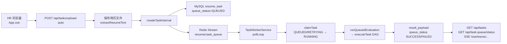

# 前端技术亮点与简历上传异步链路

本文档说明 ResumAI Agent 前端（`frontend/src/App.vue` 及 composables）的核心实现，以及简历上传后的后台异步评估链路。

---

## 一、前端技术亮点（分点）

### 1. 大盘 KPI 如何「实时」更新

前端**没有 WebSocket 推送大盘**，采用的是 **HTTP 拉取 + 条件轮询 + SSE 增量** 的组合：

| 数据来源 | 接口 | 触发时机 |
|----------|------|----------|
| 候选人总数 / 列表样本 | `GET /api/tasks?page=1&pageSize=50` | `refreshAll()`、`loadTasks()` |
| 平均分等业务指标 | `GET /api/metrics` | 同上 |
| 排队 / 运行中 / 卡住 / Worker | `GET /api/task-queue/status` | 同上；上传成功后立即再拉一次 |
| 运行中任务的阶段文案 | `GET /api/traces/{traceId}` | `refreshRunningStages()`，与轮询一并执行 |
| 详情页 Trace 流 | `GET /sse/traces/{traceId}` | 进入任务详情时 `subscribeTrace()` |

**统一刷新入口**：`refreshAll()` 并行调用 `loadTasks`、`loadMetrics`、`loadFeedbacks`、`loadCandidateList`、`loadJobList`、`loadTaskQueueStatus`，再 `refreshRunningStages()`。

**轮询策略**（`startPolling(traceId)`）：

- 上传创建任务后，对该 `traceId` 启动 **2 秒间隔** 的 `setTimeout` 链；
- 每次轮询执行 `refreshAll()` + `refreshRunningStages()`；
- 当 `resolveQueueStatus(task)` 不再是 `QUEUED` / `RETRYING` / `RUNNING` 时停止轮询，避免空闲流量。

**SSE 与 KPI 的关系**：

- 订阅 `/sse/traces/{traceId}` 时，每收到一条 `trace` 事件会 `loadTasks()`、`loadMetrics()`、`loadGraph()`，用于详情页 DAG/时间线；
- 总览 KPI 主要依赖轮询与手动「刷新」，不依赖 SSE。

**KPI 口径（与队列面板一致）**：

- **候选人**：当前已加载的 `tasks.length`（首页拉取最近 50 条，非全库 COUNT）；
- **排队中**：优先 `taskQueueStatus.queued`，否则本地数 `QUEUED`；
- **评估中**：优先 `taskQueueStatus.running`（仅 **未超时** 的 fresh RUNNING），不用 `isTaskActive()` 把排队算进评估中；
- **已完成**：`status === 'SUCCESS'`（业务终态），与 `queue_status` 解耦；
- **卡住**：仅在「异步队列状态」面板展示 `taskQueueStatus.stuck`（超时 RUNNING）。

### 2. 分页怎么做

项目里有两套分页，对应 `composables/`：

#### A. 客户端分页 — `usePagination`（`usePagination.ts`）

- 对**已在内存中的数组**做 `slice((page-1)*pageSize, ...)`；
- `total` / `totalPages` 由数组长度计算；
- 换 `pageSize` 或数据变短时自动校正当前页。

**使用场景**：

| 场景 | 数据源 | 默认 pageSize |
|------|--------|----------------|
| 总览「最近任务」 | `tasks`（最多 50 条） | 8 |
| 招聘洞察 · 岗位分布 | `jobCategoryStats` | 6 |
| 待复核列表 | `pendingReviewTasks` | 6 |
| 洞察页反馈 | `validFeedbacks` | 8 |
| JD Top 匹配卡片 | `jdMatchCards` | 3 |
| 详情 · 简历长文本 | `splitTextPages(text, 2400)` | 1 页/段 |
| 详情 · 单任务反馈 | `activeTaskFeedbacks` | 5 |

#### B. 服务端分页 — `useServerPagination` + `buildQuery`（`useServerPagination.ts`）

- `page` / `pageSize` 变化时由 `watch` 触发 API；
- 响应 `PageResult { items, total, page, pageSize }`，`total` 写入 `candidatePagination.total` 等。

**使用场景**：

- **候选人列表**：`GET /api/tasks?...&page=&pageSize=`，支持 keyword、status、queueStatus、recommendation、scoreMin/Max、sortBy；
- **岗位列表**：`GET /api/jds?page=&pageSize=`。

岗位描述过长时，另有**纯前端** `jobDescriptionPage` 对单条 JD 文本分页（与 API 无关）。

### 3. Markdown 渲染与 XSS 防护

评估报告 `summary` 使用 `v-html="renderMarkdown(activeTask.summary)"` 渲染。

**策略：先转义、再替换为有限 HTML（非完整 Markdown 引擎）**：

1. `escapeHtml()`：将 `& < > "` 转为实体，**打断任意 HTML/脚本注入**；
2. 在已转义字符串上做受限规则：标题 `#`、`**粗体**`、列表 `-`、分隔线 `---`、段落 `
`；
3. 列表区域用正则包成 `<ul><li>...</li></ul>`。

**其它展示位**（优势/风险/面试题、降级原因等）使用 `stripMarkdown()` **去掉 Markdown 符号后以纯文本显示**，不走 `v-html`，进一步降低 XSS 面。

**已知边界**：

- 未使用 DOMPurify / marked + sanitize；依赖「全量 escape + 白名单式替换」；
- 不支持链接、图片、代码块等复杂语法；若未来扩展，建议在 escape 之后增加 HTML 白名单过滤库。

相关代码：`App.vue` 中 `escapeHtml`、`renderMarkdown`、`stripMarkdown`。

### 4. 其它前端技术亮点

- **Vue 3 Composition API 单文件应用**：状态、计算属性、watch 集中在 `App.vue`，分页逻辑抽到 composable 复用。
- **队列状态与业务状态双轨展示**：`resolveQueueStatus()` 在业务已 `SUCCESS/FAILED/CANCELLED` 时优先业务态，避免 migration 后 `queue_status` 与 `status` 不一致误导 UI。
- **上传即返回、后台评估**：`POST /api/tasks/upload-auto` 只等创建与入队，不阻塞 DAG；前端 `uploadPhase`（validating → evaluating → accepted）+ `startPolling` 反馈进度。
- **SSE 实时 Trace**：详情页 `EventSource('/sse/traces/{traceId}')`，边评估边追加步骤；与 REST 拉全量 trace 互补。
- **DAG 双视图**：`dagViewMode` 在 HR 视图 / 开发视图间切换，过滤 `viewType=DEV`、质量检查等步骤；拓扑图 `dagTopology` 按 Agent 管线排布。
- **PDF / 文本双模式预览**：`resumeViewMode`；PDF 通过任务 `resumeFileUrl` 嵌入预览，长文本用 `splitTextPages` 分段阅读。
- **RAG 配置本地持久化**：`localStorage` 保存 RAG 选项与岗位草稿；岗位主数据同步后端 JD 库。
- **JD 乐观锁**：`PUT /api/jds/{id}` 携带 `version`；409 冲突时展示服务端当前版本并支持合并草稿。
- **多条件筛选与排序**：候选人列表 query 拼装（`buildQuery`），减少一次拉全量再过滤的压力。
- **类型安全**：`TaskResponse`、`TaskQueueStatus`、`PageResult` 等 TS 接口与后端 DTO 对齐。

---

## 二、简历上传异步链路

### 2.1 流程总览

### 2.2 分步说明

| 步骤 | 组件 | 说明 |
|------|------|------|
| 1 | `TaskController.uploadTaskAutoMatch` | 接收 `multipart/form-data`，默认 `executionMode=DAG_CONCURRENT`。 |
| 2 | `MvpEvaluationService.createTaskFromUploadAutoMatch` | PDF/文本解析、`ResumeFileService.save` 落盘/对象存储；**不在此步做 JD 匹配**（AUTO 类别，匹配进 DAG）。 |
| 3 | `createTaskInternal` | 生成 `traceId`，内存 `MutableTask` + `persistResumeTask` 写 MySQL；`queue_status=QUEUED`，`status=QUEUED`，记录 `uploadedBy`（`HrContext`，请求头 `X-HR-Id`）。 |
| 4 | `TaskQueueService.enqueue` | 向 Redis Stream 写入 `{ traceId, taskId, tenantId, uploadedBy, priority }`；Consumer Group：`resume-workers`。 |
| 5 | HTTP 响应 | 立即返回 `TaskResponse`（含 `queue` 字段）；前端 `loadTasks` + `startPolling`。 |
| 6 | `TaskWorkerService.pollLoop` | 单线程 poll Redis；线程池 `maxWorkers`（默认 6）执行；满负载时 sleep 等待。 |
| 7 | `TaskQueueRepository.claimTask` | **条件更新**：仅当 `queue_status ∈ {QUEUED, RETRYING}` 时改为 `RUNNING`，设置 `worker_id`、`started_at`，防止重复消费。 |
| 8 | `MvpEvaluationService.runQueuedEvaluation` | 加载任务，跑 Orchestrator + 多 Agent DAG（含 AUTO JD 匹配、RAG、报告生成）。 |
| 9 | 结束落库 | 成功：`queue_status=SUCCESS`，`status=SUCCESS`；失败：重试或 `FAILED`；`executeTask` finally 更新 `result_payload`。 |
| 10 | `ack` | Redis 消息 ACK；失败按 `maxAttempts` 退避重新 `enqueue`。 |
| 11 | 卡住恢复 | 启动时 + 每 60s `recoverStuckRunning`：超时 `RUNNING` → `RETRYING` 并重新入队。 |
| 12 | 前端感知 | 轮询任务列表与 `/api/task-queue/status`；详情页 SSE 看逐步 Trace。 |

### 2.3 与「同步上传」的差异

- **`/api/tasks/upload`**：指定 `jobCategory` + `jobDescription`，同样入队异步执行，但 JD 上下文在创建时已确定。
- **`POST /api/tasks`（JSON 粘贴简历）**：无文件上传，同样 `createTaskInternal` + 入队。
- 历史上若在 API 线程内同步 `executeTask`，会阻塞 HTTP；当前 MVP **一律先入队**，由 Worker 消费。

### 2.4 关键配置（`application.yml` → `resumai.task-queue`）

| 配置项 | 含义 |
|--------|------|
| `enabled` | 是否启用队列 Worker |
| `maxWorkers` | 并发执行线程数 |
| `runningTimeoutMinutes` | 超过该时间的 `RUNNING` 视为 stuck，可被回收 |
| `maxAttempts` / `retryBackoffSeconds` | 失败重试策略 |
| `streamKey` / `consumerGroup` / `workerId` | Redis Stream 与消费组标识 |

### 2.5 代码索引

| 能力 | 路径 |
|------|------|
| 上传 API | `backend/.../api/TaskController.java` |
| 创建 + 入队 | `backend/.../service/MvpEvaluationService.java` |
| Redis Stream | `backend/.../service/TaskQueueService.java` |
| Worker | `backend/.../service/TaskWorkerService.java` |
| MySQL 抢占 | `backend/.../service/TaskQueueRepository.java` |
| 队列状态 API | `backend/.../api/TaskQueueController.java` |
| 前端上传与轮询 | `frontend/src/App.vue`（`createEvaluations`、`startPolling`、`loadTaskQueueStatus`） |

---

## 三、相关文档

- 项目总览与架构：[README.md](../README.md)
- 异步队列展示修复（stuck / KPI 口径）：见仓库内计划与 `TaskQueueController`、`App.vue` KPI 区
