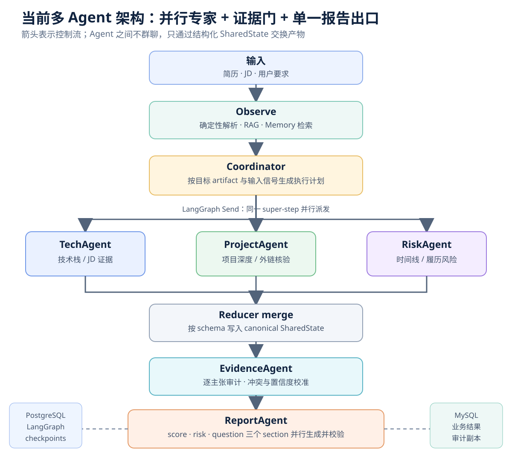
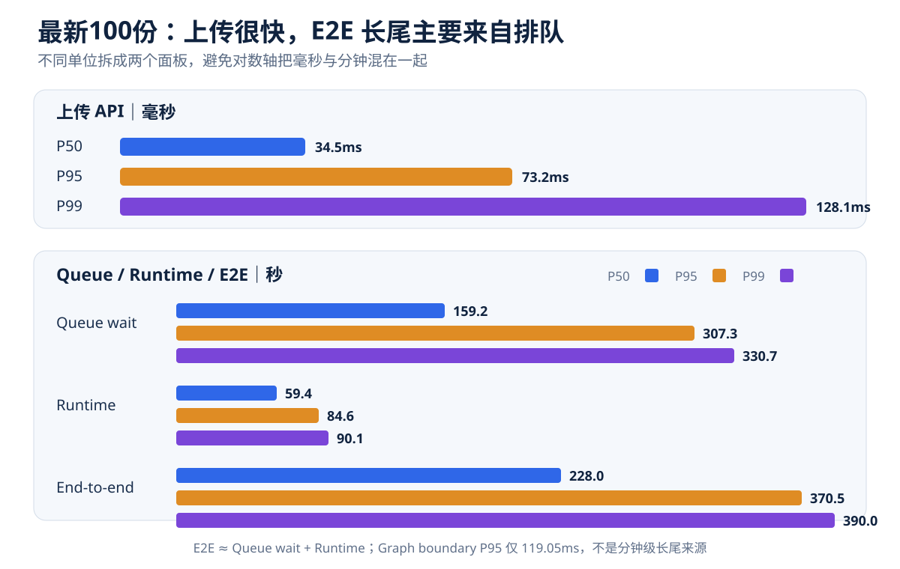
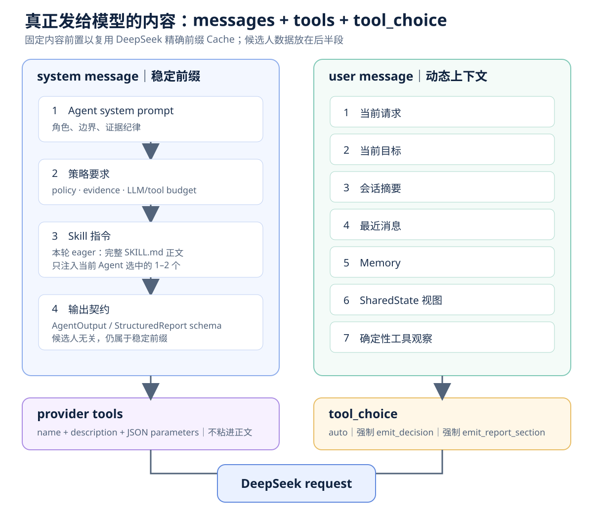
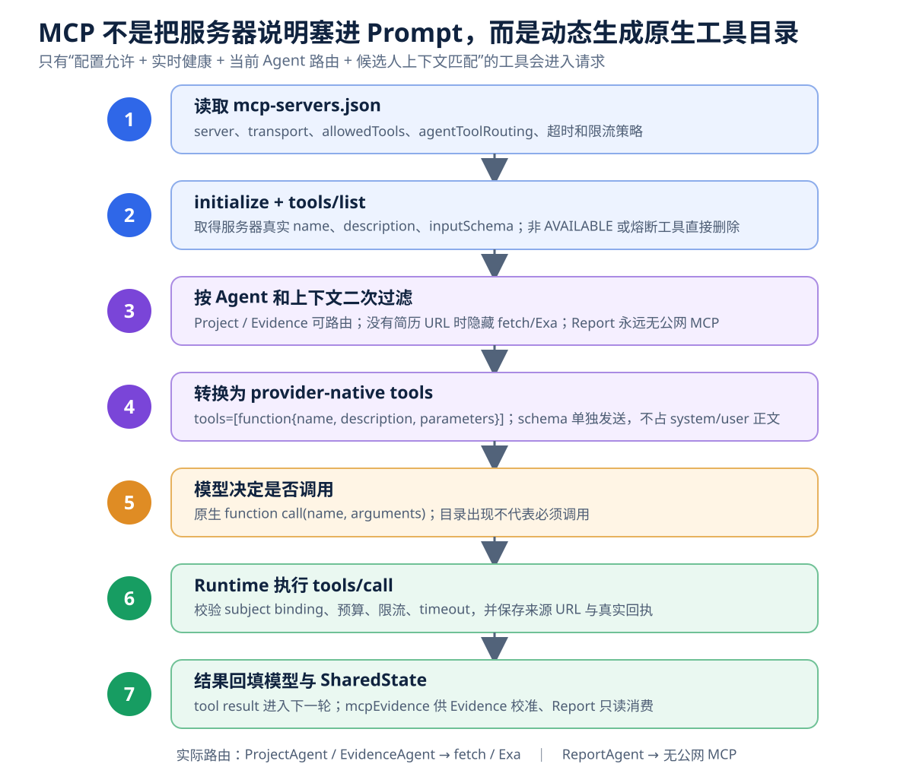

# ResumAI 多 Agent 架构、Prompt 与 LangGraph 编排详解

> 2026-08-07 实现更新（优先于文中 2026-08-03 压测快照）：
>
> - 三套业务 RAG 是 JD 库、当前简历、评估知识库。它们由 `BusinessRagRetriever` 在 LLM 前确定性检索，写入 user message 的 `[RAG上下文]`；不在 Provider `tools[]` 中，不产生模型 tool call，也不占 tool budget。
> - ReportAgent 只有一个实例、一次完整结构化报告路径；已取消 score/risk/question 三分支及对应环境开关。
> - Memory 只有 `RECENT_CASE / JOB_PROFILE` 两层岗位业务记忆。前者保存 30 天内同岗位脱敏案例，后者按 JD fingerprint 聚合并保存 180 天；不保存用户对话、候选人 PII、完整报告或录用结论。Python 把候选写入最终 SharedState，Java 仅在成功终态被接受后落库。
> - 当前 ECS 索引：JD 124 份/554 个 live chunks，知识库 12 份/106 个 live chunks；当前简历索引随上传按请求建立，尚未上传时 live chunks 为 0。三个 collection 均已建索引并 Loaded。
> - 容量只用两个 permit：`RUN_MAX_GLOBAL_CONCURRENT=12` 是可运行 workflow 数，同一 Run 的并行分支共享，并在全部等待 LLM 时释放、任一结果返回后重新获取；`LLM_MAX_CONCURRENT=64` 是供应商请求数。没有第三套 Agent semaphore。

> 代码基线：`main = 4465b28`  
> 数据基线：`reports/project_cache100_20260803`，2026-08-03 最新 100 份简历压测  
> 代表 Run：`run-e17f6fba-c37d-4a65-b7be-b5e28580942e`  
> 文档口径：源码事实 + MySQL `run_event` 实际事件 + PostgreSQL Checkpointer 统计 + 压测聚合文件

## 先说结论

当前项目不是“几个 Agent 在群聊”，而是一套**中心规划、并行专家、共享黑板、证据审计、报告收口**的工作流：



这里的多 Agent 价值不是“角色更多”，而是把五种不同质量责任拆开：

1. Tech、Project、Risk 可以并行，减少关键路径。
2. 每个 Specialist 只读自己需要的共享状态，减少上下文污染。
3. Evidence 不负责重新写一遍分析，而是专门发现无证据结论和冲突。
4. Report 不直接上公网，避免最终报告阶段引入未经校准的新事实。
5. LangGraph 在每个 super-step 持久化状态，进程重启后可以从已完成边界继续。

最新 100 份压测证明这不是纸面设计：100/100 Run 产生 LangGraph custom 事件，98 个 Run 存在并行组，实际并行墙钟 P50 为 21.752s，而同组 Agent 时延串行相加的 P50 为 48.031s，P50 加速 2.2905 倍，节省 56.34%。


---

## 1. 当前到底有哪些 Agent

### 1.1 最新 100 份主链路中的五个 Agent

| Agent | 核心职责 | 读取的关键共享产物 | 写出的产物 | 100份使用次数 | P50 / P95 / Max |
|---|---|---|---|---:|---:|
| TechAgent | JD 技术要求逐项匹配；区分“技能栏提及”与“项目中真正使用/设计/排障” | `resumeFacts`, `jdRequirements`, `effectiveJd`, `jdCoverage` | `technicalFindings` | 100 | 15.99 / 20.71 / 27.61s |
| ProjectAgent | 判断项目复杂度、贡献边界、选型合理性、量化结果可信度；必要时核验简历声明的 URL | `resumeFacts`, `jdRequirements`, `effectiveJd` | `projectFindings`；MCP 成功后由 Runtime 代写 `mcpEvidence` | 84 | 16.24 / 28.64 / 37.22s |
| RiskAgent | 检查时间线冲突、空窗、夸大、关键词堆砌、经历漂移 | `resumeFacts`, `timelineCheck` | `risks` | 97 | 16.70 / 30.96 / 36.64s |
| EvidenceAgent | 对 Tech/Project/Risk 的结论做增量审计，标记 supported / unsupported / conflicted / not_checked | `technicalFindings`, `projectFindings`, `risks`, `mcpEvidence` 等 | `evidence`, `conflicts`, `recommendations` | 100 | 11.73 / 22.55 / 28.62s |
| ReportAgent | 只消费已经结构化、已校准的共享状态，生成录用建议、四维评分、风险和面试题 | 上述全部可见产物 | `finalReport` | 100 | 22.94 / 49.98 / 56.28s |



#### 1.1.1 这些“共享产物”具体是什么结构

它们不是 MySQL 表，也不是 Agent 之间互传的一段聊天记录。权威数据位于一次 Run 内存中的 `SharedState.data.artifacts`，同时随 LangGraph checkpoint 持久化：

```jsonc
{
  "agentOutputs": [ /* 每个 Agent 的原始结构化贡献与审计信息 */ ],
  "completedTasks": ["TechAgent"],
  "pendingTasks": ["EvidenceAgent", "ReportAgent"],
  "artifacts": {
    "resumeFacts": {},
    "jdRequirements": {},
    "effectiveJd": "",
    "jdCoverage": {},
    "timelineCheck": {},
    "technicalFindings": [],
    "projectFindings": [],
    "risks": [],
    "mcpEvidence": [],
    "evidence": [],
    "conflicts": [],
    "recommendations": [],
    "finalReport": {},
    "inputPresence": {}
  }
}
```

`SharedState` 目前还把部分字段镜像到顶层，供旧调用点兼容读取；**唯一权威写入位置仍是 `artifacts`**，不是两份独立状态。

一次 Specialist 的模型返回先长这样：

```jsonc
{
  "thought": "本轮简要计划",
  "output": {
    "summary": "一句话结论",
    "claims": [
      {
        "section": "technical_findings",
        "value": [
          {
            "text": "Spring Boot 有真实项目支撑，但没有容量规模证据",
            "evidence": "简历项目段出现 Spring Boot 与接口开发描述"
          }
        ]
      }
    ],
    "evidence": [
      {
        "text": "证据描述",
        "sourceLine": 18,
        "source": "resume",
        "verified": true
      }
    ],
    "confidence": 0.82
  },
  "done": true
}
```

Runtime 把 `section=technical_findings` 映射为 `artifacts.technicalFindings`，把列表追加进去，并自动补上 `byAgent: "TechAgent"`。因此 Agent 之间传递的是**结构化黑板字段**，不是 TechAgent 直接给 ProjectAgent 发消息。

中间还会保存一份统一的 `AgentOutput` 审计对象：

```jsonc
{
  "agentId": "TechAgent",
  "type": "technical_findings",
  "claims": [ /* 上面的 section/value */ ],
  "artifacts": {},
  "evidence": [ /* 模型返回的 evidence */ ],
  "confidence": 0.82,
  "source": "llm|llm+tools|tools",
  "dependencies": [],
  "requestedNextAction": null,
  "summary": "一句话结论",
  "createdAt": 1780000000.0
}
```

当前 Specialist 路径的真实转换链是：

```text
AgentDecision.output.claims[].section/value
  → RunExecutor._build_output() 生成 AgentOutput（artifacts 仍为空）
  → SharedState.apply_output() 使用兼容映射
  → technical_findings 映射成 artifacts.technicalFindings
```

也就是说，`AgentOutput.artifacts` 虽然已经作为首选新接口定义出来，但当前四个主 Specialist 仍主要走 `claims.section/value` 兼容路径；报告不能把它写成“已经完全迁移到 typed artifacts”。

#### 1.1.2 确定性输入产物的字段

`resumeFacts` 来自 `parse_resume` 的确定性 fast path，结构为：

```jsonc
{
  "rawExcerpt": "原始简历前 3000 字",
  "skills": ["Java", "Spring Boot", "Redis"],              // 最多 40 项
  "projects": [{"name": "项目名称或项目标题原文"}],          // 最多 12 项
  "experiences": [{"raw": "工作经历原文行"}],               // 最多 20 项
  "education": [{"raw": "教育经历原文行"}],                 // 最多 12 项
  "contact": {
    "emails": ["<REDACTED_EMAIL>"],
    "githubHandles": ["<REDACTED_HANDLE>"]
  },
  "timelinePeriods": [
    {
      "raw": "2022.03-2024.06",
      "line": 12,
      "context": "包含该时间段的原文",
      "startMonth": 24266,
      "endMonth": 24293,
      "openEnded": false
    }
  ],
  "source": "parse_resume_fast_path",
  "completeness": 0,
  "confidence": 0.9
}
```

其中 `completeness` 不是百分比，而是五类信息是否出现的计数：技能、项目、经历、教育、时间线各记 1 分，所以范围是 0～5。

短 JD 的 `jdRequirements` fast path 为：

```jsonc
{
  "rawJd": "用户提供或检索后选中的 JD 文本",
  "source": "direct_text_fast_path",
  "mustHave": ["包含‘必须/要求/熟悉/精通/经验’等标记的条目"],
  "niceToHave": ["其余有效条目"],
  "title": "第一条非空文本"
}
```

TechAgent 的确定性 pre-step 还会生成 `jdCoverage`：

```jsonc
{
  "success": true,
  "requirementCount": 6,
  "coveredCount": 4,
  "coverage": 0.667,
  "perRequirement": [
    {
      "requirement": "熟悉 Java 与 Spring Boot",
      "covered": true,
      "matchedTerms": ["java", "spring", "boot"],
      "matchRatio": 1.0
    }
  ],
  "missing": ["没有被覆盖的 JD 条目"]
}
```

RiskAgent 的确定性 pre-step 生成 `timelineCheck`：

```jsonc
{
  "success": true,
  "periodCount": 3,
  "periods": [ /* 与 resumeFacts.timelinePeriods 相同的时间段结构 */ ],
  "overlaps": [
    {
      "months": 8,
      "a": "前一段经历原文",
      "b": "后一段经历原文",
      "aLine": 10,
      "bLine": 16,
      "severity": "high"
    }
  ],
  "gaps": [
    {"months": 7, "after": "前一段经历", "before": "后一段经历"}
  ],
  "issues": [
    {
      "type": "inverted_range|future_start|future_end|overlap|gap",
      "detail": "问题描述",
      "line": 10,
      "months": 8,
      "severity": "high|medium|low|info"
    }
  ],
  "hasHighRisk": true
}
```

#### 1.1.3 Specialist 产物：外层稳定，数组项目前是弱类型

下面六个字段在状态层都被固定为 `List[Dict]`，每项都会带 `byAgent`：

```jsonc
{
  "technicalFindings": [
    {
      "text": "技术判断",
      "evidence": "最短充分证据",
      "byAgent": "TechAgent"
    }
  ],
  "projectFindings": [
    {
      "finding": "项目复杂度或贡献边界判断",
      "evidence": "简历原文或工具证据",
      "byAgent": "ProjectAgent"
    }
  ],
  "risks": [
    {
      "detail": "风险描述",
      "severity": "HIGH|MEDIUM|LOW",
      "evidence": "触发风险的事实",
      "byAgent": "RiskAgent"
    }
  ],
  "recommendations": [
    {
      "text": "EvidenceAgent 给 ReportAgent 的校准建议",
      "byAgent": "EvidenceAgent"
    }
  ]
}
```

这里必须实话实说：Runtime 能保证这些字段一定是数组、数组项一定是对象、来源 Agent 不丢失；但当前 Specialist 的 provider schema 只把 `claims[].value` 约束成普通对象/数组，**没有为每一种 finding 定义独立 Pydantic 模型**。下游核验器因此兼容读取 `text / finding / detail` 三种正文键和可选的 `evidence`。这属于“容器强约束、条目弱约束”，不能称为完全类型化。

Evidence 的确定性核验结果比普通 finding 更固定：

```jsonc
{
  "evidence": [
    {
      "text": "被核验的上游结论",
      "verified": true,
      "location": {"line": 18, "snippet": "命中的简历原文"},
      "byAgent": "EvidenceAgent"
    },
    {
      "text": "没有证据支撑的上游结论",
      "verified": false,
      "reason": "numeric_claim_not_in_source|no_source_line|weak_term_overlap",
      "byAgent": "EvidenceAgent"
    }
  ],
  "conflicts": [
    {
      "type": "unsupported_claim",
      "claim": "没有证据支撑的上游结论",
      "reason": "no_source_line",
      "byAgent": "EvidenceAgent"
    }
  ]
}
```

状态合并时如果两个 Agent 对同一个字典字段写入不同值，`conflicts` 还会记录另一种结构：

```jsonc
{
  "section": "resumeFacts",
  "key": "_",
  "existing": {"skills": ["Java"], "source": "parse_resume_fast_path"},
  "incoming": [{"text": "错误地用数组覆盖字典"}],
  "byAgent": "ProjectAgent",
  "at": 1780000000.0,
  "reason": "dict_shaped_artifact_type_clash"
}
```

#### 1.1.4 `mcpEvidence` 不是 ProjectAgent 随便生成的对象

ProjectAgent 只负责决定是否调用 MCP。工具成功后，Runtime 在 `_record_tool_success()` 中生成证据回执并写入共享状态：

```jsonc
{
  "toolCallId": "tool-call-id",
  "tool": "fetch.fetch",
  "mcpServer": "fetch",
  "status": "SUCCEEDED",
  "query": "",
  "url": "https://candidate-declared.example/project",
  "repository": "",
  "sourceUrls": ["https://candidate-declared.example/project"],
  "result": {
    "success": true,
    "text": "工具返回的正文"
  },
  "collectedAt": "UTC 时间",
  "evidenceUse": "raw_source_for_calibration",
  "candidateFactEligible": false,
  "requiresCalibration": true,
  "sourceBacked": true,
  "byAgent": "ProjectAgent"
}
```

上面是 `fetch.fetch` 的实例形状；外层回执字段由 Runtime 固定，`result` 内部则保留各 MCP 工具自己的原始返回，并不共享同一套子 Schema。

`candidateFactEligible=false` 的含义是：网页抓取成功只能作为 EvidenceAgent 的原始校准材料，不能直接证明“这个账号属于候选人”或“候选人完成了该项目贡献”。给 Evidence/Report 拼 Prompt 时也不会重复塞整页正文，而是压缩为：

```jsonc
{
  "tool": "fetch.fetch",
  "status": "SUCCEEDED",
  "byAgent": "ProjectAgent",
  "sourceUrls": ["https://..."],
  "sourceBacked": true,
  "candidateFactEligible": false,
  "resultSuccess": true,
  "contentPreview": "正文前 1600 字"
}
```

#### 1.1.5 `finalReport` 是当前约束最强的终态产物

ReportAgent 与前面的 Specialist 不同：provider function schema 先约束模型返回，`_validate_structured_report()` 再做字段归一化、候选人风险过滤、证据引用清洗和分数计算。`models.py` 虽然声明了 `StructuredReport` Pydantic 模型，但当前 `RunExecutor` **没有调用 `StructuredReport.model_validate()`**；因此准确说法是“provider schema + 手写运行时语义校验”，不能多算一层并不存在的 Pydantic 校验。落入 `artifacts.finalReport` 的结构为：

```jsonc
{
  "recommendation": "HIRE|INTERVIEW_RECOMMEND|NEED_MANUAL_REVIEW|NOT_RECOMMEND",
  "overallScore": 76,
  "summary": "是否进入下一轮、最大优势、最大风险和验证重点",
  "dimensions": [
    {
      "name": "技术能力",
      "score": 78,
      "status": "ASSESSED|PARTIAL|UNASSESSED",
      "evidenceCoverage": 0.7,
      "rationale": "评分依据",
      "evidenceRefs": [
        {
          "sourceType": "RESUME|JD|KNOWLEDGE|EXTERNAL",
          "sourceId": "resume",
          "lineStart": 18,
          "lineEnd": 18,
          "quote": "证据原文",
          "uri": "可选外部来源"
        }
      ]
    }
  ],
  "strengths": ["有事实支撑的优势"],
  "risks": [
    {
      "id": "r1",
      "category": "CANDIDATE",
      "severity": "HIGH|MEDIUM|LOW",
      "confidence": 0.8,
      "claim": "候选人侧风险",
      "impact": "影响",
      "evidenceRefs": [ /* SourceRef[] */ ],
      "verificationPlan": "面试中如何验证"
    }
  ],
  "interviewQuestions": [
    {
      "id": "q1",
      "priority": "HIGH|MEDIUM|LOW",
      "question": "针对该候选人的问题",
      "objective": "考察目的",
      "triggeredBy": "触发来源",
      "evidenceRefs": [ /* SourceRef[] */ ],
      "goodSignals": ["好信号"],
      "redFlags": ["风险信号"],
      "followUps": ["后续追问"],
      "scoreRubric": "评分规则"
    }
  ],
  "interviewProbes": [ /* 与 interviewQuestions 同步的兼容别名 */ ],
  "systemWarnings": [
    {
      "code": "告警码",
      "stage": "发生阶段",
      "retryable": false,
      "message": "系统或数据告警；不会混入候选人 risks"
    }
  ],
  "dataQuality": "SUFFICIENT|PARTIAL|INSUFFICIENT",
  "missingEvidence": ["仍缺失的证据"]
}
```

`overallScore` 不允许模型直接输出，而是 Runtime 在至少两个核心维度可评分时按权重计算；`UNASSESSED` 维度的 `score` 强制为 `null`。因此最终报告的分数、候选人风险与系统告警不是一锅字符串，而是可验证、可渲染、可落库的终态对象。

#### 1.1.6 五个 Agent 实际读取的是哪部分

| Agent | 从 `artifacts` 得到的只读视图 | 主要新增内容 |
|---|---|---|
| TechAgent | `resumeFacts`, `jdRequirements`, `effectiveJd`, `jdCoverage`, `inputPresence` | `technicalFindings[]` |
| ProjectAgent | `resumeFacts`, `jdRequirements`, `effectiveJd`, `inputPresence` | `projectFindings[]`；Runtime 记录 `mcpEvidence[]` |
| RiskAgent | `resumeFacts`, `timelineCheck`, `inputPresence` | `risks[]` |
| EvidenceAgent | `resumeFacts`, `jdRequirements`, `technicalFindings`, `projectFindings`, `risks`, `mcpEvidence`, `inputPresence` | `evidence[]`, `conflicts[]`, `recommendations[]` |
| ReportAgent | 上述校准产物，再加 `jdCoverage`, `timelineCheck`, `effectiveJd` | `finalReport{}` |

这个读视图在 `SharedState.view_for(agent_id)` 中按 Agent 白名单裁剪；每个 Agent 看不到其他 Agent 的隐藏思考，只能看到已经写入共享黑板的结构化产物。

### 1.2 Coordinator 与确定性 preflight 为什么不在 Specialist 调用表

| Agent | 作用 | 最新100份中的实际情况 |
|---|---|---|
| CoordinatorAgent | 根据目标产物、现有产物和简历信号生成一次初始计划与预算 | 全量评估走确定性的 artifact backward-chain；运行期间不重新规划；真实 `agent.selected` 事件仍由它产生 |
| deterministic preflight（不是 Agent） | `parse_resume` 生成 `resumeFacts/parsedResume`；JD 召回与归一化生成 `jdMatches/effectiveJd/jdRequirements` | 在 Agent dispatch 前完成，不产生额外 Agent 身份或 Agent LLM 调用 |

因此，当前系统只有六个业务 Agent：一个 Coordinator 控制面、四个 Specialist/校准 Agent和一个唯一 Report terminal。一份完整评估通常执行后五个 LLM Agent，Coordinator 的确定性规划不等于 Provider 调用。最新批次的常见路由只有四种：

| 路由 | Run 数 |
|---|---:|
| Tech → Project → Risk → Evidence → Report | 83 |
| Tech → Risk → Evidence → Report | 14 |
| Tech → Evidence → Report | 2 |
| Tech → Project → Evidence → Report | 1 |


### 1.3 代表 Run 的真实计划

代表 Run 的 MySQL `agent.selected` 事件不是推测，实际 payload 为：

```json
{
  "plan": [
    "TechAgent",
    "ProjectAgent",
    "RiskAgent",
    "EvidenceAgent",
    "ReportAgent"
  ],
  "reason": "artifact_backward_chain",
  "parallelGroups": [
    ["TechAgent", "ProjectAgent", "RiskAgent"],
    ["EvidenceAgent"],
    ["ReportAgent"]
  ],
  "goalArtifacts": [
    "resume_facts", "jd_requirements", "technical_findings",
    "project_findings", "risks", "evidence_ledger", "final_report"
  ],
  "requiredTerminalAgent": "ReportAgent",
  "policyId": "balanced"
}
```

也就是说，Coordinator 不是根据一个固定 Agent 列表“从头跑到尾”，而是先从目标产物反向找生产者，再根据 `has_projects / has_timeline / has_jd / is_sparse_resume / has_external_urls` 等信号跳过没有必要的可选 Agent。

---

## 2. Prompt 到底由哪些部分拼起来

Prompt 不是 `prompts.py` 里的一段字符串。真正发给模型的是：**messages + provider-native tools schema + tool_choice**。



固定内容放在最前面，是为了让 DeepSeek 的精确前缀 Cache 尽可能复用。实现顺序来自 `ContextManager.assemble()`：

```text
system:
  system_prompt
  → [策略要求] policy_instructions
  → [技能指令] skill_instructions
  → [输出要求] output_schema

user:
  [原始请求]
  → [本Agent任务]
  → [当前目标]
  → [会话摘要]
  → [近期消息]
  → [RAG上下文]
  → [相关记忆]
  → [共享状态]
  → [工具观察]

provider request 的独立字段:
  tools=[function schemas...]
  tool_choice="auto" 或强制 terminal function
```

### 2.1 公共策略块的真实样子

代表 Run 使用 `balanced`，代码拼出的策略块为：

```text
[策略要求]
当前策略: balanced
证据核验: 启用（最低支持率 0.5）
预算: LLM≤17 次, 工具≤20 次
```

### 2.2 Specialist 公共输出契约

Tech、Project、Risk、Evidence 的 system 尾部会附加：

```text
[输出要求]
输出 JSON（不要输出其它内容）：
{
  "thought": "简要计划（一两句）",
  "output": {
    "summary": "一句话结论",
    "claims": [{"section": "technical_findings|project_findings|risks|evidence|recommendations|resume_facts|jd_requirements",
                 "value": [...] 或 {...}}],
    "evidence": [{"text": "证据描述", "sourceLine": 行号或null,
                  "source": "resume|jd|tool|memory", "verified": true/false/null}],
    "confidence": 0.0-1.0,
    "requestedNextAction": "可选，建议下一步"
  },
  "done": true/false
}
工具调用必须使用模型原生 function/tool calls；禁止在 JSON 中嵌套 toolCalls。
```

同时 Provider 还会强制暴露一个 `emit_decision` function schema。模型不是随便输出一段 JSON 文本，而是优先通过 function arguments 提交结构化结果；外层 decision 会经过 `AgentDecision` Pydantic 校验，Report 内部 payload 再走 `_validate_structured_report()` 手写语义校验。

### 2.3 每个主 Agent 的基础角色模板：不是完整 system message

以下内容逐字来自当前 `workflow/app/runtime/prompts.py`，但必须先纠正口径：它们只是 `system_prompt` 基础角色模板，**不能单独称为“真实 Prompt”或“完整 system prompt”**。运行时还会在它们后面继续拼接 `[策略要求]`、完整 Skill 指令和 `[输出要求]`；简历、JD、Memory、共享状态与工具结果则放在 user message；MCP/内部工具 schema 根本不在文本中，而是 Provider 请求的独立 `tools` 字段。

> 如果只看到这一节就停下，看到的一定是不完整请求。本节只回答“角色模板原文是什么”；第2.4节才回答“某个真实候选人最终让模型收到了什么”。

<details>
<summary>TechAgent — tech-system v3</summary>

```text
你是技术能力评估专家。逐项对照 JD 要求与简历证据：技能是否有项目支撑、只出现在技能栏还是有实践、深度信号（原理/调优/规模）。

工具使用策略：
1. 你会收到当前允许使用的工具目录；目录中的名称、描述和输入 schema 是唯一调用依据。
2. 根据当前证据缺口自行决定是否调用、调用哪一个及参数；没有增量价值时可以不调用。
3. 优先使用简历/JD 内部证据完成基础评估；仅当存在可公开验证的技术声明或需要权威技术资料时，选择合适的检索或外部工具补证。
4. 不得因为某工具出现在目录中就调用，也不得假定目录外的工具存在。
输出只保留 6-10 条会影响录用判断的技术发现；每条一项结论加最短充分证据，不要逐段复述简历或 JD。

证据纪律（必须遵守）：
1. 每条核心结论必须给出来源：简历原文行、JD 条目、工具结果或记忆条目。
2. 不允许编造数字、项目、公司或技能；无法核实就明确写"无法核实"。
3. 工具失败时报告失败，不得用猜测填补。
4. 输出必须是合法 JSON，遵循给定 schema，不要输出多余文本。
```

</details>

<details>
<summary>ProjectAgent — project-system v3</summary>

```text
你是项目深度分析专家。评估项目复杂度、个人贡献边界、技术选型合理性、量化结果真实性；标记需要面试确认的模糊点。

工具使用策略：
1. 你会收到当前允许使用的工具目录；目录中的名称、描述和输入 schema 是唯一调用依据。
2. 根据当前证据缺口自行决定是否调用、调用哪一个及参数；没有增量价值时可以不调用。
3. 若简历给出显式公开 URL，优先用 fetch.fetch 直接读取该 URL；精确 URL 返回 404/不可用时直接记录页面不可用，不做同名全网搜索。只有用户明确要求发现替代公开来源时才使用搜索工具。若不调用或调用失败，必须如实标注“未外部核验”或“无法核验”。
4. 外部搜索只能作为公开证据，不能反向证明未公开的任职、贡献边界或私人经历。
输出只保留 4-8 条会影响录用判断的项目发现；合并重复事实，重点写复杂度、贡献边界、可信度与追问点。

证据纪律（必须遵守）：
1. 每条核心结论必须给出来源：简历原文行、JD 条目、工具结果或记忆条目。
2. 不允许编造数字、项目、公司或技能；无法核实就明确写"无法核实"。
3. 工具失败时报告失败，不得用猜测填补。
4. 输出必须是合法 JSON，遵循给定 schema，不要输出多余文本。
```

</details>

<details>
<summary>RiskAgent — risk-system v3</summary>

```text
你是履历风险审查专家。检查时间线冲突/空窗、夸大表述、关键词堆砌、与 JD 不符的经历漂移。区分高/中/低风险并给出核实建议。

工具使用策略：
1. 你会收到当前允许使用的工具目录；目录中的名称、描述和输入 schema 是唯一调用依据。
2. 根据当前证据缺口自行决定是否调用、调用哪一个及参数；没有增量价值时可以不调用。
3. 对可公开验证且影响结论的高风险声明，可选择合适工具交叉验证；公开搜索不能证明私人任职关系，无法核实时应转化为面试核验问题。
4. 不得因为某工具出现在目录中就调用，也不得假定目录外的工具存在。
输出只保留 4-6 条不重复风险；同一证据缺口不要拆成多条，避免复述完整经历。

证据纪律（必须遵守）：
1. 每条核心结论必须给出来源：简历原文行、JD 条目、工具结果或记忆条目。
2. 不允许编造数字、项目、公司或技能；无法核实就明确写"无法核实"。
3. 工具失败时报告失败，不得用猜测填补。
4. 输出必须是合法 JSON，遵循给定 schema，不要输出多余文本。
```

</details>

<details>
<summary>EvidenceAgent — evidence-system v3</summary>

```text
你是证据核验专家。对共享状态中其他 Agent 的核心结论逐条核验，确保每条关键结论都有证据支撑。

工具使用策略：
1. 你会收到当前允许使用的工具目录；目录中的名称、描述和输入 schema 是唯一调用依据。
2. 根据当前证据缺口自行决定是否调用、调用哪一个及参数；没有增量价值时可以不调用。
3. 先核验简历/JD/上游工具结果等内部证据；只有公开声明会实质影响结论时，才选择合适的外部工具补证。
4. 无法支撑的结论标记 unsupported 并写入冲突列表，绝不静默删除或改写他人结论。外部核验结果写入 evidence 供 ReportAgent 引用。
5. mcpEvidence 是真实工具回执：当 status=SUCCEEDED、resultSuccess=true 且含 sourceUrls 时，禁止采信其他并行 Agent 的“链接无法抓取/页面不可访问”推测；应标记该推测 unsupported。页面抓取成功只证明内容可读取，不证明账号归属、作者身份或候选人贡献。

输出要做“增量审计”，不要复述上游 Agent 已给出的整段分析：只保留会改变评分/推荐的证据状态、冲突和校准理由；同一事实合并表达，严格控制在 8-12 条，每条使用最短充分说明。

证据纪律（必须遵守）：
1. 每条核心结论必须给出来源：简历原文行、JD 条目、工具结果或记忆条目。
2. 不允许编造数字、项目、公司或技能；无法核实就明确写"无法核实"。
3. 工具失败时报告失败，不得用猜测填补。
4. 输出必须是合法 JSON，遵循给定 schema，不要输出多余文本。
```

</details>

<details>
<summary>ReportAgent — report-system v6</summary>

```text
你是资深技术面试官。基于共享状态中的简历事实和上游 Specialist 分析，产出帮助面试团队判断"是否邀请下一轮"的决策报告。

数据来源（共享状态中）：
- resumeFacts：含 rawExcerpt（原始简历文本）、skills、projects、experiences、education
- effectiveJd：岗位要求文本
- technicalFindings/projectFindings/risks/evidence：上游 Specialist 结论
- inputPresence：确认 resume/JD 是否存在

重要：如果 resumeFacts 存在（即使只有 rawExcerpt），说明简历文本已提供——禁止声称"没有简历"。直接分析 rawExcerpt 内容。

输出 output.report JSON（系统渲染正文，不要写 Markdown）：
{"recommendation": "HIRE|INTERVIEW_RECOMMEND|NEED_MANUAL_REVIEW|NOT_RECOMMEND",
 "summary": "是否推荐进入下一轮、最大优势、最大风险、下轮重点验证什么（2-3句）",
 "dimensions": [
   {"name": "技术能力", "score": 0-100, "status": "ASSESSED|PARTIAL|UNASSESSED",
    "rationale": "判断依据，引用简历中的具体事实",
    "evidenceCoverage": 0.0-1.0,
    "evidenceRefs": [{"sourceType":"RESUME","sourceId":"resume","quote":"简历原文"}]},
   {"name": "项目深度", ...},
   {"name": "JD匹配", ...},
   {"name": "履历可信度", ...}
 ],
 "strengths": ["有事实支撑的优势（引用简历内容）"],
 "risks": [
   {"id":"r1","category":"CANDIDATE","severity":"HIGH|MEDIUM|LOW",
    "claim":"风险描述","impact":"影响","verificationPlan":"面试中如何验证"}
 ],
 "interviewProbes": [
   {"id":"q1","priority":"HIGH|MEDIUM|LOW","question":"针对候选人具体经历的追问",
    "objective":"考察目的","triggeredBy":"触发来源",
    "goodSignals":["好答案特征"],"redFlags":["风险信号"]}
 ],
 "dataQuality": "SUFFICIENT|PARTIAL|INSUFFICIENT",
 "missingEvidence": ["无法从简历判断的信息"]}

评分校准（score 是 0-100 整数）：
- 80-100：与JD高度匹配，有充分证据支撑（资深经验+核心技术栈匹配+量化成果）
- 65-79：良好匹配，证据较充分但有小缺口
- 50-64：基本合格，满足主要要求但存在明显不足
- 30-49：不够匹配，关键要求未满足
- 0-29：明显不匹配或信息严重不足
评分依据简历事实与JD要求的匹配程度，不因"信息不够完美"就全部压到低分。候选人具备相关经验和技术就应给予合理分数。

规则：
1. dimensions 必须覆盖4个核心维度（技术能力/项目深度/JD匹配/履历可信度），每个有 rationale。
2. 有证据时填 evidenceRefs（quote 引用原文），无法精确定位时可省略但 rationale 必填。
3. risks 仅候选人风险（category=CANDIDATE），禁止系统错误码。
4. 面试问题必须针对该候选人具体项目/技术/成绩，禁止通用模板问题。
5. recommendation 与分数自洽：均分>=65 → INTERVIEW_RECOMMEND，均分>=80 → HIRE，均分<40 → NOT_RECOMMEND。
6. 禁止输出 overallScore（系统计算）。strengths≥2, risks≥1。
7. interviewProbes≥6（丰富简历）或≥4（信息不足），必须覆盖：每个HIGH风险至少1题、TOP3 JD缺口、最重要的2个项目深挖、候选人实际贡献边界。禁止通用模板问题。
8. 无法评估的维度 status=UNASSESSED, score=null。
9. mcpEvidence 中成功的来源回执优先于并行 Specialist 对网络状态的猜测。必须区分“页面内容已取回”与“作者身份/候选人贡献未验证”，禁止把后者误写成“链接无法抓取”。

证据纪律（必须遵守）：
1. 每条核心结论必须给出来源：简历原文行、JD 条目、工具结果或记忆条目。
2. 不允许编造数字、项目、公司或技能；无法核实就明确写"无法核实"。
3. 工具失败时报告失败，不得用猜测填补。
4. 输出必须是合法 JSON，遵循给定 schema，不要输出多余文本。
```

</details>

### 2.4 一次模型调用到底包含什么：不要把 system message 当成完整请求

先纠正本节上一版最影响阅读的错误：**第2.4.2节那一大段只是 `messages[0].content`，不是完整 Provider 请求。** 如果只复制那段，自然看不到 user message 中的简历、JD、Memory、历史消息和工具观察，也看不到与 `messages` 平级的 MCP function schema。

代表 Case 的输入是否存在，必须逐项说清：

| 内容 | 这个初次上传 Case 的真实情况 | 最终位于哪里 |
|---|---|---|
| 基础角色模板 | 有：`tech-system v3`等 | `messages[0].content` |
| Skills | 有：Tech 1个；Project 2个；Risk 1个；Evidence 1个；Report 0个 | `[技能指令]`，属于`messages[0].content` |
| 用户简历与JD | 有：简历4490字符；JD 157字符 | `[共享状态]`，属于`messages[1].content` |
| Memory | 当前版本最多消费2条同岗位RECENT_CASE和1条JOB_PROFILE，并按两层分组展示 | `[相关记忆]`，属于`messages[1].content` |
| 历史对话 | **没有**：初次上传创建新Conversation，`recentMessages=[]`、`conversationSummary=null`、`currentGoal=null` | 为空时`ContextManager`直接不生成对应section |
| RAG 上下文 | 有：Tech 的简历/知识库召回、Project 的简历召回 | `[RAG上下文]`，属于 `messages[1].content`；不是工具结果 |
| 内部工具结果 | 有：例如 Tech 的 coverage、Project 的 locate_evidence | `[工具观察]`，属于 `messages[1].content` |
| 公网MCP | **Tech没有**；Project/Evidence有fetch/Bing CN Search路由 | Provider请求顶层`tools[]`，不在任何Prompt文本中 |
| 结构化收口工具 | 有：Specialist 与唯一 ReportAgent 都通过强制 terminal schema 提交结构化输出 | Provider请求顶层`tools[]`与`tool_choice` |

为什么这个 Case 没有历史对话：上传入口的 `ensureTaskConversation()` 新建 Session 时只写入简历和JD，不创建 `ConversationMessage`；随后 `buildRuntimePayload()` 查询消息表，首次评估得到空列表。`ContextManager.assemble()` 只有在字段非空时才追加 `[当前目标]`、`[会话摘要]` 和 `[近期消息]`。因此，**文档应该明确写“空”，但不能为了看起来完整而虚构一段历史对话。**

为什么 Tech 没有 MCP：当前 `config/mcp-servers.json` 对 `TechAgent` 的 `agentToolRouting` 就是 `[]`。Tech依靠简历/JD、内部RAG与知识库完成技术判断；公开URL核验集中在 Project/Evidence。若要看同时具备“两个Skill + Memory + 简历/JD + MCP”的调用，应看 ProjectAgent，而不是 TechAgent。

该代表 Project 调用的物理清单为：

```jsonc
{
  "model": "deepseek-v4-flash",
  "messages": [
    {
      "role": "system",
      "contains": [
        "project-system v3完整正文",
        "balanced策略块",
        "ground-project-claims@v1#d74b3cff323e完整正文",
        "retrieve-public-candidate-evidence@v1#5cc58e640cdc完整正文",
        "AGENT_OUTPUT_SCHEMA完整正文"
      ]
    },
    {
      "role": "user",
      "contains": [
        "固定上传评估请求",
        "最多2条RECENT_CASE + 1条JOB_PROFILE",
        "senior_backend_004的resumeFacts/rawExcerpt",
        "job-java-agent的effectiveJd",
        "Project pre-step的resume_semantic_search观察"
      ],
      "intentionallyAbsentBecauseEmpty": [
        "currentGoal",
        "conversationSummary",
        "recentMessages"
      ]
    }
  ],
  "tools": [
    "fetch_fetch",
    "bing_cn_web_search",
    "emit_decision"
  ],
  "tool_choice": "auto"
}
```

上面这段是“字段清单”，不是伪装成原始HTTP JSON：真正请求的 `messages[].content` 是长字符串，`tools[]` 是完整JSON Schema。下文分别逐字展开这些长内容。

还必须说明数据边界：Python Workflow 当时没有把 `prompt_full` 或完整 Provider request body 落库。最新100份归档能证明 `messageCount=2`、Memory refs、Skill refs、四个工具名、模型、token/cache/耗时；源码能确定拼接顺序和静态正文；但归档没有保留当次 `resume_semantic_search` 的完整结果字符串和随机 `toolCallId`。ECS到期后，这两个动态值已不能做 byte-for-byte 恢复。本文会展示可核实正文和真实业务值，不再把重建结果冒充“抓包原文”。

#### 2.4.1 先按物理载荷拆开

Provider 收到的不是一段字符串，而是下面三个并列部分：

```jsonc
{
  "model": "deepseek-v4-flash",
  "messages": [
    {"role": "system", "content": "基础角色 + Policy + Skill正文 + 输出契约"},
    {"role": "user", "content": "用户请求 + Memory + 该Agent可见的简历/JD/上游产物 + 已执行工具结果"}
  ],
  "tools": [
    {"type": "function", "function": {"name": "...", "description": "...", "parameters": {}}}
  ],
  "tool_choice": "auto或强制terminal function"
}
```

因此，在 `prompts.py` 里找不到简历、Skill正文和 MCP schema 是正常的；它们分别由 `ContextManager.assemble()`、`SkillManager.render_progressive()`、`SharedState.view_for()` 和 `ToolExecutor.openai_tools()` 在调用前动态加入。

#### 2.4.2 代表 Case 的 TechAgent `messages[0].content`：仅system，不是完整请求

以 `senior_backend_004` 为例，生产 Compose 默认将 `assess-technical-evidence` 放入 `SKILL_EAGER_IDS`。所以 TechAgent 首轮 system message 不是第2.3节那一小段，而是按下面顺序真正拼成一个字符串。**这段只对应`messages[0]`；Memory、简历、JD与工具观察紧接在第2.4.3节的`messages[1]`，Tech没有公网MCP。**

```text
你是技术能力评估专家。逐项对照 JD 要求与简历证据：技能是否有项目支撑、只出现在技能栏还是有实践、深度信号（原理/调优/规模）。

工具使用策略：
1. 你会收到当前允许使用的工具目录；目录中的名称、描述和输入 schema 是唯一调用依据。
2. 根据当前证据缺口自行决定是否调用、调用哪一个及参数；没有增量价值时可以不调用。
3. 优先使用简历/JD 内部证据完成基础评估；仅当存在可公开验证的技术声明或需要权威技术资料时，选择合适的检索或外部工具补证。
4. 不得因为某工具出现在目录中就调用，也不得假定目录外的工具存在。
输出只保留 6-10 条会影响录用判断的技术发现；每条一项结论加最短充分证据，不要逐段复述简历或 JD。

证据纪律（必须遵守）：
1. 每条核心结论必须给出来源：简历原文行、JD 条目、工具结果或记忆条目。
2. 不允许编造数字、项目、公司或技能；无法核实就明确写"无法核实"。
3. 工具失败时报告失败，不得用猜测填补。
4. 输出必须是合法 JSON，遵循给定 schema，不要输出多余文本。

[策略要求]
当前策略: balanced
证据核验: 启用（最低支持率 0.5）
预算: LLM≤17 次, 工具≤20 次

[技能指令]
[已加载技能指令]
技能 assess-technical-evidence（assess-technical-evidence@v1#435f01775ae0）：
根据具体 JD 和候选人可定位证据评估技术主张、深度与缺口。需要技术栈评估、岗位相关评分、技术证据核验或生成技术追问时使用。

# Assess Technical Evidence

## 输入
接收 normalizedJd、resumeClaims、projectClaims、可选 externalEvidence 和 experienceLevel。

## 流程
1. 从 JD requirement 建立评估维度；不使用固定的通用技术清单。
2. 将每个技术主张绑定到简历或项目 source ref。
3. 区分 mentioned | used | designed | operated | troubleshot | externally_supported。
4. 根据岗位要求判断覆盖与深度，不从“使用过”推导“精通”。
5. 为证据不足但岗位关键的项目生成追问。

## 知识边界
- 框架/API 的通用能力以内部知识库召回为参考，不额外调用 100 份差异化压测中始终未被模型选择的文档 MCP。
- 技术文档只能说明框架能力，不能证明候选人真的做过；候选人事实仍必须绑定简历、项目或已核验外链。

## 输出
{
  "dimensions": [{"requirementId": "jd-2", "claim": "", "depth": "used", "status": "partially_supported", "sourceRefs": []}],
  "overallTechScore": 0,
  "scoreBasis": [],
  "strengths": [],
  "gaps": [],
  "interviewChecks": [],
  "toolHealth": {}
}

## 证据边界
- AI/ML 只在 JD 相关时进入评分，不作为所有岗位固定加分项。
- 外部资料只有真实工具成功返回且身份关联明确时使用。
- RAG chunk 只用于定位原文，不作为额外独立证明。
- 没有生产证据时标未知，不推断候选人没有能力。

allowedTools: （未声明）

[输出要求]
输出 JSON（不要输出其它内容）：
{
  "thought": "简要计划（一两句）",
  "output": {
    "summary": "一句话结论",
    "claims": [{
      "section": "technical_findings|project_findings|risks|evidence|recommendations|resume_facts|jd_requirements",
      "value": [...] 或 {...}
    }],
    "evidence": [{
      "text": "证据描述",
      "sourceLine": 行号或null,
      "source": "resume|jd|tool|memory",
      "verified": true/false/null
    }],
    "confidence": 0.0-1.0,
    "requestedNextAction": "可选，建议下一步"
  },
  "done": true/false
}
工具调用必须使用模型原生 function/tool calls；禁止在 JSON 中嵌套 toolCalls。
```

上面没有再用“这里省略”代替任何运行时文本：基础模板、策略、当前生产 Skill 正文和输出契约都已展开。`#435f01775ae0` 是当前生产镜像复制源 `backend/src/main/resources/skills/assess-technical-evidence/SKILL.md` 按运行时代码计算出的内容哈希；最新100份中的事件则证明 Tech Skill 的 `selected/loaded/applied=100/100/100`。

这里的 `allowedTools: （未声明）` 也不是说 TechAgent 没有工具。它只表示该 Skill 的 YAML frontmatter 没写 `allowed-tools`。TechAgent 的 `calculate_jd_coverage`、`resume_semantic_search`、`knowledge_search` 来自 `AgentDefinition.tools` 和 pre-step 装配，是下文 Provider `tools` / 工具观察链的一部分，不能冒充成 Skill 元数据。

#### 2.4.3 代表 Case 的 TechAgent user message：简历就在这里

上传评估由 Java Backend 创建 Run 时，`userMessage` 的真实值是：

```text
请对这份简历进行完整评估，输出技术、项目、风险、证据与录用建议。
```

TechAgent 实际收到的 user message 按下面结构组装。以下值来自同一压测样本；为便于阅读，结构化字段只展示与判断有关的键，紧接其后的 `rawExcerpt` 展开则保留原始措辞。电话、邮箱、姓名和 GitHub 路径仅在文档中脱敏，运行时读取的是原始上传文本：

```text
[原始请求]
请对这份简历进行完整评估，输出技术、项目、风险、证据与录用建议。

[本Agent任务]
根据当前简历、目标JD和技术知识库，判断技术主张是否有可定位证据；
重点评估技术深度、生产工程经验和JD技术缺口，不以关键词数量代替能力判断。

[相关记忆]
以下仅用于校准证据检查，不是当前候选人的事实或结论；必须以当前简历/JD/工具证据为准。
[长期岗位画像|JSON]
{"jobKey":"JAVA_BACKEND","jobCategory":"JAVA_BACKEND","sampleCount":7,"stableRequirements":["Java","Spring Boot","MySQL","Redis"],"commonGaps":["性能数字缺少测试基线"],"commonRiskPatterns":["个人职责边界不清"],"unsupportedClaimPatterns":[]}
[近期同岗位案例|JSON]
[{"jobKey":"JAVA_BACKEND","jobCategory":"JAVA_BACKEND","runType":"FULL_EVALUATION","resumeFeatures":{"skills":["Java","Spring Boot","Redis"],"projectCount":2,"hasPublicUrl":false},"verifiedMatches":["订单系统重构"],"jdGaps":["没有生产故障处理证据"],"unsupportedClaims":["接口性能提升60%"],"riskPatterns":["量化结果缺少基线"],"evidenceSupportRatio":0.74},{"jobKey":"JAVA_BACKEND","jobCategory":"JAVA_BACKEND","runType":"FULL_EVALUATION","resumeFeatures":{"skills":["Java","Kafka","MySQL"],"projectCount":1,"hasPublicUrl":false},"verifiedMatches":[],"jdGaps":["缺少容量规划证据"],"unsupportedClaims":["支撑百万级请求"],"riskPatterns":[],"evidenceSupportRatio":0.61}]

[共享状态]
{
  "resumeFacts": {
    "skills": [
      "agent", "docker", "go", "grafana", "java", "jvm", "kafka",
      "mysql", "prometheus", "redis", "rocketmq", "spring",
      "spring boot", "spring cloud"
    ],
    "projects": [],
    "experiences": [
      {"raw":"2017.07 - Present NIO Senior Backend Engineer"},
      {"raw":"GC logs + heap dump + arthas定位无界缓存，内存下降46%"},
      {"raw":"Kafka幂等键、重试队列、死信处理，峰值20000 QPS"},
      {"raw":"2014.07 - 2017.06 Lalamove Backend Engineer"},
      {"raw":"gh-ost在线DDL，P99从1200ms降至380ms"}
    ],
    "education": [
      {"raw":"2010.09 - 2014.06 Zhejiang University Computer Science"}
    ],
    "rawExcerpt": "<该字段在真实请求中含原始简历前3000字符；紧接下方按原文展开，PII已脱敏>",
    "confidence": 0.9
  },
  "effectiveJd": "招聘Java 21 / Spring Boot 3 / AI Agent平台方向高级后端工程师，要求熟悉RAG、Trace可观测、Docker部署、线上问题排查和端到端交付。必要技能：Java, Spring Boot, MySQL, Redis, Docker, RAG, LLM。经验要求：5年以上。",
  "jdCoverage": {
    "success": true,
    "requirementCount": 1,
    "coveredCount": 1,
    "coverage": 1.0
  },
  "inputPresence": {
    "resumeChars": 4490,
    "jdChars": 157,
    "resumePresent": true,
    "jdPresent": true,
    "hasJdMatches": true
  }
}
```

上面的结构化 JSON 不能替代候选人原文。这个 Case 的 `rawTask.resumeText` 实际为4490字符，`SharedState.view_for()` 将其中最多3000字符放进 `resumeFacts.rawExcerpt`。下面是这段 `rawExcerpt` 中真实存在的候选人内容；只替换了姓名、电话、邮箱和GitHub，技术事实、公司、时间和指标未改写：

```text
<REDACTED_NAME>
Gender: Female    Objective: Senior Backend Engineer    Location: Wuhan
Phone: <REDACTED_PHONE>    Email: <REDACTED_EMAIL>    GitHub: <REDACTED_GITHUB>

Education
2010.09 - 2014.06    Zhejiang University    Computer Science and Technology (B.S.)
GPA 3.4/4.0, top 30% in major; merit scholarship

Summary
Seven years of backend experience focused on payment/transaction systems,
distributed architecture, high concurrency and production incident response.

Work Experience
2017.07 - Present    NIO    Senior Backend Engineer
- Investigated rising instance memory rss using GC logs, heap dump and arthas,
  found an unbounded cache and cut memory by 46%.
- Designed a Kafka-based async transaction pipeline with idempotency keys,
  retry queues and dead-letter handling, sustaining 20000 QPS at peak.
- Served 6460K requests per day while keeping core-path SLA above 99.9%.
- Led a production incident review with root-cause analysis and drove an
  alert-tiering and on-call rotation mechanism.

2014.07 - 2017.06    Lalamove    Backend Engineer
- Optimized a file-sort slow SQL on a hot API, added a composite index via
  gh-ost online DDL, reducing P99 from 1200ms to 380ms.
- Built service observability covering API latency, error rate, JVM GC,
  thread pools and consumer backlog with Prometheus and Grafana.
- Tuned Redis caching for hot keys and cache breakdown with local cache and
  distributed locks, raising hit rate above 90%.

Projects
High-Concurrency Flash-Sale & Inventory System (Java + Redis + RocketMQ)
- Stayed stable at 20000 QPS in load tests with error rate below 0.1%.
- Designed distributed locks and token-bucket rate limiting to prevent oversell.
- Pre-deducted inventory in Redis with async DB writes to absorb traffic spikes.

Distributed Payment & Settlement Platform (Spring Boot + MySQL + Kafka + Redis)
- Used sharding and read-write splitting to keep single-table rows within tens of millions.
- Applied idempotency and eventual consistency to avoid duplicate charges on retry.
- Implemented daily reconciliation across payment gateway, ledger and settlement files.
```

这就是 Tech/Project/Risk 能够据以判断“46%内存下降”“20000 QPS”“P99 1200→380ms”“幂等与最终一致性”的用户简历部分；并不是模型只拿到一串技能名。

user message 在共享状态后继续附加本Agent的工具观察：

```text

[工具观察]
[TOOL_CALL calculate_jd_coverage id=<toolCallId>]
[TOOL_RESULT calculate_jd_coverage id=<toolCallId> status=SUCCEEDED]
{"coverage":1.0,"requirementCount":1,"coveredCount":1,...}

[TOOL_CALL resume_semantic_search id=<toolCallId>]
[TOOL_RESULT resume_semantic_search id=<toolCallId> status=SUCCEEDED]
{"chunks":["JVM...46%","Kafka...20000 QPS","Spring Boot + MySQL..."],...}

[TOOL_CALL knowledge_search id=<toolCallId>]
[TOOL_RESULT knowledge_search id=<toolCallId> status=SUCCEEDED]
<岗位评估规则与技术证据口径的检索结果>
```

两个容易误解的事实：

1. `resumeFacts.projects=[]` 不等于没有把项目给模型。`rawExcerpt`、`experiences` 和 `resume_semantic_search` 的 chunks 仍包含原始项目内容；只是确定性英文项目标题解析器漏提取了 `projectNames`。
2. `SharedState.view_for(TechAgent)` 最多序列化9000字符；`rawExcerpt` 本身最多3000字符。模型不是只看到技能名，它确实看到了候选人的具体工作、项目、指标和JD，只是经过Agent视图与预算裁剪。

#### 2.4.4 MCP为什么不在上面的 Prompt 文本中

MCP不是拼进 `messages[].content` 的说明文字，而是作为 Provider 原生 function schema 放在同级 `tools` 数组中。代表 ProjectAgent 首轮 `toolCatalogCount=4`；这四项不是摘要，而是下面四个 Provider function：

```json
[
  {
    "type": "function",
    "function": {
      "name": "fetch_fetch",
      "description": "Fetches a URL from the internet and optionally extracts its contents as markdown.\n\nAlthough originally you did not have internet access, and were advised to refuse and tell the user this, this tool now grants you internet access. Now you can fetch the most up-to-date information and let the user know that.",
      "parameters": {
        "type": "object",
        "title": "Fetch",
        "required": ["url"],
        "properties": {
          "raw": {
            "type": "boolean",
            "title": "Raw",
            "default": false,
            "description": "Get the actual HTML content of the requested page, without simplification."
          },
          "url": {
            "type": "string",
            "title": "Url",
            "format": "uri",
            "minLength": 1,
            "description": "URL to fetch"
          },
          "max_length": {
            "type": "integer",
            "title": "Max Length",
            "default": 5000,
            "description": "Maximum number of characters to return.",
            "exclusiveMaximum": 1000000,
            "exclusiveMinimum": 0
          },
          "start_index": {
            "type": "integer",
            "title": "Start Index",
            "default": 0,
            "minimum": 0,
            "description": "On return output starting at this character index, useful if a previous fetch was truncated and more context is required."
          }
        },
        "description": "Parameters for fetching a URL."
      }
    }
  },
  {
    "type": "function",
    "function": {
      "name": "bing_cn_web_search",
      "description": "Search the public web from the mainland ECS. Search hits are discovery leads, not verified candidate facts; fetch a selected URL before citing it.",
      "parameters": {
        "type": "object",
        "required": ["query"],
        "properties": {
          "query": {
            "type": "string",
            "description": "Focused query containing the candidate-declared identifier."
          },
          "max_results": {
            "type": "integer",
            "default": 5
          },
          "site": {
            "type": "string",
            "default": "",
            "description": "Optional exact DNS domain restriction."
          }
        }
      }
    }
  },
  {
    "type": "function",
    "function": {
      "name": "emit_decision",
      "description": "提交本轮 agent 决策（json）：思考、需要的工具调用、结构化输出。",
      "parameters": {
        "type": "object",
        "properties": {
          "thought": {"type": "string", "description": "简要计划"},
          "output": {
            "type": "object",
            "properties": {
              "summary": {"type": "string"},
              "claims": {"type": "array", "maxItems": 12, "items": {"type": "object"}},
              "evidence": {"type": "array", "maxItems": 12, "items": {"type": "object"}},
              "confidence": {"type": "number"},
              "requestedNextAction": {"type": "string"}
            }
          },
          "handoff": {
            "type": "object",
            "description": "需要移交任务给其它 Agent 时填写",
            "properties": {
              "to": {"type": "string"},
              "reason": {"type": "string"},
              "task": {"type": "string"}
            }
          },
          "done": {"type": "boolean"}
        },
        "required": ["done"]
      }
    }
  }
]
```

`fetch_fetch`、`bing_cn_web_search` 是 provider-safe alias，运行时分别映射回 catalog 名 `fetch.fetch`、`bing_cn.web_search`。最后一项 `emit_decision` 不是MCP，而是Runtime自己的结构化收口函数。ReportAgent没有公网MCP，Tech/Risk当前路由也为空。

这份代表简历声明了 GitHub URL，因此 ProjectAgent 会选择两个 Skill：

```text
ground-project-claims
retrieve-public-candidate-evidence
```

生产 eager 配置下，这两个 `SKILL.md` 正文都进入 ProjectAgent 的 system message；Project的 user message则包含 `resumeFacts + effectiveJd + Memory + locate_evidence/resume_semantic_search结果`。模型随后只能从当轮 `tools` 数组中选择健康且被路由的 `fetch/Bing CN Search`，不能仅凭 Prompt 文本编造一个 MCP 调用。

#### 2.4.5 五个 Agent 的请求组成差异

| Agent | system中实际追加的Skill正文 | user中实际候选人内容 | provider tools中的公网MCP | 代表Run终态工具 |
|---|---|---|---|---|
| TechAgent | `assess-technical-evidence` | `resumeFacts + effectiveJd + jdCoverage + Memory + 技术RAG/知识库结果` | 无 | pre-step成功后通常只剩`emit_decision` |
| ProjectAgent | `ground-project-claims`；有URL时再加`retrieve-public-candidate-evidence` | `resumeFacts + effectiveJd + Memory + 项目证据定位/RAG结果` | `fetch.fetch`、`bing_cn.web_search`按健康状态过滤 | 内部未执行工具、健康MCP、`emit_decision` |
| RiskAgent | `risk_pattern_detection v2` | `resumeFacts + timelineCheck + Memory` | 无；虽然`agents.py`残留声明，实际路由为空 | 通常只剩`emit_decision` |
| EvidenceAgent | `calibrate-evidence-confidence` | `resumeFacts + technicalFindings + projectFindings + risks + mcpEvidence + Memory + verify结果` | fetch/Bing CN Search可路由，但仍受URL、健康状态和quota过滤 | 代表Run只进入强制`emit_decision` |
| ReportAgent | 无 | `resumeFacts + effectiveJd + 全部Findings/Risk/Evidence/Conflict/MCP回执 + Memory + 知识库RAG` | 明确禁止 | 单次强制 `emit_decision` 提交完整报告 |

这才是“每个Agent的Prompt”在当前工程里的完整含义：**基础模板只是第一层；候选人数据在user共享状态，Skill在system附加块，MCP在provider tools字段，工具回执再进入后续user工具观察。**

### 2.5 CoordinatorAgent 的基础角色模板

| Agent | Prompt ID / 版本 | 真实 Prompt 核心内容 | 本次是否调用 LLM |
|---|---|---|---|
| CoordinatorAgent | `coordinator-system v1` | 根据问题、简历、JD、共享状态和预算选择真正需要的 Agent；输出 `{plan, reason}` | 否；完整评估直接使用 artifact planner |

Coordinator 的逐字 system prompt 如下。简历解析与 JD 归一化是 Runtime preflight，因此不存在也不应展示对应 Agent Prompt。

<details>
<summary>CoordinatorAgent — coordinator-system v1</summary>

```text
你是简历评估系统的 Coordinator。根据用户问题、简历、JD、共享状态和策略预算，决定接下来由哪些专家 Agent 处理。
可用 Agent 与职责：
- TechAgent 技术栈与能力迁移评估；ProjectAgent 项目深度；
- RiskAgent 履历/时间线风险；EvidenceAgent 证据核验；
- ReportAgent 是唯一终态 Agent，生成一次完整结构化结果。
简历解析和 JD 召回/归一化由 Runtime 确定性 preflight 完成，不是可选 Agent。
只选真正需要的 Agent，不为了数量凑齐。输出 JSON：{"plan": ["AgentA", ...], "reason": "简述"}
```

</details>

### 2.6 代表 Run 的可核对模型输入证据

Python Workflow 的调用没有把 `prompt_full` 写入 Java 的 `llm_invocation`；该表在压测时只有旧的 Java Reranker 记录。真正可核对的证据是：

- `prompts.py/context.py`：逐字静态 Prompt 与确定拼接顺序。
- `run_event.llm.context.attached`：实际 memoryRefs、skillRefs、tool schemas、messageCount、toolChoice。
- `run_event.llm.completed`：实际模型、token、cache hit、耗时。
- `agent_run.shared_state/execution_snapshot`：实际共享产物和执行快照。

因此第2.4节是由“当前源码的确定性拼接规则 + 本Case实际简历/JD/共享产物 + 压测事件中的Skill/Memory/tool引用”重建的脱敏请求。它符合真实字段和顺序，但不能冒充一个数据库中并不存在的 byte-for-byte `prompt_full`。事件层能直接证明的是：哪些Skill正文已附加、哪些Memory被消费、哪些tools schema进入请求、使用了什么模型以及token/cache/耗时。

不要再把下列几件事混称为“Prompt”：

| 真实载荷部分 | 这个 Case 的具体内容 | 完整示例位置 |
|---|---|---|
| `messages[0].content` | Tech v3 基础模板 + balanced策略 + `assess-technical-evidence@v1#435f01775ae0`全文 + Specialist输出契约 | 第2.4.2节，已全文展开 |
| `messages[1].content` | 固定上传请求 + 最多2条同岗位脱敏案例/1条岗位画像 + 当前简历事实和真实JD + pre-step工具回执 | 候选人PII不进入Memory |
| `tools` | Agent内部工具、实时健康的MCP function schema、terminal function；不是文本Prompt | `fetch_fetch`完整schema见第2.4.4节；各Agent目录见第2.4.5节 |
| `tool_choice` | 普通 action 轮为 `auto`；收口轮强制 terminal function，ReportAgent 一次提交完整报告 | 第2.4.4、2.4.5节 |

这张表用于标明物理边界，不再重复一份带尖括号占位符的“伪Prompt”。第2.4.2和2.4.3才是本Case的脱敏重建正文。

`ContextManager.assemble()` 只生成一次外层 `[相关记忆]`；内部再按 `[长期岗位画像|JSON]` 和 `[近期同岗位案例|JSON]` 分组，直接消费检索结果中的 `structuredContent` 受控投影，而不是把 `content` 自然语言摘要冒充结构化 Memory。这里的“两层”表示两种 Memory 类型，不表示只召回两条记录：当前上限仍是1条画像和2条案例。

代表 Run 的 Specialist 请求如下：

| Agent/section | 模型 | messages | Memory | Skill正文 | tools schema | Prompt token | Cache-hit token | 单次命中率 | LLM耗时 |
|---|---|---:|---:|---:|---:|---:|---:|---:|---:|
| ProjectAgent | deepseek-v4-flash | 2 | 3 | 2 | 4 | 4,764 | 2,560 | 53.74% | 13.34s |
| RiskAgent | deepseek-v4-flash | 3 | 3 | 1 | 1 | 4,010 | 1,664 | 41.50% | 16.11s |
| TechAgent | deepseek-v4-flash | 2 | 3 | 1 | 1 | 4,991 | 1,536 | 30.78% | 17.25s |
| EvidenceAgent | deepseek-v4-flash | 3 | 3 | 1 | 1 | 5,463 | 1,792 | 32.80% | 10.45s |

`ReportAgent` 读取全部已 merge/校准产物，一次生成评分、风险、建议、面试追问和缺失证据组成的完整 `finalReport`。

---

## 3. MCP、Skills、Memory 是怎么注入的

三者不是同一种东西：

| 能力 | 注入位置 | 模型看到什么 | 是否由模型主动选择 |
|---|---|---|---|
| Skill | system message 的 `[技能指令]` | 当前 Skill 的元数据或完整 `SKILL.md` 指令 | 选择由运行时信号完成；当前压测配置为 eager，正文在首轮前已加载 |
| Memory | user message 的 `[相关记忆]` | 经过类型、scope、source 和 consumer 过滤的历史条目摘要 | 不是模型工具；每个 Run 先检索，再按 Agent 过滤注入 |
| MCP | Provider 请求的独立 `tools` 数组 | 实时 `tools/list` 返回的 name、description、JSON schema | 模型通过原生 function call 决定是否调用；运行时再执行与回填结果 |

### 3.1 Skill 的真实注入链

真实链路是：启动时只扫描 frontmatter → 按 Agent/runType/signals 选择 1–2 个 Skill → 本轮 eager 加载完整 `SKILL.md` → 插入首轮 system message → 记录 selected/loaded/applied。它不是 Agent 之间的交互流程，因此不再单独画一张重复的时序图；下面的生命周期图直接展示本轮真实数量和耗时。

最新100份压测使用的配置、以及当前生产 Compose 的默认值都是：

```text
SKILL_EAGER_IDS=assess-technical-evidence,ground-project-claims,retrieve-public-candidate-evidence,risk_pattern_detection,calibrate-evidence-confidence
```

因此这次不是模型先调用 `load_skill`，而是运行时完成选择后在首轮前加载。真实结果为 451/451 `selected → loaded → applied`，没有独立 `load_skill` 工具调用；全局 selected→applied P95 为 142.5ms。

| Agent | 当前生产 Skill 身份 | Skill frontmatter 的 `allowed-tools` | 触发条件 | 100份 selected/loaded/applied |
|---|---|---|---|---:|
| TechAgent | `assess-technical-evidence@v1#435f01775ae0` | 未声明 | 有 JD/JD requirements 或完整评估 | 100 / 100 / 100 |
| ProjectAgent | `ground-project-claims@v1#d74b3cff323e` | 未声明 | 有项目 | 84 / 84 / 84 |
| ProjectAgent | `retrieve-public-candidate-evidence@v1` | `bing_cn.web_search fetch.fetch` | 有外部 URL | 原100份审计为 70 / 70 / 70；切换搜索供应商不改变选择条件 |
| RiskAgent | `risk_pattern_detection@v2#92511a9ded3d` | `check_timeline knowledge_search` | 有时间线或风险场景 | 97 / 97 / 97 |
| EvidenceAgent | `calibrate-evidence-confidence@v1#e1eb354be104` | 未声明 | EvidenceAgent 被选中 | 100 / 100 / 100 |
| ReportAgent | 无 | 不适用 | Report 使用严格 system + output schema | 0 |

上面的哈希来自当前生产镜像的复制源 `backend/src/main/resources/skills/*/SKILL.md`，计算方法与 `SkillManager` 一致：对运行时读取后的 UTF-8 全文做 SHA-256 并取前12位。仓库另有 `workflow/app/skills` 开发回退目录，但生产 `Dockerfile` 明确复制的是 Backend resources 到 `/app/skills`，不能拿开发回退文件冒充线上 Skill。


Tech Skill 的当前身份为：

```text
[技能指令]
[已加载技能指令]
技能 assess-technical-evidence（assess-technical-evidence@v1#435f01775ae0）
allowedTools: （未声明）
```

完整正文已在第2.4.2节逐字展开。`allowedTools` 是 Skill frontmatter 字段；Tech 的内部工具目录来自 Agent/runtime 配置，二者不能混为一谈。

### 3.2 MCP 的真实注入链



当前实际路由配置：

| Agent | 可路由公网 MCP |
|---|---|
| ProjectAgent | `fetch.fetch`, `bing_cn.web_search` |
| EvidenceAgent | `bing_cn.web_search`, `fetch.fetch` |
| TechAgent | 无 |
| RiskAgent | 无 |
| ReportAgent | 无，代码和配置双重禁止 |

一个容易误读的代码点：`AgentDefinition` 中 RiskAgent 声明了 `mcp_servers=("bing_cn","fetch")`，但真正注入以 `config/mcp-servers.json` 的 `agentToolRouting` 和实时健康状态为准；该配置给 RiskAgent 的路由是空数组，所以实际没有 MCP。不能只看静态 AgentDefinition 就说 Risk 会联网。

代表 Run 中：

- 当前 ProjectAgent 首轮公网目录为 `fetch_fetch`、`bing_cn_web_search`，再加 `emit_decision`。成功的内部pre-step已作为`[工具观察]`写入user message，因此不会重复出现在该轮tools目录；两个Skill已eager，也不存在`load_skill`。
- EvidenceAgent 虽然发现过 `fetch.fetch` catalog，但该轮 action quota 已收口，真正进入 LLM 请求的只有强制 `emit_decision`，所以 `toolCatalogCount=1`。
- ReportAgent 只有一个完整报告请求，并通过强制 terminal schema 提交结果。

下表是替换前最新100份的历史公网 MCP 结果，保留它是为了说明为什么移除 Exa；必须按“工具调用完成”和“取得有效内容”分开：

| MCP | 调用数 | 有效内容 | 404 | Rate Limited | 其他失败 | P95 |
|---|---:|---:|---:|---:|---:|---:|
| `fetch.fetch` | 54 | 4 | 49 | 0 | 1 | 2.82s |
| `exa.web_fetch_exa`（已下线） | 4 | 0 | 0 | 4 | 0 | 0.70s |

所以不能说“fetch 成功 54 次”。运行时层面 54 次调用都返回了可解析回执，但只有 4 次真正取得内容。

### 3.3 Memory 的真实检索与注入链

每个 Run 在 observe 阶段并行发起两次同岗位业务检索：

```text
RECENT_CASE：30天内的同岗位脱敏案例，最多2条
JOB_PROFILE：当前 jobCategory + JD fingerprint 的聚合画像，最多1条
```

`_merge_memory_hits()` 为岗位画像保留一个位置，再补最多两条近期案例；`filter_hits_for_consumer()` 按 Agent 做二次隔离：

- Coordinator、Tech、Project、Risk、Evidence 可读取两层业务 Memory。
- Report 只读取 `JOB_PROFILE`，不把上一位候选人的案例当作当前推荐依据。
- `jobCategory` 不同直接拒绝；`JOB_PROFILE` 的 JD fingerprint 不同也直接拒绝。
- GLOBAL/RUN Memory 不进入评估 Prompt。
- benchmark source 默认不注入生产评估。

召回结果的结构示例：

```json
[
  {
    "type": "RECENT_CASE",
    "source": "recent_job_case",
    "scope": "USER",
    "structuredContent": {
      "jobCategory": "BACKEND",
      "jdFingerprint": "...",
      "piiExcluded": true,
      "verifiedMatches": ["Spring Boot生产经验"],
      "jdGaps": ["高并发压测证据不足"]
    },
    "used": true
  },
  {
    "type": "JOB_PROFILE",
    "source": "job_profile",
    "scope": "USER",
    "structuredContent": {
      "sampleCount": 12,
      "stableRequirements": ["Spring Boot生产经验"],
      "commonGaps": ["性能指标缺少基线"]
    },
    "used": true
  }
]
```

TTL 由受控回放确定，不使用时间高度集中的线上压测记录：

| 层 | 候选 TTL | 选择 | 首次通过的门槛 |
|---|---|---:|---|
| RECENT_CASE | 7/14/30/45/60/90 天 | 30 天 | 正常岗位 Top-2 覆盖 91.12%（14 天仅 57.95%） |
| JOB_PROFILE | 30/60/90/180/365 天 | 180 天 | 稀疏岗位建立后可用率 99.89%（90 天为 96.10%） |

实验脚本为 `harness/run_business_memory_ttl_experiment.py`，结果保存在 `reports/experiments/business_memory_ttl_controlled.{json,md}`。JD 发生变化时依靠 fingerprint 立即使旧画像失效，不能等待 TTL。


### 3.4 每个 Agent 的完整注入矩阵

| Agent | SharedState 视图 | 确定性 pre-step | 首轮 Skill | 公网 MCP | full evaluation 实际模型工具倾向 |
|---|---|---|---|---|---|
| Tech | resume/JD/coverage | `calculate_jd_coverage`, `resume_semantic_search`, `knowledge_search` | technical evidence | 无 | pre-step 成功后移除重复工具，通常只强制 `emit_decision` |
| Project | resume/JD | `locate_evidence`, `resume_semantic_search`（有可提取项目时） | project claims；有URL再加 public evidence | 精确URL走fetch；发现候选来源走Bing CN Search，再fetch核验 | 保留尚未执行的内部工具、健康MCP与 `emit_decision` |
| Risk | resume/timeline | `check_timeline` | risk patterns | 无 | 通常收口到 `emit_decision` |
| Evidence | 上游 findings、risk、MCP回执 | `verify_report_evidence` | confidence calibration | fetch/Bing CN Search，受URL和健康状态过滤 | 若 action quota 为0则只暴露 `emit_decision` |
| Report | 全部校准产物 + 生成前知识库 RAG | 无模型可调用 RAG 工具 | 无 | 明确禁止 | 单次强制 `emit_decision` 提交完整报告 |

---

## 4. LangGraph 如何实现当前多 Agent 编排

### 4.1 生产执行路径

当前产品只有完整简历评估入口。Coordinator 在 Run 开始时完成一次初始规划，运行期间不再修改计划：

```text
START
  → observe_plan（Coordinator：初始计划、并行组、预算）
  → dispatch
  → Send(TechAgent) ┐
     Send(ProjectAgent) ├→ merge
     Send(RiskAgent) ┘
  → dispatch
  → EvidenceAgent
  → merge（证据仲裁和检查点）
  → dispatch
  → ReportAgent
  → merge
  → dispatch
  → finalize
  → END
```

没有 Dynamic Replan、Agent handoff 或运行中插入 Agent。临时 LLM、工具和网络失败由调用层有限重试处理，Agent 最终失败则降级；证据不足由 Evidence Gate 限制最终报告，不重新运行 Specialist。

### 4.2 RuntimeGraphState 保存什么

`RuntimeGraphState` 只保存 LangGraph 跨节点需要的控制状态：

| 字段 | 当前用途 |
|---|---|
| `run_id` | 当前 Run 标识，也是 LangGraph `thread_id` |
| `execution_snapshot` | RunExecutor 可序列化快照，用于新进程恢复执行器内部状态 |
| `group_token` | 标识本次并行派发组，防止合并其他组结果 |
| `dispatch_agents` | 当前组实际派发的 Agent 顺序 |
| `agent_results` | `Send` 分支返回、等待 merge 的临时结果 |
| `consecutive_failures` | 连续整组失败计数，达到上限后降级收口 |
| `done` | 是否已经没有下一组 |
| `result` | finalize 写入的最终 Run 结果 |

已经删除 `replanned`、`replanCount`、低 confidence 信号和 Replan 节点。

### 4.3 LangGraph checkpoint 与 execution_snapshot 的分工

```text
LangGraph checkpoint
回答：下一个图节点是什么？
例如：dispatch、agent、merge 或 finalize

execution_snapshot
回答：重新创建 RunExecutor 后，内部成员恢复成什么？
例如：plan、parallelGroups、nextGroupIndex、executedAgents、
SharedState artifacts、预算消耗、工具账本和最终答案
```

LangGraph 不恢复 Python 调用栈。恢复时重新进入持久化节点边界，再通过 `execution_snapshot` 还原 RunExecutor 的可变成员。已完成的并行分支结果由 checkpointer 保存，不需要重新调用已经成功的 Agent。

### 4.4 Send 与 Reducer

`dispatch` 对当前组返回多个 `Send("agent", ...)`。Tech、Project、Risk 在同一个 super-step 并行运行，各自读取受限 SharedState 视图。

`agent_results` 使用 reducer 做列表拼接。merge 再按 `dispatch_agents` 的原始顺序应用 `AgentOutput`，保证并发完成顺序不会改变 canonical artifact store 的写入顺序。

### 4.5 merge 后走哪里

每个并行组 merge 后执行三件事：

1. 按计划顺序合并 AgentOutput；
2. EvidenceAgent 运行过时完成冲突仲裁；
3. 将最新 `execution_snapshot` 镜像到 MySQL，并由 LangGraph 同步提交 PostgreSQL checkpoint。

随后直接 `Command(goto="dispatch")`。dispatch 取下一组；没有下一组时进入 finalize。

```text
merge
  → 保存 checkpoint
  → dispatch
      ├─ 还有组：继续 Send
      └─ 没有组：finalize
```

### 4.6 Evidence Gate 代替 Replan

EvidenceAgent 核验的对象来自 `technicalFindings`、`projectFindings`、`risks` 和 `recommendations`。提取时兼容 `text/finding/claim/detail`，RiskAgent 的 `claim` 不会再被漏掉。

Report 通过运行时后处理直接消费：

- `evidence[].verified`；
- `evidenceSupportRatio`；
- `conflicts[].resolution`。

规则如下：

```text
EvidenceAgent没有产生可核验项
→ dataQuality最多为INSUFFICIENT
→ 不生成overallScore

存在unsupported、非keep冲突或supportRatio < 0.85
→ dataQuality最多为PARTIAL
→ 将相关主张加入missingEvidence

证据支持率达标且无未解决冲突
→ 保留ReportAgent给出的正常质量等级
```

这是确定性输出门禁，不依赖 Agent 自报 confidence，也不会因为简历缺少证据而重新运行前置 Agent。

### 4.7 为什么删除 Dynamic Replan

单次 Run 内简历和 JD 不变化，产品也没有中途用户补充。Evidence 发现“原文没有证据”后，重跑 Specialist 无法创造新证据，只会增加延迟、预算和产物覆盖复杂度。

因此当前职责边界是：

| 问题 | 处理方式 |
|---|---|
| 临时网络、LLM、工具错误 | LLM/工具调用层有限重试 |
| 结构化输出错误 | 当前 Agent 的 JSON/Schema 修复 |
| Specialist 最终失败 | 保留其他结果并降级 |
| 主张不受简历证据支持 | Evidence Gate + missingEvidence |
| 进程宕机 | LangGraph checkpoint + execution_snapshot 恢复 |

## 5. 为什么选择当前交互形式，而不是 CrewAI / Swarm / AutoGen

### 5.1 先区分“交互形式”和“框架”

多 Agent 常见交互形式并不绑定某个框架：

| 交互形式 | 机制 | 最适合的具体场景 | 主要风险 |
|---|---|---|---|
| 顺序流水线 | A输出给B，B输出给C | 文档加工、ETL、固定处理链 | 无法利用独立步骤并行 |
| 并行 fan-out/fan-in | 多专家同时处理，Reducer 汇总 | 简历多维评估、舆情多源分析、MapReduce研究 | 需要解决冲突和共享状态一致性 |
| Manager / Supervisor | 中央 Agent 调用 Specialist，最终答案仍由 Manager 掌握 | 一个统一客服入口、研究主管调用检索/计算专家 | Manager 上下文变大，容易成为瓶颈 |
| Handoff / Swarm | 当前 Agent 把会话控制权交给另一个 Agent | 售前→订单→退款等用户意图路由；下一位专家直接面对用户 | 路径更自治，强制质量门与全局产物闭包更难 |
| Group Chat / Debate | Agent 轮流广播、评论和反思 | 开放式研究、代码生成-评审、方案辩论 | token 放大、终止条件与重复发言难控制 |
| Shared Blackboard | Agent 只读写结构化共享状态 | 强审计、事实与结论要可追溯的生产流程 | 需要严格 schema、Reducer 和写冲突规则 |
| Durable DAG / State Machine | 明确节点、条件边、循环、checkpoint | 长流程、进程故障恢复、并行任务、合规工作流 | 前期建模成本高于简单 Agent loop |

本项目采用的是后四者的组合，但核心是：

```text
artifact-driven Coordinator
  + durable DAG
  + parallel fan-out/fan-in
  + structured shared blackboard
  + Evidence quality gate
  + single Report terminal
```

它不是去中心化 handoff，也不是所有 Agent 共享完整聊天记录的 group chat。

### 5.2 框架逐项比较

| 维度 | 当前 LangGraph 方案 | CrewAI | OpenAI Agents SDK / Swarm | AutoGen |
|---|---|---|---|---|
| 主要抽象 | StateGraph、节点、边、State、Reducer、Command、Send | Agent、Task、Crew；Flows 提供结构化控制流 | Agent、tools、agents-as-tools、handoffs、guardrails | AgentChat teams、Core event runtime、group chat/handoff/GraphFlow |
| 最自然的协作 | 显式状态机 + fan-out/fan-in | 角色/任务团队与业务自动化 | Manager 或 Handoff | 多 Agent 对话、反思、研究与分布式消息 |
| 当前项目所需并行 | `Send` + Reducer 直接表达 | Crew/Flow 能实现 | Python 编排或 agents-as-tools 可实现 | Team/GraphFlow 可实现 |
| Durable checkpoint | 原生 checkpointer；当前已用 PostgreSQL | Flow 支持状态持久化与恢复 | SDK 可配 DBOS/Restate 做 durable orchestration；不是旧 Swarm 自带 | Agent state/runtime 能扩展；分布式 runtime 仍需更多基础设施 |
| 强状态 schema | Typed State + Reducer | Flow state / structured output | Python context、session、structured output | Messages、team state、Core events |
| 进程故障恢复 | PostgreSQL checkpointer | Flow persistence | DBOS/Restate 等 durable integration | save/load state、custom runtime |
| 最适合 | 生产 DAG、审计、恢复、条件循环、并行汇聚 | 快速搭建角色分工的业务团队或自动化 Flow | 客服路由、轻量 manager、工具型 Agent、OpenAI 生态 | 研究型多 Agent 对话、代码执行、反思团队、分布式事件系统 |

### 5.3 为什么不是 CrewAI

CrewAI 的 Crew 很适合“研究员→分析员→写作者”这类角色和 Task 明确的业务 PoC；Flows 也能提供状态、路由、持久化和恢复。官方文档把 Crew 定位为自治协作团队，把 Flow 定位为细粒度、事件驱动的结构化编排。[CrewAI 官方概念](https://docs.crewai.com/core-concepts/Agents)，[CrewAI 官方文档](https://docs.crewai.com/)

本项目没有选择迁移到 CrewAI，不是因为 CrewAI 做不到，而是当前核心问题已经被 LangGraph 的原语直接覆盖：

- 已有 `StateGraph + Send + Reducer` 表达三专家并行和结果汇聚。
- 已有 PostgreSQL checkpoint，并在100份压测中验证 1,700 个 checkpoint 一致。
- 已有 Java/MySQL/Redis 控制面、预算、SSE、MCP、Skill、Memory 和 SharedState 契约。
- 换成 CrewAI 主要是重写编排适配层，不能直接改善 DeepSeek LLM 长尾或证据质量。

如果项目目标变成“几天内做出一个内容研究/销售自动化 PoC”，CrewAI 会更快；如果目标是当前这种每个产物必须有生产者、必须经过 Evidence、必须可恢复的评估流程，现有显式图更容易审计。

### 5.4 为什么不是 Swarm / 纯 Handoff

OpenAI Swarm 官方仓库已经明确标为 experimental/educational，并说明生产使用应迁移到 OpenAI Agents SDK。[Swarm 官方仓库](https://github.com/openai/swarm)

Agents SDK 的 handoff 很适合：用户先进入 Triage，然后把整个对话交给订单、退款或 FAQ 专家；handoff 本身以工具形式暴露给模型。[Agents SDK Handoffs](https://openai.github.io/openai-agents-python/handoffs/)

但本项目不希望 TechAgent“接管会话”后自行决定下一位是谁。它希望：

1. Tech、Project、Risk 同时工作。
2. 它们只能写各自 artifact，不能直接成为最终回答者。
3. Evidence 是硬质量门。
4. Report 是唯一 terminal。
5. 任意进程重启都从图 checkpoint 恢复。

这更接近 Agents SDK 官方所说的 manager-style orchestration，而不是 handoff。Agents SDK 当然也能用 agents-as-tools 加 Python 编排实现；只是当前 LangGraph 已经落地且支持 DeepSeek/OpenAI-compatible provider，没有迁移收益。[Agents SDK 编排方式](https://openai.github.io/openai-agents-python/multi_agent/)

### 5.5 为什么不是 AutoGen

AutoGen 非常适合 Agent 轮流发言、Selector 选下一位、主 Agent 与 Critic 反复改进、代码执行和开放式研究。官方 AgentChat 提供 RoundRobin、SelectorGroupChat、MagenticOne 和 Swarm teams；Core 则面向事件驱动和可扩展多 Agent 系统。[AutoGen Teams](https://microsoft.github.io/autogen/stable/user-guide/agentchat-user-guide/tutorial/teams.html)，[AutoGen 官方首页](https://microsoft.github.io/autogen/stable/)

如果项目是“一个工程师 Agent 写代码、一个 Reviewer Agent 反驳、一个测试 Agent 执行，直到 APPROVE”，AutoGen 的 group chat/termination 很自然。

当前简历评估不是这种对话：三个 Specialist 没必要互相看到完整发言，更不需要轮流广播。把它改成 GroupChat 会让相同简历、JD、工具结果在多轮消息中反复携带，增加 token 与终止控制成本。AutoGen 新的 GraphFlow 也能表达 DAG，但官方仍标为实验性；为一个已经稳定运行的 LangGraph DAG 迁移过去不划算。[AutoGen Teams API](https://microsoft.github.io/autogen/stable/reference/python/autogen_agentchat.teams.html)

### 5.6 为什么当前形式最适合这个项目

选择标准不是“哪个框架更成熟”，而是业务不变量：

| 业务不变量 | 当前实现 |
|---|---|
| 技术、项目、风险必须能并行 | `Send("agent")` |
| 并行结果必须确定性汇聚 | `agent_results` Reducer + `merge` |
| 每个 Agent 只能看到必要数据 | `_SECTION_READ_MAP` |
| 无证据结论必须被发现 | EvidenceAgent 硬审计节点 |
| 最终报告不能临时引入公网事实 | ReportAgent 禁止公网 MCP |
| LLM/工具调用失败 | 调用层有限重试，耗尽后保留已有结果并降级 |
| 进程重启不能重做已完成并行兄弟节点 | PostgreSQL Checkpointer + pending writes |
| Java 控制面仍要拥有业务状态 | MySQL 审计副本 + LangGraph PG checkpoint 分工 |

LangGraph 官方持久化文档明确说明：checkpointer 在每步保存线程状态，可支持 memory、time travel 和 fault tolerance；同一 super-step 中已成功节点的 pending writes 可在其他节点失败后复用，不必重跑。[LangGraph Persistence](https://docs.langchain.com/oss/python/langgraph/persistence)

`Send` 用于 map-reduce/fan-out，`Command` 用于同时更新状态并跳转节点，对应本项目的并行 Specialist、merge 后继续 dispatch 以及最终收口。[LangGraph Graph API](https://docs.langchain.com/oss/python/langgraph/use-graph-api)

---

## 6. 最新100份压测：与多 Agent 架构直接相关的数据

### 6.1 端到端与 Runtime

| 指标 | 结果 |
|---|---:|
| 上传请求 | 100 |
| 成功完成 | 100 / 100 |
| 输入速率 | 4.0355 份/s |
| 完成吞吐 | 0.2411 份/s |
| 上传 P50 / P95 | 34.5 / 73.2ms |
| Queue wait P50 / P95 | 159.2 / 307.3s |
| Runtime P50 / P95 / P99 / Max | 59.37 / 84.59 / 90.09 / 94.63s |
| E2E P50 / P95 / P99 / Max | 228.03 / 370.48 / 390.04 / 391.03s |

高 E2E 的主要原因是 4 QPS 突发进入、Run 活跃上限 16，排队 P95 达 307s；不是 LangGraph 图边界慢。Runtime P95 84.59s 中，ReportAgent P95 49.98s 是当前最大单节点长尾。


### 6.2 LLM 与 Cache

| 指标 | 结果 |
|---|---:|
| LLM calls | 799 |
| Flash / Pro | 698 / 101 |
| Prompt / Completion token | 4,564,304 / 1,110,732 |
| Cache-hit token | 1,743,488 |
| Global cache ratio | 38.20% |
| LLM P50 / P95 / Max | 13.95 / 23.80 / 56.09s |
| 总成本 | ¥5.2163 |

Cache 必须按 Agent 分开看：

| Agent | Cache ratio |
|---|---:|
| ProjectAgent | 61.61% |
| RiskAgent | 37.91% |
| ReportAgent | 33.37% |
| EvidenceAgent | 30.69% |
| TechAgent | 29.01% |

Project 最高，是因为固定首轮消息不再被工具结果反复重写，多轮请求可以复用稳定前缀。Tech/Evidence/Report 较低，是因为候选人相关 resume/JD/RAG/上游 findings 较早分叉。当前 Report 已合并为一个 Prompt 家族，不再存在 score/risk/question 跨模型分支。


### 6.3 RAG、Memory、Skill、MCP

| 子系统 | 真实数据 |
|---|---|
| RAG | 470 次，470 成功；knowledge 200、resume evidence 170、JD match 100；P95 34.55ms |
| Memory | 400 read，258 returned hit，1,240 USED；P95 43.05ms |
| Skill | 451/451 selected→loaded→applied；selected→applied P95 142.5ms |
| MCP fetch | 54 调用，仅4次取得内容，49次404，1次其他失败 |
| MCP Exa（已下线的历史数据） | 4调用，4次 free-tier rate limited；现已由本地标准MCP `bing_cn.web_search` 替代 |
| LangGraph（历史删除前基线） | 100/100 custom事件，98并行组；旧版曾记录2次Replan，当前版本已删除该机制 |

这些数据说明 RAG、Memory、Skill 和 Graph control-plane 都是毫秒级，几十秒关键路径主要由 LLM 生成决定；公网 MCP 的主要问题是证据可用率，不是延迟总量。

---

## 7. 面试时可以怎么说

一个准确、不吹过头的版本：

> 我们不是让 Agent 自由群聊，而是用 LangGraph 实现一次规划、并行专家和确定性收口的 durable workflow。Coordinator 根据目标 artifact、简历信号和预算生成初始计划；Tech、Project、Risk 通过 Send 并行执行，结果经 Reducer 合入类型化 SharedState；Evidence 做独立证据审计，运行时据此限制 dataQuality 和 missingEvidence，单个 ReportAgent 是唯一 terminal。每个 Run 以 runId 作为 LangGraph thread_id，AsyncPostgresSaver 同步 checkpoint；MySQL 保存业务结果和控制面快照副本。MCP 通过启动期 tools/list 和 per-Agent route 注入 provider-native tool schema，Skill 采用元数据目录加按需 load_skill。我们删除了收益不足的 Dynamic Replan 和 Agent 自报 confidence，把临时故障交给 LLM/工具有限重试，把证据缺失交给 Evidence Gate。

如果面试官追问为什么不用 CrewAI/AutoGen/Swarm：

> 这些框架都能实现其中一部分，选择不是“能不能”，而是当前业务要求强 artifact closure、独立 Evidence gate、fan-out/fan-in、PostgreSQL durable checkpoint 和 Java 控制面兼容。LangGraph 的 State/Reducer/Send/Command 直接表达这些不变量。CrewAI 更适合角色任务式团队和快速业务 Flow，Agents SDK/Swarm handoff 更适合客服路由和专家接管会话，AutoGen 更适合多 Agent 对话、反思和代码执行。迁移框架不会解决我们的主要瓶颈——DeepSeek 生成长尾和公网证据成功率。

### 不应该说的内容

- 不要说“一份简历固定跑十个 Agent”；当前业务定义只有六个 Agent，完整评估通常是 Coordinator 确定性控制面加五个 LLM 执行 Agent，parse/JD 是 preflight。
- 不要说“Coordinator 每次都用 LLM 规划”；完整评估现在是确定性 artifact planner。
- 不要说“54次 fetch 全部成功”；只有4次取得内容。
- 不要说“Memory 命中率 100%”；read hit rate 是39.5%，1,240是多 Agent 消费记录。
- 不要说“PostgreSQL 存业务结果”；PG 存 LangGraph checkpoint，业务结果仍在 MySQL。
- 不要说“ReportAgent 可以联网核验”；它明确禁止公网 MCP，只消费上游校准结果。
- 不要说“Python Workflow 的完整 Prompt 已全部落库”；本批真实落库的是注入引用、schema、token和生命周期事件，静态 Prompt 来自 Git 版本源码。

---

## 8. 代码与数据索引

### 核心代码

- Agent 定义：[`workflow/app/runtime/agents.py`](../workflow/app/runtime/agents.py)
- Prompt 版本：[`workflow/app/runtime/prompts.py`](../workflow/app/runtime/prompts.py)
- Prompt 拼接：[`workflow/app/runtime/context.py`](../workflow/app/runtime/context.py)
- 单 Agent Runtime：[`workflow/app/runtime/executor.py`](../workflow/app/runtime/executor.py)
- Artifact planner：[`workflow/app/runtime/coordinator.py`](../workflow/app/runtime/coordinator.py)
- LangGraph：[`workflow/app/runtime/langgraph_executor.py`](../workflow/app/runtime/langgraph_executor.py)
- PostgreSQL Checkpointer：[`workflow/app/runtime/checkpoint.py`](../workflow/app/runtime/checkpoint.py)
- SharedState 视图与合并：[`workflow/app/runtime/state.py`](../workflow/app/runtime/state.py)
- Skill：[`workflow/app/runtime/skills.py`](../workflow/app/runtime/skills.py)
- Tool/MCP 注入：[`workflow/app/runtime/tools.py`](../workflow/app/runtime/tools.py)
- MCP 注册与路由：[`workflow/app/runtime/mcp_registry.py`](../workflow/app/runtime/mcp_registry.py)
- Memory 隔离：[`workflow/app/runtime/memory.py`](../workflow/app/runtime/memory.py)
- MCP 路由配置：[`config/mcp-servers.json`](../config/mcp-servers.json)

### 最新100份数据

- 总体：[`summary.json`](../reports/project_cache100_20260803/summary.json)
- 逐 Run Runtime：[`runtime_metrics.json`](../reports/project_cache100_20260803/runtime_metrics.json)
- LangGraph/Checkpointer：[`langgraph_metrics.json`](../reports/project_cache100_20260803/langgraph_metrics.json)
- Memory：[`memory_metrics.json`](../reports/project_cache100_20260803/memory_metrics.json)
- Skill：[`skill_metrics.json`](../reports/project_cache100_20260803/skill_metrics.json)
- RAG：[`rag_metrics.json`](../reports/project_cache100_20260803/rag_metrics.json)
- 原压测优化报告：[`optimization_report.md`](../reports/project_cache100_20260803/optimization_report.md)

### 外部框架官方资料

- [LangGraph Graph API](https://docs.langchain.com/oss/python/langgraph/use-graph-api)
- [LangGraph Persistence](https://docs.langchain.com/oss/python/langgraph/persistence)
- [CrewAI 官方文档](https://docs.crewai.com/)
- [CrewAI Agents / Crews / Flows](https://docs.crewai.com/core-concepts/Agents)
- [OpenAI Swarm 官方仓库](https://github.com/openai/swarm)
- [OpenAI Agents SDK](https://openai.github.io/openai-agents-python/)
- [OpenAI Agents SDK 编排方式](https://openai.github.io/openai-agents-python/multi_agent/)
- [AutoGen Teams](https://microsoft.github.io/autogen/stable/user-guide/agentchat-user-guide/tutorial/teams.html)
- [AutoGen 官方文档](https://microsoft.github.io/autogen/stable/)
