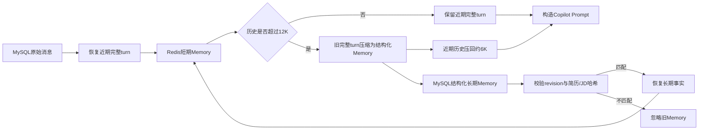

# Copilot 12K 上下文压缩与小规模压测报告

> 更新日期：2026-08-25
> 范围：仅 Copilot 会话链路。
> 上下文参数：历史高水位 12000 tokens，压缩目标 6000 tokens。

## 结论

Copilot 使用 **token-first + 高低水位** 管理历史上下文：历史估算超过 12000 tokens 时，按完整 `USER + ASSISTANT` turn 从最旧部分开始压缩，并将近期原始历史压回约 6000 tokens。

在此基础上，当前代码已经形成两层 Memory：Redis 保存 2 小时内可直接拼入 Prompt 的短期上下文；MySQL `context_snapshot` 保存带候选人范围校验的结构化长期记忆。MySQL 原始消息表继续作为审计与重建来源，不把整段聊天记录冒充“长期记忆”。

512 条消息只是异常输入安全护栏，正常业务触发依据是 token 预算。DeepSeek V4 Flash 的 1M 上下文是模型容量上限，不是每轮短问答的目标输入量；应用层 12K 历史预算用于平衡多轮连贯性、Prompt Cache、延迟、费用和信息噪声。

## 当前配置

```text
历史压缩触发：12000 tokens
压缩后目标：6000 tokens
Redis热缓存TTL：2小时
异常消息数护栏：512条
普通长文本截断：60%头部 + 截断标记 + 40%尾部
```

环境变量：

```ini
COPILOT_HISTORY_HIGH_WATERMARK_TOKENS=12000
COPILOT_HISTORY_TARGET_TOKENS=6000
```

## 上下文链路



### Redis 与 MySQL

| 存储 | 内容 | 作用 |
|---|---|---|
| Redis | `scopeHash`、结构化长期 Memory 的 Prompt 投影、近期完整 turn、待压缩区和边界信息；TTL 2 小时 | 短期记忆，避免每轮重新扫描完整历史 |
| MySQL `context_snapshot` | `copilot-memory-v1` 结构化长期 Memory、适用范围、压缩边界和压缩前后 token | 长期记忆与压缩审计 |
| MySQL `conversation_message` | 完整 USER/ASSISTANT 原始消息 | 审计与 Redis 丢失后的重建来源 |

Redis 丢失或过期后，服务端先按当前会话计算 `scopeHash`，只读取范围匹配的最新结构化快照，再加载快照边界之后的原始消息重建 Redis。简历、JD 或会话 revision 改变时，旧 Memory 不再注入 Prompt；历史纯文本快照同样不会被误当成新版 Memory。

### 结构化长期 Memory

```json
{
  "schemaVersion": "copilot-memory-v1",
  "scope": {
    "revision": 3,
    "resumeHash": "...",
    "jdHash": "...",
    "scopeHash": "..."
  },
  "goals": [
    {"text": "突出 Java 后端项目", "sourceMessageId": 480, "status": "active"}
  ],
  "confirmedCorrections": [],
  "decisions": [],
  "openQuestions": [],
  "evidenceRefs": [],
  "compactedThroughMessageId": 479
}
```

运行时负责 `scope`、压缩边界、累计合并、去重和条数上限；LLM 只提取 `goals`、`confirmedCorrections`、`decisions`、`openQuestions`、`evidenceRefs` 五类业务内容。这样既保留可解释的长期事实，又不把每次模型生成的自然语言摘要无限叠加。

## 完整性保护

### 完整 turn 边界

相邻 `USER + ASSISTANT` 作为整体保留或整体压缩，避免只留下回答而丢失对应问题。

### 长文本头尾保留

历史消息、简历、JD 和摘要超长时使用：

```text
60%头部 + […中间内容已截断…] + 40%尾部
```

### Tool Result

工具结果保留 `success/status/tool/mcpServer` envelope，只对 `text` 和 `structuredContent` 分别截断并重新序列化，避免产生半截 JSON 或破坏 tool-call 对应关系。

## 12K 压缩 Smoke（已实测基线）

专用合成会话预置 30 个完整 turn、60 条消息，只使用一次真实 Copilot 请求触发压缩。该次数据验证了 12K/6K 高低水位、完整 turn 边界、SSE 和 Prompt Cache；采集时快照仍为旧版增量摘要，因此不能用这组数据宣称新版结构化 Memory 已完成线上回归。

| 指标 | 结果 |
|---|---:|
| 压缩前估算 | 13366 tokens |
| 压缩后估算 | 5955 tokens |
| 减少 | 7411 tokens |
| 压缩比例 | 55.45% |
| 压缩结束边界 | ASSISTANT 479 |
| 第一条保留消息 | USER 480 |
| 快照原因 | `copilot_token_budget_12000_target_6000` |
| HTTP / SSE | 200 / 成功 |
| Provider failures | 0 |
| 公网 TTFT | 5578 ms |
| 公网完整响应 | 7777 ms |
| Provider 原始首 token | 335 ms |
| Provider 完整生成 | 2917 ms |
| DeepSeek cached tokens | 16384 / 16479 |
| DeepSeek cache token rate | 99.42% |

## Copilot 小规模压测

测试条件：

```text
请求数：12
并发：2
场景：普通Copilot短问答
MCP：不调用
conversation：每个请求使用新会话
```

| 指标 | 结果 |
|---|---:|
| 成功率 | 100%（12/12） |
| SSE 流式成功 | 12/12 |
| 完成吞吐 | 0.3116 req/s |
| TTFT P50 | 5510 ms |
| TTFT P95 | 5896 ms |
| 完整响应 P50 | 6336 ms |
| 完整响应 P95 | 6953 ms |
| Provider failures | 0 |
| Prompt tokens | 5648 |
| Cached prompt tokens | 4608 |
| Provider cache token rate | 81.59% |
| Redis context hit/miss | 0 / 12 |

12 个请求均为新 conversation，因此 Redis context 全部冷启动是预期结果；相同的稳定候选人前缀仍被 DeepSeek Prompt Cache 复用。

## 时延解释

外部 Windows 测试端观测到 TTFT 约 5.5～6.2 秒，但服务端从接收请求到首个 SSE delta 实测约 1.1～1.5 秒，Provider 原始首 token 约 0.3～0.6 秒。外部 TTFT 包含测试端到 ECS 的网络、连接与代理路径，不能全部归因于 Backend 或模型。

服务端数据库前置链路的 3 次分段 smoke 结果：

| 阶段 | P50 | 最大值 |
|---|---:|---:|
| 进入事务 | 1ms | 7ms |
| 会话解析 | 3ms | 10ms |
| 会话行锁 | 1ms | 1ms |
| 幂等查询 | 1ms | 4ms |
| conversation_turn 写入 | 1ms | 2ms |
| USER 消息写入 | 0ms | 2ms |
| 请求进入 ReplyService 前总计 | 10ms | 31ms |

因此数据库不是当前 5 秒级 TTFT 的瓶颈。

## 两层 Memory 改造状态

| 项目 | 当前状态 |
|---|---|
| Redis 短期上下文 | 已有，TTL 2 小时；本次增加 `scopeHash` 校验和结构化 Memory 投影 |
| MySQL 结构化长期 Memory | 本地代码已实现，复用现有 `context_snapshot`，不增加基础设施 |
| 累计合并与去重 | 本地代码已实现；同一事实不会随多次压缩机械重复 |
| 候选人范围隔离 | 本地代码已实现；通过 revision、resumeHash、jdHash、scopeHash 校验 |
| 历史文本快照兼容 | 失败关闭：旧文本可保留审计，但不会注入新版 Prompt |
| 新版线上 smoke / 压测 | 未执行；ECS 已过期，且本次按要求不编译、不测试 |

因此，下方验收结论只覆盖既有 12K 基线；两层 Memory 的功能与性能需要在下次可用环境中补一次低成本 smoke 后才能标记为“已验证”。

## 验收结果

- 12K 高水位、6K 低水位：通过。
- 单次压缩比例 55.45%：通过。
- 完整 USER/ASSISTANT turn 边界：通过。
- 非空增量摘要与快照落库：通过。
- DeepSeek Prompt Cache：smoke 99.42%，小压测 81.59%。
- SSE：12/12。
- Provider failures：0。

样本规模仅用于低成本功能、流式和低并发回归，不代表系统高并发容量上限；新版两层 Memory 尚未包含在这些实测数据中。
