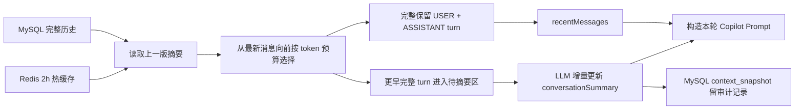

# Copilot 上下文压缩与低成本回归报告

> 日期：2026-08-20
> 范围：仅 Copilot 会话链路，不包含简历评估 Workflow。
> 成本控制：复用一个合成长上下文会话；修复部署后只追加 2 次 LLM 请求。

## 结论

Copilot 已从“固定保留最近 8 条消息”改为 **token-first + 高低水位**：2400 tokens 是触发上限，触发后一次压回约 1600 tokens；64 条仅作为极端安全上限，不参与正常触发判断。

最终线上快照 version 4 实测：

| 指标 | 结果 |
|---|---:|
| 压缩前估算 | 2459 tokens |
| 压缩后估算 | 1600 tokens |
| 本次减少 | 859 tokens |
| 压缩比例 | 34.93% |
| 被摘要消息 | 319–324（3 个完整 USER + ASSISTANT turn） |
| 第一条保留消息 | 325 |
| 快照原因 | `copilot_token_budget_2400_target_1600` |

压缩后回到 1600-token 目标，形成 2400/1600 的迟滞区间，避免每次只压缩一个 turn 后很快再次调用摘要模型。

## 当前链路



### Redis 与 MySQL 的职责

| 存储 | 保存内容 | 目的 |
|---|---|---|
| Redis | 当前可直接注入 Prompt 的摘要、近期消息和待压缩区；TTL 2 小时 | 避免每轮重复查询和重建历史窗口 |
| MySQL `conversation_message` | 完整 USER/ASSISTANT 消息 | 事实源、长期保存、可重建 Redis |
| MySQL `context_snapshot` | 摘要版本、压缩消息范围、首条保留消息、压缩前后 token 估算 | 压缩过程审计与效果观测 |

Redis 不是唯一事实源。缓存丢失或过期后，可由 MySQL 消息和最新快照重建。

## 边界保护

### 1. 不拆完整 turn

相邻的 `USER + ASSISTANT` 优先作为整体选择或整体压缩，避免 Prompt 中只剩回答、没有对应问题。

### 2. 普通长文本保留头尾

历史消息、简历、JD、摘要超长时使用：

```text
60% 头部 + […中间内容已截断…] + 40% 尾部
```

这样能同时保留开头的对象/目标和结尾的结论、状态或约束。

### 3. tool-call 结果不从 JSON 中部硬切

工具消息先保留稳定 envelope：

- `success`
- `status`
- `tool`
- `mcpServer`

只对大字段 `text` 和 `structuredContent` 分别做头尾截断，最后重新序列化，因此不会产生半截 JSON，也不会切坏 tool-call ID 对应关系。

## 线上回归

### 长上下文触发验证

同一合成 conversation 连续执行 8 个长 turn：

- 8/8 成功；
- 全部为 `DIRECT_REPLY`；
- 全部 `runId=null`，未误创建 Workflow Run；
- 前 5 个 turn 后仍未产生快照，因为有效历史只有约 1600 tokens；
- 第 8 个 turn 后才首次超过预算并生成快照。

这直接排除了“仍按固定 8 条触发”的情况。

### 部署后最小回归

| 请求 | HTTP | TTFT | 总耗时 | SSE delta | disposition | Workflow Run |
|---|---:|---:|---:|---:|---|---|
| metric fix | 200 | 6879 ms | 7922 ms | 97 | DIRECT_REPLY | 无 |
| metric fix v3 | 200 | 5997 ms | 7409 ms | 98 | DIRECT_REPLY | 无 |

以上只有 2 个请求，作用是功能与指标回归，不能用来宣称高并发容量或稳定 P95。

### 低成本 Copilot 压测

为避免 DeepSeek 费用过高，采用两批独立的并发 2 测试，每批 4 个请求，随后补跑 8 个请求，合计 12 个普通 Copilot turn。测试不调用 MCP，也不创建 Workflow Run。

| 批次 | 请求 | 并发 | 成功率 | TTFT P50/P95 | 完整响应 P50/P95 | 批次吞吐 |
|---|---:|---:|---:|---:|---:|---:|
| 第一批 | 4 | 2 | 100% | 5817 / 5954 ms | 6982 / 7412 ms | 0.2763 req/s |
| 第二批 | 8 | 2 | 100% | 5639 / 5733 ms | 6365 / 7230 ms | 0.3017 req/s |

合并 12 个成功样本的分布：

- TTFT P50 ≈ 5667 ms，P95 ≈ 5901 ms；
- 完整响应 P50 ≈ 6631 ms，P95 ≈ 7429 ms；
- SSE 流式成功 `12/12`；
- 意外创建 Workflow Run `0`。

这轮足以支撑“并发 2 下 Copilot 链路可用、流式正常、无 Workflow 串扰”的面试描述；样本仍不足以宣称高并发容量上限。

## 快照版本说明

| 版本 | before → after | 是否用于最终结论 | 原因 |
|---|---:|---|---|
| v1 | 2325 → 2379 | 否 | 旧实现漏算待摘要消息，统计口径错误 |
| v2 | 2369 → 2369 | 否 | 部署保留 Redis 持久卷，请求读取到修复前缓存 |
| v3 | 2655 → 2372 | 否 | 缓存已重建，但仍属于旧的单水位策略 |
| v4 | 2459 → 1600 | 是 | 高低水位策略；一次压缩 3 个完整 turn |

v1、v2 保留在数据库中是为了审计，不应覆盖或伪装成有效结果；正式对外口径使用 v3。

## 验收结论

- token-first 触发：通过。
- 完整 turn 边界：通过。
- 普通长文本头尾保留：已部署并通过构建。
- tool-call JSON 字段级截断：已部署并通过构建。
- SSE 真流式：通过。
- Copilot 与 Workflow 隔离：通过，回归请求未创建 Run。
- 压缩指标：修复完成，最终实测 `2459 → 1600`（34.93%）。
- 高低水位策略：通过，避免单次只释放约 10% 上下文。
