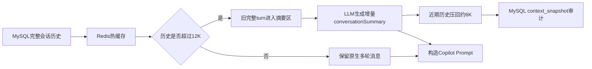

# Copilot 12K 上下文压缩与小规模压测报告

> 日期：2026-08-21
> 范围：仅 Copilot 会话链路，不包含简历评估 Workflow。
> 当前生产参数：历史高水位 12000 tokens，压缩目标 6000 tokens。

## 结论

Copilot 使用 **token-first + 高低水位** 管理历史上下文：历史估算超过 12000 tokens 时，按完整 `USER + ASSISTANT` turn 从最旧部分开始生成增量摘要，并将近期原始历史压回约 6000 tokens。

512 条消息只是异常输入安全护栏，正常业务触发依据是 token 预算。DeepSeek V4 Flash 的 1M 上下文是模型容量上限，不是每轮短问答的目标输入量；应用层 12K 历史预算用于平衡多轮连贯性、Prompt Cache、延迟、费用和信息噪声。

## 当前配置

```text
历史压缩触发：12000 tokens
压缩后目标：6000 tokens
Redis热缓存TTL：2小时
异常消息数护栏：512条
普通长文本截断：60%头部 + 截断标记 + 40%尾部
```

环境变量：

```ini
COPILOT_HISTORY_HIGH_WATERMARK_TOKENS=12000
COPILOT_HISTORY_TARGET_TOKENS=6000
```

## 上下文链路



### Redis 与 MySQL

| 存储 | 内容 | 作用 |
|---|---|---|
| Redis | Prompt 可直接使用的摘要、近期消息和待压缩区 | 避免每轮重新扫描完整历史 |
| MySQL `conversation_message` | 完整 USER/ASSISTANT 消息 | 长期事实源，可重建 Redis |
| MySQL `context_snapshot` | 摘要版本、压缩范围、首条保留消息、压缩前后 token | 压缩过程审计 |

Redis 丢失或过期后，由 MySQL 消息和最新快照重建。

## 完整性保护

### 完整 turn 边界

相邻 `USER + ASSISTANT` 作为整体保留或整体压缩，避免只留下回答而丢失对应问题。

### 长文本头尾保留

历史消息、简历、JD 和摘要超长时使用：

```text
60%头部 + […中间内容已截断…] + 40%尾部
```

### Tool Result

工具结果保留 `success/status/tool/mcpServer` envelope，只对 `text` 和 `structuredContent` 分别截断并重新序列化，避免产生半截 JSON 或破坏 tool-call 对应关系。

## 12K 压缩 Smoke

专用合成会话预置 30 个完整 turn、60 条消息，只使用一次真实 Copilot 请求触发压缩。首次 smoke 发现模型可能返回 `conversationSummary=null`；修复为在存在 `messagesToCompact` 时于动态 Prompt 尾部明确要求返回非空增量摘要，重新回归通过。

| 指标 | 结果 |
|---|---:|
| 压缩前估算 | 13366 tokens |
| 压缩后估算 | 5955 tokens |
| 减少 | 7411 tokens |
| 压缩比例 | 55.45% |
| 压缩结束边界 | ASSISTANT 479 |
| 第一条保留消息 | USER 480 |
| 快照原因 | `copilot_token_budget_12000_target_6000` |
| HTTP / SSE | 200 / 成功 |
| Provider failures | 0 |
| 公网 TTFT | 5578 ms |
| 公网完整响应 | 7777 ms |
| Provider 原始首 token | 335 ms |
| Provider 完整生成 | 2917 ms |
| DeepSeek cached tokens | 16384 / 16479 |
| DeepSeek cache token rate | 99.42% |
| Workflow Run | 0 |

## Copilot 小规模压测

测试条件：

```text
请求数：12
并发：2
场景：普通Copilot短问答
MCP：不调用
Workflow：不创建Run
conversation：每个请求使用新会话
```

| 指标 | 结果 |
|---|---:|
| 成功率 | 100%（12/12） |
| SSE 流式成功 | 12/12 |
| 完成吞吐 | 0.3116 req/s |
| TTFT P50 | 5510 ms |
| TTFT P95 | 5896 ms |
| 完整响应 P50 | 6336 ms |
| 完整响应 P95 | 6953 ms |
| Provider failures | 0 |
| Prompt tokens | 5648 |
| Cached prompt tokens | 4608 |
| Provider cache token rate | 81.59% |
| Redis context hit/miss | 0 / 12 |
| 意外 Workflow Run | 0 |

12 个请求均为新 conversation，因此 Redis context 全部冷启动是预期结果；相同的稳定候选人前缀仍被 DeepSeek Prompt Cache 复用。

## 时延解释

外部 Windows 测试端观测到 TTFT 约 5.5～6.2 秒，但服务端从接收请求到首个 SSE delta 实测约 1.1～1.5 秒，Provider 原始首 token 约 0.3～0.6 秒。外部 TTFT 包含测试端到 ECS 的网络、连接与代理路径，不能全部归因于 Backend 或模型。

服务端数据库前置链路的 3 次分段 smoke 结果：

| 阶段 | P50 | 最大值 |
|---|---:|---:|
| 进入事务 | 1ms | 7ms |
| 会话解析 | 3ms | 10ms |
| 会话行锁 | 1ms | 1ms |
| 幂等查询 | 1ms | 4ms |
| Run 状态查询 | 0ms | 1ms |
| conversation_turn 写入 | 1ms | 2ms |
| USER 消息写入 | 0ms | 2ms |
| 请求进入 ReplyService 前总计 | 10ms | 31ms |

因此数据库不是当前 5 秒级 TTFT 的瓶颈。

## 数据库热路径优化

虽然当前数据量下 SQL 仅为毫秒级，Copilot 每轮原先仍需分别查询 active、paused、pending Run，最多产生 3 次 MySQL round-trip。当前版本改为一次状态快照查询：

```sql
SELECT *
FROM agent_run
WHERE conversation_id = ?
  AND status IN (...active statuses..., 'PAUSED', 'QUEUED');
```

Java 在结果中选择各类别 `created_at` 最新记录，并通过 V24 增加联合索引：

```sql
CREATE INDEX idx_agent_run_conv_status_created
ON agent_run(conversation_id, status, created_at);
```

该优化的准确收益是将 Run 状态读取从最多 3 次 SQL 往返缩减为 1 次，并为会话 Run 历史增长提供组合过滤路径；不能宣称它把当前外部 TTFT 降低了数秒。线上 V24 已应用，最终 Copilot smoke HTTP 200、SSE 正常、Provider failure 为 0、未创建 Workflow Run。

## 验收结果

- 12K 高水位、6K 低水位：通过。
- 单次压缩比例 55.45%：通过。
- 完整 USER/ASSISTANT turn 边界：通过。
- 非空增量摘要与快照落库：通过。
- DeepSeek Prompt Cache：smoke 99.42%，小压测 81.59%。
- SSE：12/12。
- Provider failures：0。
- Copilot 与 Workflow 隔离：通过，未创建 Workflow Run。
- ECS Backend/Workflow：部署后健康。

样本规模仅用于低成本功能、流式和低并发回归，不代表系统高并发容量上限。
