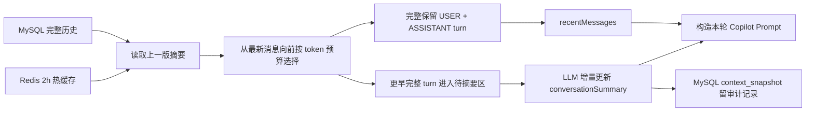

# Copilot 上下文压缩与低成本回归报告

> 日期：2026-08-21
> 范围：仅 Copilot 会话链路，不包含简历评估 Workflow。
> 成本控制：长上下文通过专用合成会话预置，只用真实 Copilot 请求验证压缩；容量回归限定为 12 请求、并发 2。

## 结论

Copilot 已从“固定保留最近 8 条消息”改为 **token-first + 高低水位**。当前生产配置以历史消息约 12000 tokens 为触发上限，触发后压回约 6000 tokens；512 条仅作为异常输入安全护栏，不参与正常业务触发。模型的 1M 上下文是容量上限，不是每轮短问答的目标填充量；应用层还需控制首 token 延迟、费用和信息噪声。

当前生产 `12000/6000` smoke：

| 指标 | 结果 |
|---|---:|
| 压缩前估算 | 13366 tokens |
| 压缩后估算 | 5955 tokens |
| 本次减少 | 7411 tokens |
| 压缩比例 | 55.45% |
| 被摘要消息边界 | 结束于 ASSISTANT 479 |
| 第一条保留消息 | USER 480 |
| 快照原因 | `copilot_token_budget_12000_target_6000` |
| SSE / Provider | 成功 / failures=0 |
| 公网 TTFT / 完整响应 | 5578 / 7777 ms |
| Provider 原始首 token | 335 ms |
| DeepSeek cache token rate | 99.42%（16384/16479） |

本轮首先发现模型未返回增量摘要、因此没有生成快照；修复为在动态尾部显式要求非空 `conversationSummary` 后重新回归通过。该要求不会进入稳定前缀，不破坏 DeepSeek Prompt Cache。

## 当前链路



### Redis 与 MySQL 的职责

| 存储 | 保存内容 | 目的 |
|---|---|---|
| Redis | 当前可直接注入 Prompt 的摘要、近期消息和待压缩区；TTL 2 小时 | 避免每轮重复查询和重建历史窗口 |
| MySQL `conversation_message` | 完整 USER/ASSISTANT 消息 | 事实源、长期保存、可重建 Redis |
| MySQL `context_snapshot` | 摘要版本、压缩消息范围、首条保留消息、压缩前后 token 估算 | 压缩过程审计与效果观测 |

Redis 不是唯一事实源。缓存丢失或过期后，可由 MySQL 消息和最新快照重建。

## 边界保护

### 1. 不拆完整 turn

相邻的 `USER + ASSISTANT` 优先作为整体选择或整体压缩，避免 Prompt 中只剩回答、没有对应问题。

### 2. 普通长文本保留头尾

历史消息、简历、JD、摘要超长时使用：

```text
60% 头部 + […中间内容已截断…] + 40% 尾部
```

这样能同时保留开头的对象/目标和结尾的结论、状态或约束。

### 3. tool-call 结果不从 JSON 中部硬切

工具消息先保留稳定 envelope：

- `success`
- `status`
- `tool`
- `mcpServer`

只对大字段 `text` 和 `structuredContent` 分别做头尾截断，最后重新序列化，因此不会产生半截 JSON，也不会切坏 tool-call ID 对应关系。

## 线上回归

### 历史机制实验

同一合成 conversation 连续执行 8 个长 turn：

- 8/8 成功；
- 全部为 `DIRECT_REPLY`；
- 全部 `runId=null`，未误创建 Workflow Run；
- 前 5 个 turn 后仍未产生快照，因为有效历史只有约 1600 tokens；
- 第 8 个 turn 后才首次超过预算并生成快照。

这组早期数据排除了“仍按固定 8 条触发”的情况，但使用的是实验参数 `2400/1600`；当前生产验收以本报告开头的 `13366 → 5955` 为准。

### 部署后最小回归

| 请求 | HTTP | TTFT | 总耗时 | SSE delta | disposition | Workflow Run |
|---|---:|---:|---:|---:|---|---|
| metric fix | 200 | 6879 ms | 7922 ms | 97 | DIRECT_REPLY | 无 |
| metric fix v3 | 200 | 5997 ms | 7409 ms | 98 | DIRECT_REPLY | 无 |

以上只有 2 个请求，作用是功能与指标回归，不能用来宣称高并发容量或稳定 P95。

### 当前生产参数低成本 Copilot 压测

2026-08-21 在 `12000/6000` 与原生多轮 Prompt Cache 版本上执行 12 个普通 Copilot turn。每个请求使用新 conversation，并发 2；不调用 MCP，也不创建 Workflow Run。

| 请求 | 并发 | 成功率 | TTFT P50/P95 | 完整响应 P50/P95 | 完成吞吐 |
|---:|---:|---:|---:|---:|---:|
| 12 | 2 | 100% | 5510 / 5896 ms | 6336 / 6953 ms | 0.3116 req/s |

- SSE 流式成功 `12/12`；
- Provider failures `0`；
- 意外创建 Workflow Run `0`。
- DeepSeek Prompt tokens `5648`，cached tokens `4608`，cache token rate `81.59%`。
- Redis 上下文缓存 `0 hit / 12 miss`：12 个全是新 conversation，属于预期冷启动，不表示同会话热缓存失效。

这轮足以支撑“并发 2 下 Copilot 链路可用、流式正常、无 Workflow 串扰”的描述；样本仍不足以宣称高并发容量上限。

## 快照版本说明

| 版本 | before → after | 是否用于最终结论 | 原因 |
|---|---:|---|---|
| v1 | 2325 → 2379 | 否 | 旧实现漏算待摘要消息，统计口径错误 |
| v2 | 2369 → 2369 | 否 | 部署保留 Redis 持久卷，请求读取到修复前缓存 |
| v3 | 2655 → 2372 | 否 | 缓存已重建，但仍属于旧的单水位策略 |
| v4 | 2459 → 1600 | 机制实验 | 早期 2400/1600 参数；一次压缩 3 个完整 turn |

v1、v2 保留在数据库中是为了审计，不应覆盖或伪装成有效结果；当前正式对外口径使用独立生产 smoke 的 `13366 → 5955`。

## 验收结论

- token-first 触发：通过。
- 完整 turn 边界：通过。
- 普通长文本头尾保留：已部署并通过构建。
- tool-call JSON 字段级截断：已部署并通过构建。
- SSE 真流式：通过。
- Copilot 与 Workflow 隔离：通过，回归请求未创建 Run。
- 压缩机制：历史实验实测 `2459 → 1600`（34.93%），证明完整 turn 与高低水位生效。
- 当前生产阈值：`12000 → 6000`；专用长会话实测 `13366 → 5955`，压缩 55.45%。

## DeepSeek Prompt Cache 优化回归

Copilot 不再把近期对话整体序列化进一个动态 JSON，而是按原生多轮消息发送：稳定候选人上下文进入 system 前缀，历史按 `USER/ASSISTANT` 顺序追加，当前问题始终位于最后。历史 assistant 使用与当前 JSON mode 一致的结构重放，避免模型受纯文本历史影响而返回空 `answer`。

同一 conversation 连续 10 个极短 turn 的最终线上结果：

| 指标 | 结果 |
|---|---:|
| 10 轮累计 Prompt tokens | 7761 |
| 10 轮累计 cached tokens | 7040 |
| 10 轮累计 cache token rate | 90.71% |
| 第 3～10 轮 warm cache rate | 90.98% |
| Provider 成功 | 10/10 |
| Provider failures | 0 |
| 意外 Workflow Run | 0 |
| Provider 完整耗时 P50/P95 | 1150 / 1488 ms |

本轮验收同时要求缓存命中和 Provider 零 fallback，未把本地降级回答计入模型成功率。
