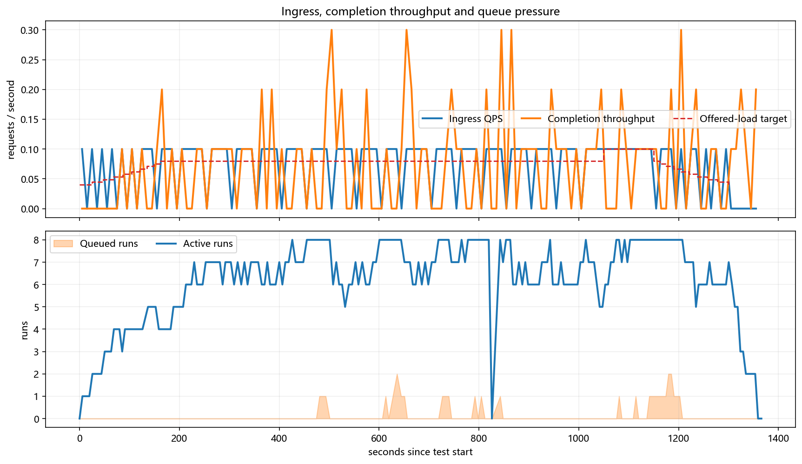
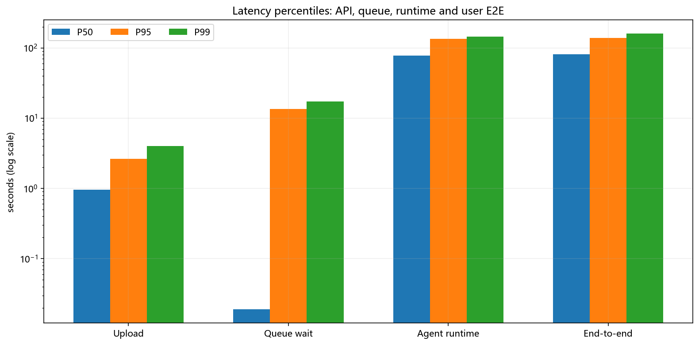
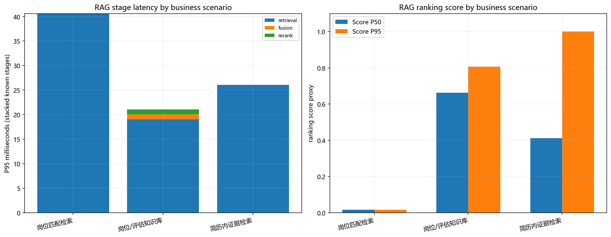
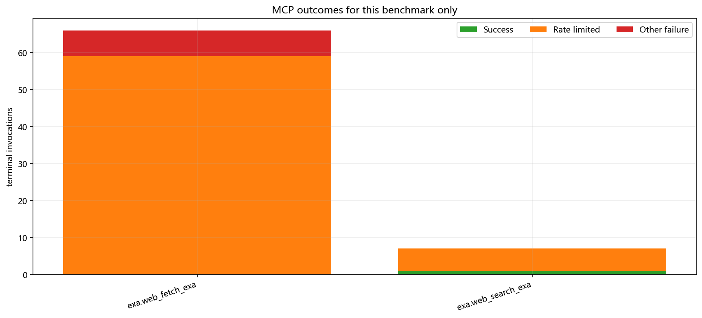
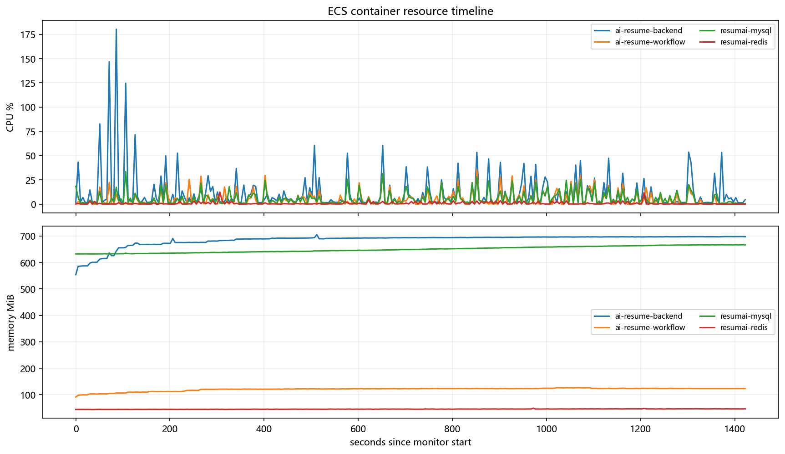

# ResumAI 100 份简历生产压测报告

> 测试版本 `f89ab83` · 生成时间 2026-07-31 21:07:29
> 负载模型：10 份预热（0.04 → 0.08 QPS） → 70 份稳态（0.08 QPS） → 10 份短过载（0.1 QPS） → 10 份降载（0.08 → 0.04 QPS）；用户入口为简历上传接口。

## 执行摘要

| 维度 | 判定 | 关键证据 |
|---|:---:|---|
| 上传入口 | **PASS** | 100/100 成功；稳态 0.08 QPS；P95 2.64 s |
| 评估正确结束 | **PASS** | SUCCESS 100，PARTIAL 0；LLM 失败 1（DeepSeek 429 0） |
| 报告产出质量 | **PASS** | 空报告 0；平均 5,537.2 字符、5.51 个风险、7.08 个面试题、38.48 条证据引用 |
| 持续消费能力 | **PASS** | 完成吞吐 0.0736 份/s；队列峰值 2；结束队列 0；排空 1.0 min |
| 单份评估时延 | **WARN** | Runtime P95 2.25 min；Queue wait P95 13.58 s |
| RAG | **PASS** | 485 次，成功率 100.0%，P95 38 ms，零召回 0；Score 遥测 100.0% |
| MCP 外部证据 | **WARN** | 限流 65，404 0，其他失败 7；覆盖 2/3 endpoint |
| Skill | **PASS** | 5/5 有实际应用；本地加载 P95 38 ms；2 个 Skill 按信号动态跳过 |
| 运行稳定性 | **PASS** | 重启 0，OOM 0，CPU throttling 0 |
| 存储水位 | **PASS** | `/data` 峰值 43% |

**总评：入口稳态达到 0.08 QPS；本批观测并发 8、Run 队列峰值 2、完成吞吐约 0.0736 份/s。队列能在降载阶段归零，本轮 0.08 QPS 持续 SLO 通过；长尾和公共 Exa 配额是剩余风险。**

## 1. 测试设计

| 阶段 | 请求数 | 目标流量 | 实际 QPS | 上传 P95 |
|---|---:|---:|---:|---:|
| 预热 | 10 | 0.04 → 0.08 QPS | 0.0555 | 2.90 s |
| 稳态 | 70 | 0.08 QPS | 0.08 | 2.74 s |
| 短过载 | 10 | 0.1 QPS | 0.1 | 1.27 s |
| 降载 | 10 | 0.08 → 0.04 QPS | 0.06 | 993.9 ms |

- 发压时长：1,300.31 s；等待全部任务完成：58.99 s。
- ECS 监控：285 个有效样本，覆盖 1,422 s；监控坏样本 0。

## 2. 流量、容量与时延

| 指标 | P50 | P95 | P99 | Max |
|---|---:|---:|---:|---:|
| 上传接口 | 952.5 ms | 2.64 s | 4.02 s | 4.25 s |
| 队列等待 | 19 ms | 13.58 s | 17.23 s | 25.71 s |
| Agent Runtime | 1.29 min | 2.25 min | 2.40 min | 2.45 min |
| 用户端到端 | 1.36 min | 2.32 min | 2.68 min | 2.84 min |

### Agent 与 LLM

| Agent | 参与 Run | P50 | P95 | Max |
|---|---:|---:|---:|---:|
| EvidenceAgent | 100 | 15.39 s | 26.85 s | 43.86 s |
| ProjectAgent | 84 | 27.72 s | 44.64 s | 53.28 s |
| ReportAgent | 100 | 24.64 s | 1.49 min | 1.66 min |
| RiskAgent | 97 | 27.51 s | 44.22 s | 53.28 s |
| TechAgent | 100 | 27.43 s | 44.13 s | 53.28 s |

- 共 1,023 次 LLM 调用（平均 10.23 次/份），失败 1；P95 24.22 s。
- LLM 失败分类：{"JSON_TRUNCATED": 1}；DeepSeek 429 = 0。
- Prompt / Completion：5,894,908 / 1,272,534 tokens；缓存命中 29.5%；总成本 ¥6.8772（¥0.0688/份）。
- 报告正文字符 P50/P95 = 5,626.5/7,275.1；风险数 P50/P95 = 6/6；面试题 P50/P95 = 8/8。

### 动态路由

共出现 **4 种** Agent 组合。样本间 Agent 组合存在实际差异。

| Agent 路由 | Run 数 |
|---|---:|
| TechAgent → ProjectAgent → RiskAgent → EvidenceAgent → ReportAgent | 83 |
| TechAgent → RiskAgent → EvidenceAgent → ReportAgent | 14 |
| TechAgent → EvidenceAgent → ReportAgent | 2 |
| TechAgent → ProjectAgent → EvidenceAgent → ReportAgent | 1 |

## 3. RAG 质量与耗时

| 调用 | 成功率 | 零召回 | 降级 | P50 | P95 | P99 |
|---:|---:|---:|---:|---:|---:|---:|
| 485 | 100.0% | 0 | 1 | 21 ms | 38 ms | 57.16 ms |

### 按业务场景拆分

| 场景 | Tool | 调用 | 成功率 | P95 | Score 覆盖 | Score P50 | Top-K P50 | Rerank |
|---|---|---:|---:|---:|---:|---:|---:|---:|
| 岗位匹配检索 | `jd_match_search` | 100 | 100.0% | 40.2 ms | 100.0% | 0.016 | 100.0% | 0 |
| 岗位/评估知识库 | `knowledge_search` | 200 | 100.0% | 44.05 ms | 100.0% | 0.662 | 100.0% | 200 |
| 简历内证据检索 | `resume_semantic_search` | 185 | 100.0% | 25.8 ms | 100.0% | 0.412 | 100.0% | 185 |

岗位匹配、岗位/评估知识库、简历内证据是三条不同检索链路，因此 Score 和时延不能混成一个平均数。外部公开证据来自 MCP，在第 6 节单列，不把网页搜索冒充内部 RAG。

> Query planning 口径：`provider_authored_query_with_deterministic_passthrough`。本版本独立 rewrite 次数 0，多 query 次数 0。Agent 的 LLM 会生成工具 query，但 Runtime 当前仅原样透传；阶段图中的 0ms 不能宣称为独立 query rewrite。

### Score 分布

Score 遥测覆盖 485/485 次调用（100.0%）。无 score 的调用不计为 0，避免把遥测缺失伪装成低相关度。

| 指标 | Min | Avg | P50 | P95 | P99 | Max |
|---|---:|---:|---:|---:|---:|---:|
| Top score proxy | 0.016 | 0.509 | 0.539 | 1 | 1 | 1 |

| Score 档位 | 样本数 | 占已采集 score |
|---|---:|---:|
| 高（≥ 0.7） | 127 | 26.2% |
| 中（0.4–0.7） | 170 | 35.1% |
| 低（< 0.4） | 188 | 38.8% |

Top-K 填充率 Avg / P50 / P95 = 94.0% / 100.0% / 100.0%。

按 Tool / Strategy 查看 Top score

| 维度 | 样本 | Avg | P50 | P95 | Min |
|---|---:|---:|---:|---:|---:|
| Tool `jd_match_search` | 100 | 0.024 | 0.016 | 0.016 | 0.016 |
| Tool `knowledge_search` | 200 | 0.705 | 0.662 | 0.807 | 0.498 |
| Tool `resume_semantic_search` | 185 | 0.559 | 0.412 | 1 | 0.068 |
| Strategy `embedding_only+feature_rerank` | 16 | 0.498 | 0.498 | 0.498 | 0.498 |
| Strategy `hybrid` | 100 | 0.024 | 0.016 | 0.016 | 0.016 |
| Strategy `hybrid_bm25_embedding+feature_rerank` | 184 | 0.723 | 0.662 | 0.883 | 0.662 |
| Strategy `resume_text_fallback` | 1 | 0.068 | 0.068 | 0.068 | 0.068 |
| Strategy `section_bm25_rrf` | 184 | 0.562 | 0.412 | 1 | 0.2 |

| 检索策略 | 调用数 | 占比 |
|---|---:|---:|
| `hybrid_bm25_embedding+feature_rerank` | 184 | 37.9% |
| `section_bm25_rrf` | 184 | 37.9% |
| `hybrid` | 100 | 20.6% |
| `embedding_only+feature_rerank` | 16 | 3.3% |
| `resume_text_fallback` | 1 | 0.2% |

> Rerank 标记覆盖 79.4%；顺序遥测覆盖 200 次，其中 72 次改变排序、60 次替换 Top-1。旧批次若顺序遥测为 0，只能判定历史埋点不足，不能把 score lift=0 误写成二次排序无收益。

### 离线带标签质量验收

| 场景 | Cases/Queries | Precision@K | Recall@K | MRR | nDCG@K |
|---|---:|---:|---:|---:|---:|
| 岗位匹配 | 10 | 0.25 | 1 | 1 | 1 |
| 岗位/评估知识库 | 16 | 0.2 | 1 | 0.9688 | 0.9769 |
| 简历内证据 | 24 | 0.7778 | 0.6933 | 0.9097 | 0.9529 |

在线 Score 是排序代理分；上表才是带 gold 标签的质量结论。知识库每 case 只有 1 个 gold 且固定返回 5 条，Precision@5 理论上限为 0.20。

## 4. Memory 生产与消费

| 类型 | 本次产出 | 本次消费 | TTL |
|---|---:|---:|---:|
| WORKING | 593 | 0 | 1 天 |
| SEMANTIC | 100 | 0 | 90 天 |
| EPISODIC | 393 | 344 | 90 天 |
| PROCEDURAL | 1 | 785 | 365 天 |

- 读取 400 次，命中读取 42.0%，返回 236 个片段。
- USED 1,129 条；score P50 / P95 = 0.541 / 0.57。
- **0 条（0.0%）存在 producer/consumer 版本不一致。各 Memory 类型是否均衡参与以本节类型表为准，不从历史累计反推本轮。**
- Memory 检索耗时：`MEASURED`；P50 / P95 = 37 ms / 56 ms。memory.read durationMs measured at the Java search boundary。

## 5. Skill 动态性与耗时

`load_skill` 共 324 次，全部成功；本地执行 P50 / P95 / Max = 28 ms / 38 ms / 55 ms。本地加载不是主要时延来源。

| Skill | Selected | Applied | 采用率 | 本地 P95 | 决策至采用 P95 |
|---|---:|---:|---:|---:|---:|
| 技术证据评估 | 100 | 100 | 100.0% | 38 ms | 1.53 s |
| 证据置信度校准 | 100 | 35 | 35.0% | 45.2 ms | 11.26 s |
| 项目主张核验 | 84 | 84 | 100.0% | 38 ms | 1.76 s |
| 公网候选人证据 | 70 | 70 | 100.0% | 37 ms | 1.81 s |
| 履历风险模式 | 97 | 35 | 36.1% | 35 ms | 1.96 s |

- 全局 selected→loaded P95 7.12 s；loaded→applied P95 116 ms。
- Skill 是否动态不以“注册过”判断，而以本轮不同简历的 selected/applied/skipped 及 Agent 分布判断；采用率低可能是路由策略，也可能是样本信号不足，报告不预设结论。

查看 Skill 原始标识与分阶段耗时

| Skill ID | Selected→Loaded P95 | Loaded→Applied P95 | Skipped |
|---|---:|---:|---:|
| `assess-technical-evidence` | 1.49 s | 55 ms | 0 |
| `calibrate-evidence-confidence` | 11.15 s | 144.1 ms | 65 |
| `ground-project-claims` | 1.66 s | 126.85 ms | 0 |
| `retrieve-public-candidate-evidence` | 1.72 s | 94.2 ms | 0 |
| `risk_pattern_detection` | 1.88 s | 103.6 ms | 62 |

## 6. MCP endpoint

本次实际调用 2/3 个 endpoint。以下数据只统计本轮 100 个 runId；Ops 页的历史累计不混入本轮成功率。`tool.completed` 但回执 `success=false` 仍计失败。

| Endpoint | 总调用 | 成功 | 限流 | 超时 | 404 | 其他失败 | P95 |
|---|---:|---:|---:|---:|---:|---:|---:|
| `exa.web_fetch_exa` | 66 | 0 | 59 | 0 | 0 | 7 | 8.53 s |
| `exa.web_search_exa` | 7 | 1 | 6 | 0 | 0 | 0 | 5.91 s |

未被调用的 endpoint

- `fetch.fetch`

## 7. ECS 资源与依赖

| 容器 | CPU Avg | CPU P95 | CPU Max | 内存 P95 | 内存 Max |
|---|---:|---:|---:|---:|---:|
| ai-resume-backend | 11.2% | 46.34% | 180.24% | 697.48 MiB | 705 MiB |
| ai-resume-workflow | 5.13% | 22.23% | 35.75% | 125.56 MiB | 126.5 MiB |
| resumai-mysql | 5.59% | 20.95% | 33.5% | 666.5 MiB | 666.9 MiB |
| resumai-redis | 0.88% | 3.2% | 12.51% | 46.67 MiB | 49.26 MiB |

- MySQL：Threads_running Max 6；行锁等待 Max 1。
- Redis：connected_clients Max 27；blocked_clients Max 1；evicted_keys 0。
- Runtime active P95 / Max = 8 / 8；Run queue P95 / Max = 1 / 2。

## 8. 主要问题与修复优先级

| 优先级 | 问题 | 证据 | 动作 |
|:---:|---|---|---|
| 已闭环 | 0.08 QPS 持续容量 | 完成吞吐 0.0736 份/s；队列峰值 2、结束为 0；排空 1.0 min | 本轮 0.08 QPS 稳态通过，0.10 QPS 只作短时突发；1 QPS 上传入口与深评完成能力分开表达 |
| 观察项 | 单份深评长尾 | Runtime P95 2.25 min；ReportAgent P95 1.49 min | 长尾主要来自外部 LLM；本轮不再修改 Workflow，若继续优化必须使用同样本 A/B 同时验收时延和报告质量 |
| P1 | 外部证据可靠性不足 | 限流 65，404 0，其他失败 7 | 限流来自未配付费 Key 的公共 Exa MCP，不是 DeepSeek；配置 EXA_API_KEY/替代供应商，否则标记外链不可核验，本地退避无法创造配额 |

## 9. 口径与限制

- **入口 QPS** 是上传请求速率；**完成吞吐** 是评估完成速率，二者不混用。
- 本报告对应测试版本 `f89ab83` 的 100 份本轮样本；后续修复必须单独回归，不能反写成本次已通过。
- RAG Top score 与 Top-K 填充率是在线代理指标，不等同于人工标注的 Precision/Recall。
- Skill 本地耗时取 `load_skill.startedAt → endedAt`；selected→applied 包含模型决策等待。
- Memory 检索耗时状态：`MEASURED`；未采集时不以 Agent 时长替代。

### 原始数据

- `load_report.json`：本报告结构化数据
- `raw_results.json`：100 份请求与任务结果
- `runtime_metrics.json`：Agent Runtime 聚合输入
- `rag_metrics.json` / `memory_metrics.json` / `skill_metrics.json`：三条质量链路
- `ecs_monitor.csv`：ECS 与容器采样
- `charts/*.png`：由上述原始数据生成的报告图表
