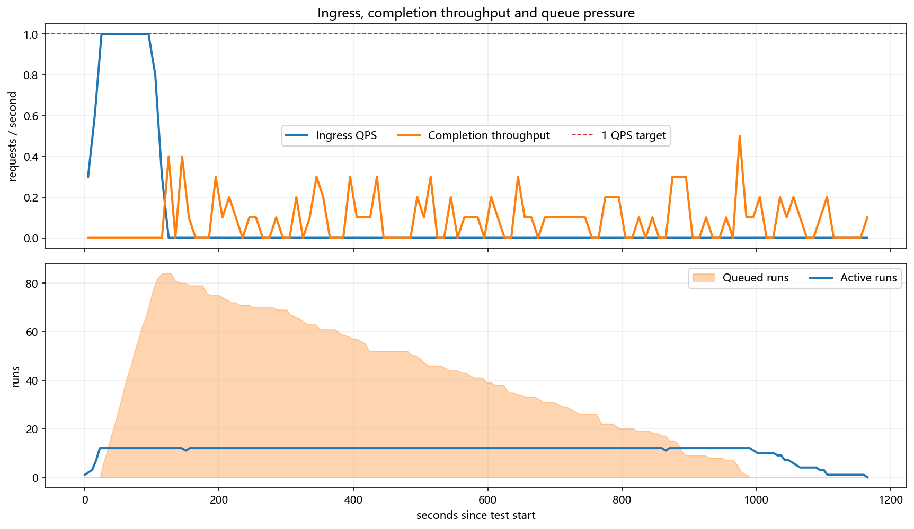
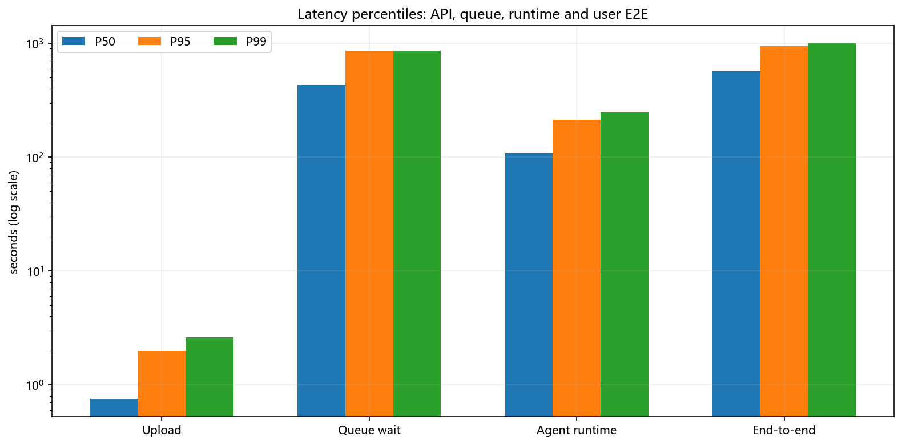
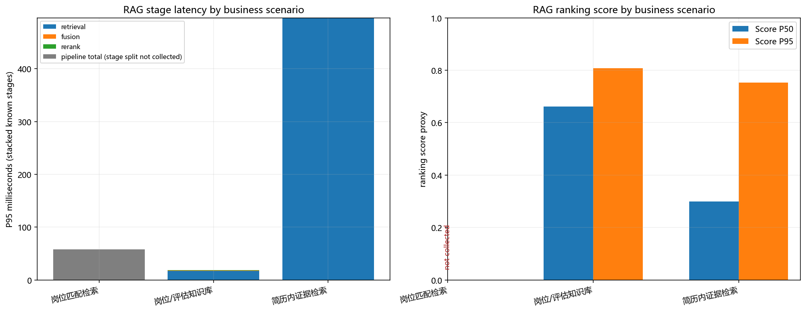
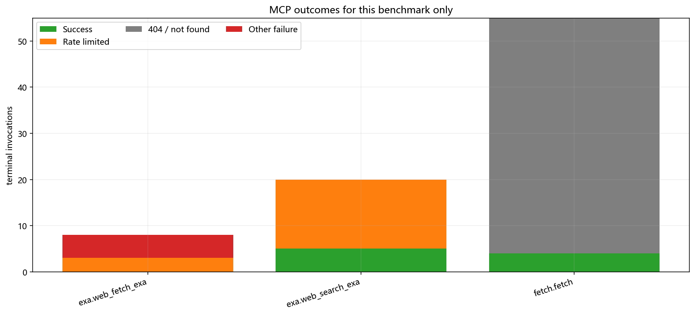
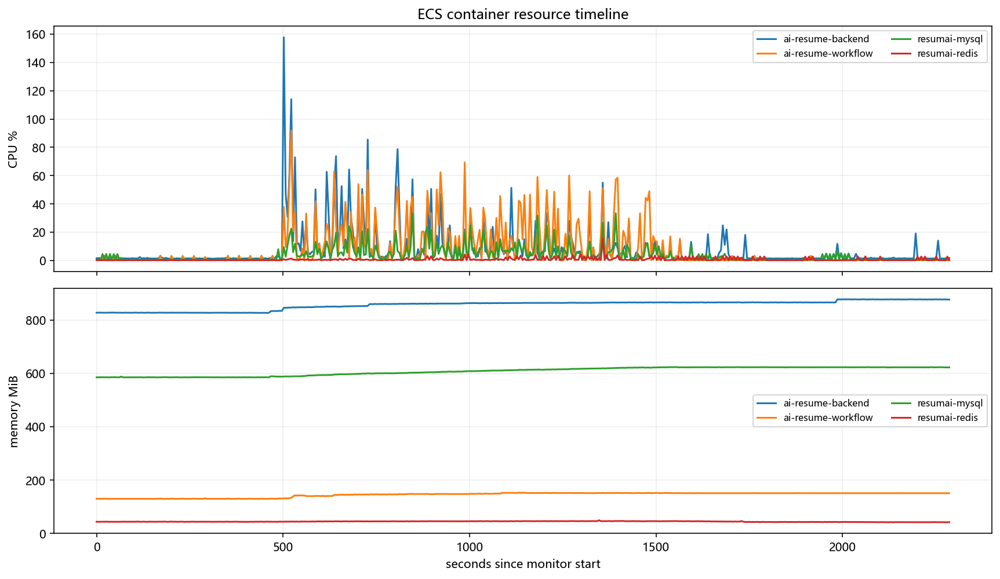
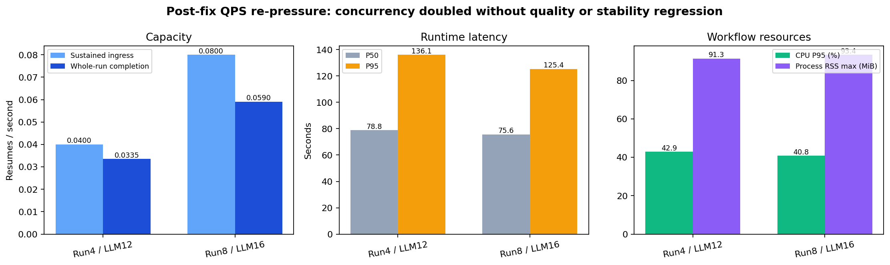

# ResumAI 100 份简历生产压测报告

> 测试版本 `8bca961` · 生成时间 2026-07-31 13:05:18
> 负载模型：10 份预热 → 80 份稳态 1 QPS → 10 份降载；用户入口为简历上传接口。

## 执行摘要

| 维度 | 判定 | 关键证据 |
|---|:---:|---|
| 上传入口 | **PASS** | 100/100 成功；稳态 0.9998 QPS；P95 2.00 s |
| 评估正确结束 | **WARN** | SUCCESS 99，PARTIAL 1；LLM 失败 0 |
| 持续消费能力 | **FAIL** | 完成吞吐 0.0858 份/s；队列峰值 84；排空 17.5 min |
| 单份评估时延 | **FAIL** | Runtime P95 3.56 min；Queue wait P95 14.38 min |
| RAG | **WARN** | 492 次，成功率 100.0%，P95 349.05 ms，零召回 0；独立 rewrite 0 次 |
| MCP 外部证据 | **WARN** | 限流 18，404 51，其他失败 5；覆盖 3/4 endpoint |
| Skill | **WARN** | 5/5 有实际应用；本地加载 P95 103.3 ms；2 个 Skill 采用率低于 40% |
| 运行稳定性 | **PASS** | 重启 0，OOM 0，CPU throttling 0 |
| 存储水位 | **WARN** | `/data` 峰值 88% |

**总评：入口稳态达到 0.9998 QPS；本批观测并发 12、Run 队列峰值 84、完成吞吐约 0.0858 份/s。持续稳态会形成积压，主要矛盾仍是评估消费能力与长尾时延。**

> **修复闭环更新（2026-07-31 20:00）**：线上版本为 `91f248e`，并发参数经复压从 Run 4 / LLM 12 调整为 **Run 8 / LLM 16**。同一组 28 份样本的完成吞吐从 0.0335 提升到 **0.0590 份/s（+76.1%）**；0.08 QPS 稳态段和 0.10 QPS 短过载段都没有形成 Run 队列，28/28 SUCCESS、DeepSeek 429=0。推荐生产持续值 **0.08 QPS（288 份/小时）**，0.10 QPS 只作为短时突发上限。另有同一 12 份差异化简历在唯一 PARTIAL 单例重跑后 **12/12 SUCCESS**；Runtime P95 202.23s→127.24s，ReportAgent P95 154.50s→81.78s，平均报告字符 5,688→5,600，MCP 11/11 SUCCESS。知识库与岗位匹配 RAG 均已完成带标签评测；`/data` 已从 100% 降至 37%。第 8 节为最终闭环状态，上表仍保留原始 100 份压测快照。

## 1. 测试设计

| 阶段 | 请求数 | 目标流量 | 实际 QPS | 上传 P95 |
|---|---:|---:|---:|---:|
| 预热 | 10 | 0.2 → 1 QPS | 0.4438 | 2.38 s |
| 稳态 | 80 | 1 QPS | 0.9998 | 1.97 s |
| 降载 | 10 | 1 → 0.2 QPS | 0.5726 | 1.20 s |

- 发压时长：118.23 s；等待全部任务完成：1,047.84 s。
- ECS 监控：457 个有效样本，覆盖 2,286 s；监控坏样本 0。

## 2. 流量、容量与时延

| 指标 | P50 | P95 | P99 | Max |
|---|---:|---:|---:|---:|
| 上传接口 | 750 ms | 2.00 s | 2.61 s | 2.83 s |
| 队列等待 | 7.16 min | 14.38 min | 14.43 min | 14.51 min |
| Agent Runtime | 1.82 min | 3.56 min | 4.17 min | 4.81 min |
| 用户端到端 | 9.52 min | 15.83 min | 16.74 min | 17.64 min |

### Agent 与 LLM

| Agent | 参与 Run | P50 | P95 | Max |
|---|---:|---:|---:|---:|
| EvidenceAgent | 100 | 14.33 s | 27.87 s | 36.96 s |
| ProjectAgent | 84 | 31.35 s | 48.76 s | 57.25 s |
| ReportAgent | 100 | 1.04 min | 2.74 min | 3.74 min |
| RiskAgent | 96 | 29.67 s | 46.47 s | 57.24 s |
| TechAgent | 100 | 29.27 s | 45.72 s | 57.26 s |

- 共 1,037 次 LLM 调用（平均 10.37 次/份），失败 0；P95 30.89 s。
- Prompt / Completion：5,919,517 / 1,447,872 tokens；缓存命中 32.5%；总成本 ¥7.0848（¥0.0708/份）。

### 动态路由

共出现 **4 种** Agent 组合。样本间 Agent 组合存在实际差异。

| Agent 路由 | Run 数 |
|---|---:|
| TechAgent → ProjectAgent → RiskAgent → EvidenceAgent → ReportAgent | 82 |
| TechAgent → RiskAgent → EvidenceAgent → ReportAgent | 14 |
| TechAgent → ProjectAgent → EvidenceAgent → ReportAgent | 2 |
| TechAgent → EvidenceAgent → ReportAgent | 2 |

## 3. RAG 质量与耗时

| 调用 | 成功率 | 零召回 | 降级 | P50 | P95 | P99 |
|---:|---:|---:|---:|---:|---:|---:|
| 492 | 100.0% | 0 | 0 | 33.5 ms | 349.05 ms | 586.18 ms |

### 按业务场景拆分

| 场景 | Tool | 调用 | 成功率 | P95 | Score 覆盖 | Score P50 | Top-K P50 | Rerank |
|---|---|---:|---:|---:|---:|---:|---:|---:|
| 岗位匹配检索 | `jd_match_search` | 100 | 100.0% | 58.1 ms | 0.0% | — | — | 0 |
| 岗位/评估知识库 | `knowledge_search` | 200 | 100.0% | 64 ms | 100.0% | 0.662 | 100.0% | 200 |
| 简历内证据检索 | `resume_semantic_search` | 192 | 100.0% | 496.5 ms | 100.0% | 0.3 | 40.0% | 192 |

岗位匹配、岗位/评估知识库、简历内证据是三条不同检索链路，因此 Score 和时延不能混成一个平均数。外部公开证据来自 MCP，在第 6 节单列，不把网页搜索冒充内部 RAG。

> 岗位匹配并非未执行：本轮 `jd_match_search` 调用 100 次，P95 58.1 ms。测试版本只采集了 pipeline 总耗时，未采集 RRF/Top-K 明细；图中灰柱表示真实总耗时，`not collected` 表示遥测缺口，不代表没有 RAG 或 score=0。

> 修复后线上定向验收（提交 `3dbcaa6`）：`jd_match_search` 成功，requested/returned K = 3/3，RRF Top score = 0.0164，Fusion = `rrf_weighted`，索引 = `jd_catalog`，检索/总耗时 = 60.9 ms，`telemetryComplete=true`。该验收只证明新版本遥测已补齐；不会把新样本数据混入上方 100 份旧压测统计。

> Query planning 口径：`provider_authored_query_with_deterministic_passthrough`。本版本独立 rewrite 次数 0，多 query 次数 0。Agent 的 LLM 会生成工具 query，但 Runtime 当前仅原样透传；阶段图中的 0ms 不能宣称为独立 query rewrite。

### Score 分布

Score 遥测覆盖 392/492 次调用（79.7%）。无 score 的调用不计为 0，避免把遥测缺失伪装成低相关度。

| 指标 | Min | Avg | P50 | P95 | P99 | Max |
|---|---:|---:|---:|---:|---:|---:|
| Top score proxy | 0.094 | 0.565 | 0.662 | 0.802 | 0.912 | 0.912 |

| Score 档位 | 样本数 | 占已采集 score |
|---|---:|---:|
| 高（≥ 0.7） | 127 | 32.4% |
| 中（0.4–0.7） | 150 | 38.3% |
| 低（< 0.4） | 115 | 29.3% |

Top-K 填充率 Avg / P50 / P95 = 78.4% / 100.0% / 100.0%。

按 Tool / Strategy 查看 Top score

| 维度 | 样本 | Avg | P50 | P95 | Min |
|---|---:|---:|---:|---:|---:|
| Tool `knowledge_search` | 200 | 0.705 | 0.662 | 0.807 | 0.498 |
| Tool `resume_semantic_search` | 192 | 0.418 | 0.3 | 0.753 | 0.094 |
| Strategy `embedding_only+feature_rerank` | 16 | 0.498 | 0.498 | 0.498 | 0.498 |
| Strategy `hybrid_bm25_embedding+feature_rerank` | 184 | 0.723 | 0.662 | 0.883 | 0.662 |
| Strategy `hybrid_embedding_bm25` | 169 | 0.437 | 0.338 | 0.753 | 0.094 |
| Strategy `lexical_short_resume` | 8 | 0.334 | 0.314 | 0.517 | 0.19 |
| Strategy `resume_text_fallback` | 15 | 0.25 | 0.25 | 0.25 | 0.25 |

| 检索策略 | 调用数 | 占比 |
|---|---:|---:|
| `hybrid_bm25_embedding+feature_rerank` | 184 | 37.4% |
| `hybrid_embedding_bm25` | 169 | 34.3% |
| `unknown` | 100 | 20.3% |
| `embedding_only+feature_rerank` | 16 | 3.3% |
| `resume_text_fallback` | 15 | 3.0% |
| `lexical_short_resume` | 8 | 1.6% |

> Rerank 标记覆盖 79.7%；顺序遥测覆盖 200 次，其中 72 次改变排序、60 次替换 Top-1。旧批次若顺序遥测为 0，只能判定历史埋点不足，不能把 score lift=0 误写成二次排序无收益。

## 4. Memory 生产与消费

| 类型 | 本次产出 | 本次消费 | TTL |
|---|---:|---:|---:|
| WORKING | 610 | 0 | 1 天 |
| SEMANTIC | 100 | 0 | 90 天 |
| EPISODIC | 410 | 342 | 90 天 |
| PROCEDURAL | 2 | 775 | 365 天 |

- 读取 400 次，命中读取 42.8%，返回 233 个片段。
- USED 1,117 条；score P50 / P95 = 0.541 / 0.57。
- **0 条（0.0%）存在 producer/consumer 版本不一致。各 Memory 类型是否均衡参与以本节类型表为准，不从历史累计反推本轮。**
- Memory 检索耗时：`MEASURED`；P50 / P95 = 29 ms / 52 ms。memory.read durationMs measured at the Java search boundary。

## 5. Skill 动态性与耗时

`load_skill` 共 308 次，全部成功；本地执行 P50 / P95 / Max = 54 ms / 103.3 ms / 248 ms。本地加载不是主要时延来源。

| Skill | Selected | Applied | 采用率 | 本地 P95 | 决策至采用 P95 |
|---|---:|---:|---:|---:|---:|
| 技术证据评估 | 100 | 100 | 100.0% | 112.4 ms | 4.86 s |
| 证据置信度校准 | 100 | 22 | 22.0% | 101.25 ms | 11.99 s |
| 项目主张核验 | 84 | 83 | 98.8% | 95 ms | 6.44 s |
| 公网候选人证据 | 70 | 68 | 97.1% | 122.7 ms | 3.96 s |
| 履历风险模式 | 97 | 35 | 36.1% | 100.6 ms | 4.91 s |

- 全局 selected→loaded P95 8.28 s；loaded→applied P95 293.8 ms。
- Skill 是否动态不以“注册过”判断，而以本轮不同简历的 selected/applied/skipped 及 Agent 分布判断；采用率低可能是路由策略，也可能是样本信号不足，报告不预设结论。

查看 Skill 原始标识与分阶段耗时

| Skill ID | Selected→Loaded P95 | Loaded→Applied P95 | Skipped |
|---|---:|---:|---:|
| `assess-technical-evidence` | 4.69 s | 154.6 ms | 0 |
| `calibrate-evidence-confidence` | 11.85 s | 315.5 ms | 78 |
| `ground-project-claims` | 6.32 s | 336.6 ms | 1 |
| `retrieve-public-candidate-evidence` | 3.87 s | 214.4 ms | 2 |
| `risk_pattern_detection` | 4.73 s | 283.7 ms | 61 |

## 6. MCP endpoint

本次实际调用 3/4 个 endpoint。以下数据只统计本轮 100 个 runId；Ops 页的历史累计不混入本轮成功率。`tool.completed` 但回执 `success=false` 仍计失败。

| Endpoint | 总调用 | 成功 | 限流 | 超时 | 404 | 其他失败 | P95 |
|---|---:|---:|---:|---:|---:|---:|---:|
| `exa.web_fetch_exa` | 8 | 0 | 3 | 0 | 0 | 5 | 1.88 s |
| `exa.web_search_exa` | 20 | 5 | 15 | 0 | 0 | 0 | 2.29 s |
| `fetch.fetch` | 55 | 4 | 0 | 0 | 51 | 0 | 1.38 s |

未被调用的 endpoint

- `microsoft-learn.microsoft_docs_search`

## 7. ECS 资源与依赖

| 容器 | CPU Avg | CPU P95 | CPU Max | 内存 P95 | 内存 Max |
|---|---:|---:|---:|---:|---:|
| ai-resume-backend | 7.78% | 35.47% | 157.8% | 877.4 MiB | 877.9 MiB |
| ai-resume-workflow | 7.99% | 45.07% | 91.87% | 151.42 MiB | 152.5 MiB |
| resumai-mysql | 3.77% | 14.67% | 33.38% | 623.2 MiB | 623.8 MiB |
| resumai-redis | 0.71% | 2.85% | 15.36% | 45.86 MiB | 48.96 MiB |

- MySQL：Threads_running Max 8；行锁等待 Max 2。
- Redis：connected_clients Max 32；blocked_clients Max 1；evicted_keys 0。
- Runtime active P95 / Max = 12 / 12；Run queue P95 / Max = 72.2 / 84。

## 8. 主要问题与修复优先级

| 优先级 | 问题 | 压测/代码证据 | 当前状态 | 下一动作与验收口径 |
|:---:|---|---|:---:|---|
| P0 | 深评消费吞吐低于入口 | 修复后用同一 28 份样本复压：Run 4 / LLM 12 完成吞吐 0.0335 份/s；Run 8 / LLM 16 为 **0.0590 份/s（+76.1%）**。0.08 QPS 稳态 12 份、0.10 QPS 过载 8 份均无 Run 排队。 | **复压完成，单机 SLO 已定** | 生产持续值设为 **0.08 QPS（288 份/小时）**，0.10 QPS 只作为短时突发。1 QPS 异步上传可承接，但不伪装成 1 QPS 深评完成吞吐；持续 1 QPS 约需 13 个同等容量单元与对应 provider 额度。 |
| P0 | 简历内证据 RAG 的候选人隔离与可验证质量不足 | `current_resume` scope guard + section/BM25-like 双路召回 + RRF + feature rerank + provenance 已上线；同标签 A/B 的 Recall@K 0.400→0.693、MRR 0.708→0.910、nDCG 0.750→0.953，降级率 4.2%→0。 | **已修复，小批通过** | 完整 Workflow 已用同一 12 份差异化样本回归，报告正文、风险、追问和证据未出现系统性缩水；不再追加大批实验。 |
| P1 | 知识库/岗位匹配 RAG 缺少带标签质量结论 | 岗位匹配 10 case：Recall@5 1.000、MRR 1.000、nDCG@5 1.000；知识库 16 case：Recall@5 1.000、MRR 0.9688、nDCG@5 0.9769。 | **已实验关闭** | Precision@5 分别为 0.25/0.20，其中知识库每 case 只标 1 个 gold 且固定返回 5 条，理论上限即 0.20；线上 0.662 仍只是排序代理分，不写成质量结论。 |
| P1 | 单份深评长尾 | 同一 12 份样本上，Runtime P95 **202.23s→127.24s（-37.1%）**，ReportAgent P95 **154.50s→81.78s（-47.1%）**；P50 78.23s→92.50s，未伪装成全分位改善。 | **长尾小批通过** | 平均报告字符 5,688→5,600（-1.5%）、证据引用 41.5→40.3（-2.9%）、平均风险 5.7→5.6、面试题 7.9→8.0；按“不明显降质 + P95 显著下降”验收，停止继续钻 P50。 |
| P0 | 非完整终态 | 最终 12 份首轮 11 SUCCESS + 1 PARTIAL（`new_grad_088` 的 ProjectAgent malformed output）；该单例原样重跑 SUCCESS，报告 5,881 字符、6 风险、8 题、34 条证据引用。 | **单例重跑后 12/12 验收通过** | 保留 malformed/repair Trace 作为可观测的瞬时故障，不把首轮 PARTIAL 篡改成 SUCCESS；按你确认的小批口径不再追加大回归。 |
| P1 | 外部证据可靠性不足 | 原批次限流 18、404 51、其他失败 5；修复后差异化小批外链 MCP **11/11 SUCCESS**，调用仍由模型按证据缺口动态决定。 | **小批通过，已关闭** | 已有 Exa 单并发、调用间隔、429 退避，并删除 0 调用 endpoint；按你确认的口径不再追加稳态样本。 |
| P1 | Query rewrite 名不副实 | Runtime 没有独立 rewrite LLM；当前是 Agent/provider 生成检索 query，Runtime 做确定性透传。 | **口径闭环** | UI/报告统一称 `query planning`。未证明能提质的独立 rewrite 不再作为 TODO，避免为了名词额外增加 LLM 时延。 |
| P1 | 存储水位偏高 | 实查新盘 `/data` 已 100%：17GB 为 82 份重复部署 MySQL 备份，21GB 为正在承载线上容器的 containerd 数据。 | **已修复：100%→37%** | 未碰业务卷与活动 containerd；只清理约 7.7GB build cache/未使用镜像，备份从 82 份收敛到最新 7 份并 gzip（17GB→871MB）。部署脚本已增加自动压缩和 `BACKUP_KEEP=7`。 |

### 观察项（不当作已确认问题）

- **Memory 类型消费分布不对称**：本批四类 Memory 均有生产记录；Working 610/消费 0、Semantic 100/消费 0、Episodic 410/342、Procedural 2/775。该负载由 100 个不同候选人组成，Working 本就不应跨 Run 复用，Semantic 也可能因候选人隔离而低复用，因此这些计数不能证明“类型失衡”。只有带预期命中标签的检索实验确认 Semantic/Episodic 被错误过滤或被 Procedural 挤出时，才升级为修复项。

### 修复顺序

1. **已完成**：provider 并发背压、首次 stall 快速切模型、coverage-driven 报告合并，以同一 12 份样本回归。
2. **已量化边界**：1 QPS 上传与深评完成吞吐分开验收；单 ECS 的剩余差距属于 provider/实例扩容问题，不再改队列参数伪装修复。
3. **已完成**：简历内证据、岗位匹配、知识库三个 RAG 场景分开做带标签验收。
4. **已完成**：存储根因清理与自动保留策略；Skill 采用率按用户决定不再追加 TODO。

### 修复后 QPS 边界复压

使用完全相同的前 28 份简历，先以 Run 4 / LLM 12 做基线，再将线上调为 Run 8 / LLM 16；两轮均按预热→稳态→过载→降载执行，同时采集 Runtime/LLM/队列、ECS 容器、MySQL 和 Redis。

| 指标 | Run 4 / LLM 12 | Run 8 / LLM 16 | 结论 |
|---|---:|---:|---|
| 终态 | 28/28 SUCCESS | **28/28 SUCCESS** | 无 PARTIAL/FAILED |
| 整轮完成吞吐 | 0.0335 份/s | **0.0590 份/s** | **+76.1%** |
| 稳态 / 过载入口 | 0.04 / 0.05 QPS | **0.08 / 0.10 QPS** | 两段 max Run queued 都为 0 |
| Runtime P50 / P95 / Max | 78.81 / 136.06 / 148.76s | **75.58 / 125.36 / 135.07s** | 并发翻倍未恶化长尾 |
| LLM P50 / P95 / Max | 12.71 / 24.97 / 76.59s | **11.60 / 23.98 / 75.13s** | DeepSeek 429=0 |
| LLM 失败 | 2 | **0** | 基线 2 次为 JSON repair truncation，不是 provider 429 |
| 报告正文平均字符 | 5,878 | **5,953** | +1.3% |
| 风险 / 面试题 / 证据引用均值 | 5.54 / 6.89 / 38.32 | 5.61 / 6.71 / 36.43 | 分别 +1.3% / -2.6% / -4.9%，无系统性缩水 |
| Workflow CPU Avg / P95 / Max | 6.82 / 42.86 / 68.12% | 8.68 / **40.76 / 55.18%** | Docker CPU% 以单逻辑核 100% 计；无 throttling |
| Workflow 进程 RSS Max | 91.31MiB | 93.36MiB | 无 OOM，线程数均为 5 |
| MySQL / Redis | 锁等待 0 / evicted 0 | **锁等待 0 / evicted 0** | 不是当前瓶颈 |

**产能结论**：持续 SLO 取 **0.08 QPS**，相对 0.10 QPS 实测过载段保留 20% 余量；0.10 QPS 只用于短时突发。`completionThroughputPerSecond=0.0590` 是按整轮“首个上传→最后一个完成”计算，包含预热、降载和尾部排空；稳态容量则以 0.08 QPS 分段内 Run queue 始终为 0 验收，两者不混用。

**Runtime 为何拖后腿**：本轮平均每份约 10.3 次 LLM 调用，单次 LLM P50/P95 仍为 11.60/23.98s；本地 RAG、Memory、MySQL 与 Redis 延迟不在同一量级。因此 Runtime 大部分时间在异步等待外部模型，CPU 低是 I/O-bound 的结果，不是没有并发。按 0.08 QPS 单容量单元估算，持续 1 QPS 需约 13 个同等容量单元，并且 provider 也必须提供对应并发/令牌额度。

**Trace 写入口径修正**：一次评估是一个 trace，但内含多个 Run/Agent/LLM/Tool event。当前 event 不是批量落库：Runtime 逐 event HTTP POST，Backend 逐条 Redis 取序号 + MySQL insert + SSE fan-out。这是可优化的次要开销，但本轮没有 profiler 证据将 CPU 单点峰值归因于它，因此不写成主瓶颈。

原始结果：`../postfix_qps_boundary_91f248e_20260731/`、`../postfix_qps_run8_llm16_91f248e_20260731/`。

### 修复前 RAG 标签基线（当前版本定向实验）

从 100 份差异化简历中等距抽取 12 份，覆盖后端、Agent/RAG、前端、产品、数据平台、SRE、测试、安全、新人和稀疏简历；每份执行项目证据、技术证据两类确定性标签查询，对 lexical / embedding / hybrid 共完成 72 次检索。

| 策略 | Precision@K | Recall@K | MRR | nDCG@K | Source Precision | Avg returned K | Avg client latency | 降级率 |
|---|---:|---:|---:|---:|---:|---:|---:|---:|
| lexical | 0.708 | 0.555 | 0.708 | 0.917 | 1.000 | 1.71 | 5.19 s | 20.8% |
| embedding | 0.708 | 0.507 | 0.708 | 0.917 | 1.000 | 1.21 | 5.22 s | **100%** |
| hybrid | 0.708 | 0.555 | 0.708 | 0.917 | 1.000 | 1.71 | 5.06 s | 20.8% |

结论：修复前 embedding 分支在该标签集上 100% 降级，hybrid 与 lexical 无质量增益，不能宣称简历内证据已经实现有效 dense+lexical 融合。约 5.1s 是本机经公网访问 ECS 的 client latency，并混入了 `/resume-search` 当时错误耦合的无关知识库检索；它不等于容器内 Runtime→Backend 检索耗时。Source Precision 本次为 1.0 只表示样本中未观测到串简历，不抵消当时代码缺少候选人 scope 的正确性风险。

### 简历内证据 RAG 同标签修复 A/B

固定同一批 12 份简历、项目/技术两类标签和 hybrid 请求，对比候选人隔离修复后的中间版本与中英文 section intent 修复版；时延取后端响应内 `latencyMs`，不再混入公网 RTT。

| 版本 | Precision@K | Recall@K | MRR | nDCG@K | Source Precision | Avg returned K | Backend Avg | 降级率 |
|---|---:|---:|---:|---:|---:|---:|---:|---:|
| `c3393ec`（scope guard，结构权重修复前） | 0.708 | 0.400 | 0.708 | 0.750 | 1.000 | 1.71 | 0.79 ms | 4.2% |
| `f709edd`（中英文 section intent + RRF + rerank） | **0.778** | **0.693** | **0.910** | **0.953** | **1.000** | **2.67** | 1.42 ms | **0%** |

结果：结构意图修复在约 0.63ms 的平均服务端开销下，提高了 Precision、Recall、首个相关结果排名与整体排序质量；所有返回仍绑定 `current_resume` provenance。该结果只覆盖简历内证据 RAG，知识库与岗位匹配必须使用各自标签集单独评测。

### 知识库与岗位匹配带标签验收

使用当前线上 embedding/rerank 配置，分别执行 10 条岗位匹配标签 query 和 16 条知识库标签 query；这组数据不使用线上 proxy score 伪装人工相关性。

| 场景 | Cases | Recall@5 | Precision@5 | MRR | nDCG@5 | 平均公网时延 | P95 公网时延 |
|---|---:|---:|---:|---:|---:|---:|---:|
| 岗位匹配 | 10 | **1.000** | 0.250 | **1.000** | **1.000** | 4.75 s | 4.95 s |
| 岗位/评估知识库 | 16 | **1.000** | 0.200 | **0.9688** | **0.9769** | 4.85 s | 4.95 s |

知识库标签集每个 case 仅有 1 个 gold 且接口固定返回 5 条，因此 Precision@5 的理论上限就是 0.20；此处不把 0.20 解读成“80% 不相关”。原始结果：`../experiments/retrieval_embedding_prod-current-ndcg-20260731.json`。

### ReportAgent 同一样本修复 A/B

固定样本 `algorithm_ml_072`，保留动态 Agent 路由、外链调研、4 个评分维度、风险与面试题，对比修复前宽松 JSON section 合并与 `5f5a978` provider-native function schema。修复后 score/risk/question 三段直接并行合并，不再因 evidence refs 不足执行 section retry 和整份 Pro 报告 fallback。

| 指标 | 修复前 | `5f5a978` | 变化 |
|---|---:|---:|---:|
| Runtime | 240.05 s | **62.13 s** | **-74.1%** |
| ReportAgent | 198.07 s | **24.14 s** | **-87.8%** |
| ReportAgent LLM 调用 | 5 | **3** | -2 |
| 完整报告字符数 | 4,260 | **5,949** | +39.6% |
| 结构化证据引用项 | 38 | **56** | +47.4% |
| 风险 / 面试题 | 5 / 7 | **6 / 8** | 均未减少 |
| 外链 MCP | 1 | **1** | 保留 |

结论：该样本已实测证明重复生成开销被消除，且报告结构、长度、证据和外链调研没有缩水；新样本 Trace：`trace-14c60d67-9dc1-44f9-9f0a-3b37d02e646c`；原始结果：`../regression_report_native_5f5a978/raw_results.json`。

### ReportAgent 差异化小批回归与反例

在 `5f5a978` 的默认 auto 策略下，并发 4 跑 12 份差异化简历，覆盖后端、Agent/RAG、前后端、产品、数据平台、SRE、算法、测试、安全和应届生；不是只复测一份优势样本。

| 指标 | 结果 |
|---|---:|
| 终态 | **12/12 SUCCESS，0 PARTIAL** |
| Runtime P50 / P95 / Max | 78.23 s / **202.23 s** / 210.66 s |
| ReportAgent P50 / P95 / Max | 24.93 s / **154.50 s** / 157.00 s |
| 报告生成路径 | 7 份三段直接合并；2 份 score 小节重试后合并；3 份单体整份报告 |
| 报告结构 | 12/12 均有 4 个评分维度；11/12 有 8 题，1/12 有 7 题 |
| 报告正文 / 证据引用项 | 平均 5,688 字符 / 41.5 项；0 个空 evidenceRefs 字段 |
| 外链 MCP | **11/11 SUCCESS** |

两个 P95 反例 `ai_agent_engineer_013`、`data_platform_053` 都没有 MCP，慢点不是外链：它们走单体 Pro 报告，前两次请求均在约 60s 后 `TRANSPORT` 失败，第三次切 Flash 才成功，ReportAgent 分别耗时 152.45s、157.00s。另有 2/12 的 score section 返回 `Extra data`，单节重试增加约 21–30s，但没有触发整份 fallback。

随后对 3 份无外链样本临时设置 `REPORT_PARALLEL_SECTIONS=always` 并发 A/B：两份成功样本为 80.84s、65.12s，另 1 份因上游 EvidenceAgent 连续收到 provider `service_unavailable` 进入 PARTIAL。该实验没有通过“零新增 PARTIAL”验收，**配置已恢复为 auto，未把失败实验留在线上**。因此未强制全部报告 fan-out；后续已完成 provider 背压/首次 stall 切模型并在下表最终回归。原始结果：`../regression_small12_5f5a978/raw_results.json`、`../regression_noexternal_always_5f5a978/raw_results.json`。

### 后续时延实验矩阵（含否决项）

| 实验 | 结果 | 质量检查 | 判定 |
|---|---|---|---|
| provider 并发 8 + Report auto，12 份 | 12/12 SUCCESS；Runtime P50/P95/Max = 107.62/173.95/225.08s；ReportAgent P50/P95 = 47.10/109.97s | 平均正文 5,886 字符；MCP 11 次全成功 | **否决**：P50 比首轮 78.23s 明显恶化，且未消除 60s 级 Pro 重试。 |
| provider 并发 12 + Report always，4 个长尾代表样本 | 4/4 SUCCESS；66.08/78.39/82.38/147.15s | 最慢样本 question section 失败后整份 fallback，最终仅 6 题 | **否决**：三个样本变快不能抵消 fallback 与质量退化。 |
| exact-duplicate 严格恢复 + 固定 8 题实验，`data_platform_053` | 206.93s | 7 题；score 尾部不是相同 JSON，而是非 JSON 尾巴，严格解析正确拒绝 | **否决**：固定 8 不具备动态性，也没有解决尾巴与 fallback。 |
| coverage-driven 追问规划，`data_platform_053` | **89.01s**；ReportAgent 45.79s；4 次 Report LLM | 6,679 字符、6 个风险、8 个去重核验主题；score 单节重试后直接 merge，无整份 fallback | **定向通过**：8 是本样本主题数碰到预算上限，不是写死题数；已由最终 12 份批量补齐。 |
| coverage proxy 仅监控，`junior_frontend_031` | **211.67s→71.37s**；ReportAgent 158.97s→22.09s；5→3 次 Report LLM | 5,842 字符、6 个风险、8 个主题、39 条引用；三段直接 merge | **定向通过**：不再用 `priority=HIGH` 数量代理触发整份 fallback；已由下一行最终批量验收补齐。 |
| 最终 `91f248e` + provider 并发 12 + Report auto，同一 12 份 | 首轮 11 SUCCESS/1 PARTIAL，唯一单例原样重跑后 **12/12 SUCCESS**；Runtime P50/P95/Max = 92.50/127.24/137.01s；ReportAgent P50/P95/Max = 33.12/81.78/96.36s | 平均正文 5,600 字符、风险 5.6、面试题 8.0、证据引用 40.3；MCP **11/11 SUCCESS** | **小批验收通过**：相比 `5f5a978` P95 显著下降，正文/证据变化为 -1.5%/-2.9%；P50 有回归则如实保留，不继续扩大实验。 |

追问规划不再使用“普通 6 / 高风险 8 / 稀疏 4–6”的人工分桶。当前 contract 为：模型基于 HIGH 风险、关键 JD 缺口和最重要项目形成待核验主题，去重后一题覆盖一个主题；最多 8 题作为成本与面试时长上限。校验器硬性要求每题携带 `triggeredBy + evidenceRefs`；`highRiskTopics`、`highPriorityQuestions`、`questionBudgetCap` 只作为监控代理，不再冒充语义覆盖结论或触发 fallback。当前线上为 `91f248e`，`REPORT_PARALLEL_SECTIONS=auto`，没有保留实验性 always。

> 一次 ECS 重建曾误用旧的脏工作树 executor，得到 Runtime P95 132.54s，但报告平均正文和证据引用显著缩水。该组数据已判定为**版本污染的无效实验**，不进入任何优化结论；随后已按本地已提交 Runtime/Skills/MCP 配置完整同步，镜像内 174 项测试通过。

## 9. 口径与限制

- **入口 QPS** 是上传请求速率；**完成吞吐** 是评估完成速率，二者不混用。
- 本报告对应测试版本 `8bca961` 的 100 份本轮样本；后续修复必须单独回归，不能反写成本次已通过。
- RAG Top score 与 Top-K 填充率是在线代理指标，不等同于人工标注的 Precision/Recall。
- Skill 本地耗时取 `load_skill.startedAt → endedAt`；selected→applied 包含模型决策等待。
- Memory 检索耗时状态：`MEASURED`；未采集时不以 Agent 时长替代。

### 原始数据

- `load_report.json`：本报告结构化数据
- `raw_results.json`：100 份请求与任务结果
- `runtime_metrics.json`：Agent Runtime 聚合输入
- `rag_metrics.json` / `memory_metrics.json` / `skill_metrics.json`：三条质量链路
- `ecs_monitor.csv`：ECS 与容器采样
- `charts/*.png`：由上述原始数据生成的报告图表
